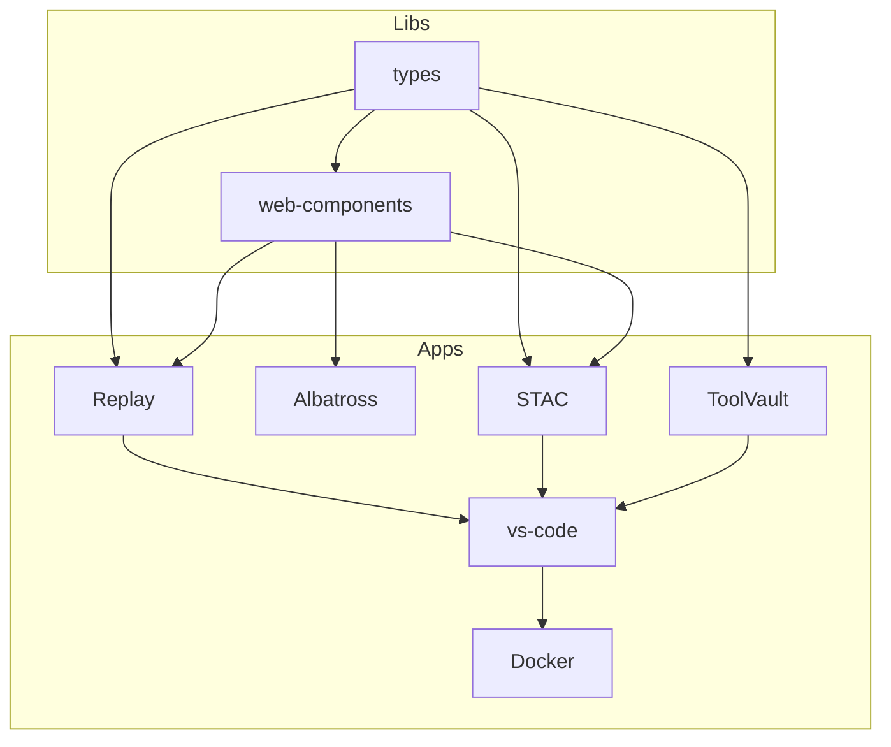

# future-debrief
Materials developed in support of a future Debrief

Sub-project dependencies as described below.

## Operations & Maintenance

### Fly.io Cleanup Script
The repository includes a script for managing fly.io preview apps and preventing cost accumulation:

- **Check Apps**: `./scripts/cleanup-flyio-apps.sh` - List orphaned PR apps (safe default)
- **Save Money**: `./scripts/cleanup-flyio-apps.sh --destroy` - Remove all orphaned apps immediately
- **Interactive**: `./scripts/cleanup-flyio-apps.sh --interactive` - Ask before destroying

**Cost Management**: This script helps identify and remove orphaned PR preview apps that accumulate fly.io costs. Production apps (`main-futuredebrief`, `toolvault-main`) are never affected.

For detailed documentation, see: `apps/vs-code/docs/flyio-setup.md#cleanup-management`
