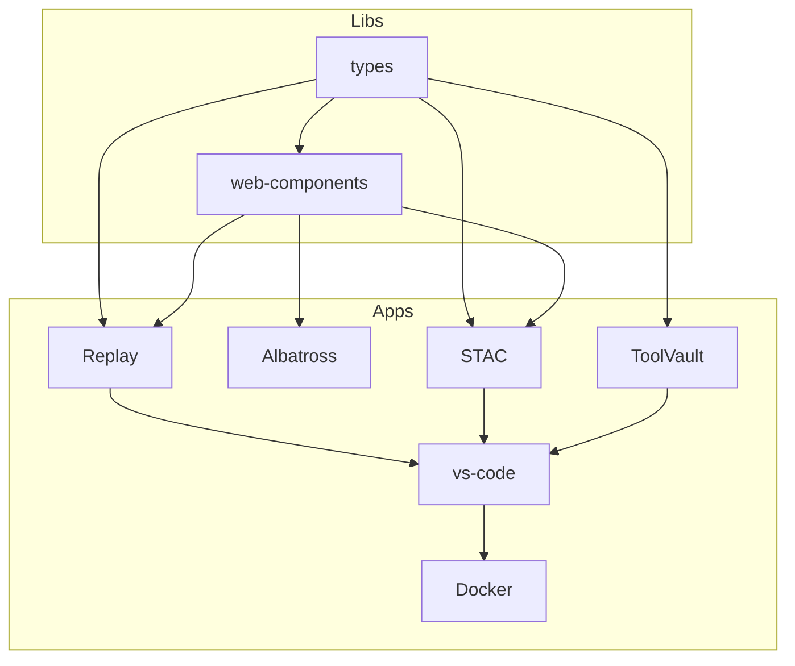

# future-debrief
Materials developed in support of a future Debrief

Sub-project dependencies as described below.

```mermaid
graph TD

  subgraph Libs
    types[types]
    web[web-components]
  end

  subgraph Apps
    replay[Replay]
    albatross[Albatross]
    stac[STAC]
    toolvault[ToolVault]
    vscode[vs-code]
    docker[Docker]
  end

  %% Lib relationships
  types --> web

  %% Apps using libs
  types --> replay
  types --> stac
  types --> toolvault
  web --> replay
  web --> albatross
  web --> stac

  %% Cross-app dependencies
  replay --> vscode
  stac --> vscode
  toolvault --> vscode
  vscode --> docker

```
