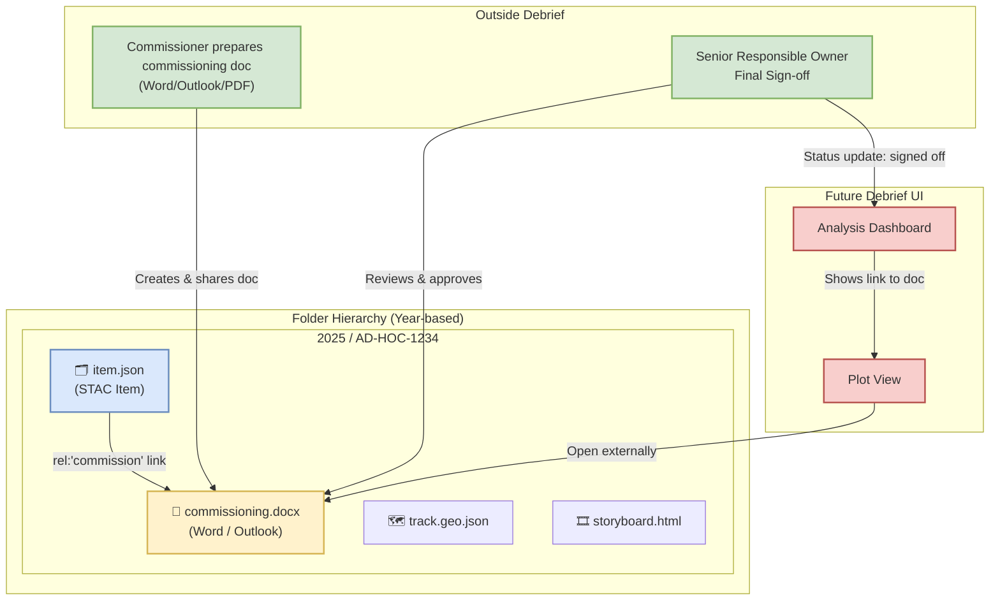

```mermaid
sequenceDiagram
    autonumber
    actor Commissioner
    participant Debrief as Future Debrief (Analyst & Tool)
    participant Folder as Year/Case Folder (STAC files)
    actor SRO as SRO (Final Approver)

%% Commissioning & Setup
Commissioner->>Folder: Create commissioning.docx / .eml / .pdf (outside Debrief)
Commissioner-->>Folder: Store under /YEAR/CASE-ID/
Debrief->>Debrief: New analysis Item (item.json) created
Debrief->>Analyst: Prompt: "Add commission link?"
Analyst->>Folder: Browse & select commissioning document
Analyst->>Debrief: Save link rel:"commission" -> ../commissioning.docx
Debrief-->>Folder: Write item.json with links/assets
Note right of Debrief: Dashboard shows Commissioner chip/link<br/>Status: planned → in_progress

%% Analysis Execution
Analyst->>Debrief: Ingest data, create track.geo.json, annotations
Debrief-->>Folder: Save assets (track.geo.json, storyboard.html)
Analyst->>Debrief: Update Item properties.status=in_progress

%% Oversight & Dialogue (outside Debrief for the doc)
Commissioner-->>Folder: Update commissioning doc if scope/QA/dates change
Analyst->>Debrief: Optional note in Item: "Commission updated on YYYY‑MM‑DD"
Note over Commissioner,Debrief: Dialogue remains via email/Word comments;<br/>Debrief provides discoverability via the commission link.

%% Delivery & Sign-off
Analyst->>Debrief: Mark Item status=awaiting_signoff; attach delivery artefacts
Debrief-->>Folder: Persist storyboard.html / exports as assets
SRO-->>Folder: Review commissioning doc + outputs (outside Debrief)
SRO->>Commissioner: Confirm approval (in the doc/email)
Analyst->>Debrief: Update Item status=complete (signed off)
Note right of Debrief: Export cover pages can display Commission title/QA level (label only)

%% Audit & Traceability
Note over Debrief,Folder: Item audit = analysis edits in Debrief.<br/>Commission doc audit/versioning = outside Debrief.<br/>Traceability maintained via rel:"commission" link in item.json.
```
