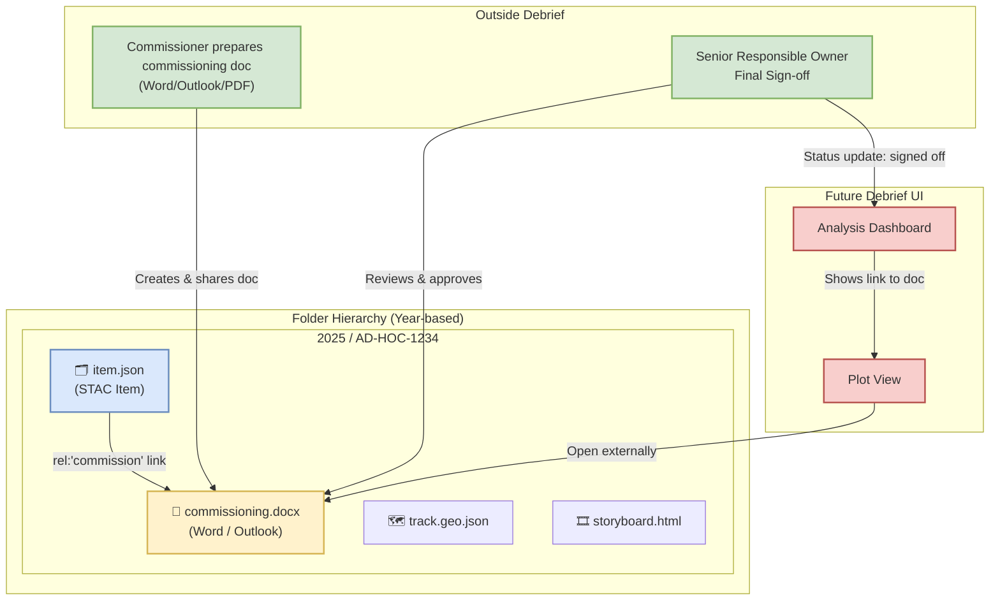

```mermaid
flowchart TD
subgraph Folder["Folder Hierarchy (Year-based)"]
    direction TB
    subgraph Case["2025 / AD-HOC-1234"]
        CommissionDoc["📄 commissioning.docx<br>(Word / Outlook)"]
        ItemJSON["🗂 item.json<br>(STAC Item)"]
        TrackFile["🗺 track.geo.json"]
        Storyboard["🎞 storyboard.html"]
    end
end

subgraph DebriefUI["Future Debrief UI"]
    Dashboard["Analysis Dashboard"]
    PlotView["Plot View"]
end

subgraph ExternalProcess["Outside Debrief"]
    Commissioner["Commissioner prepares commissioning doc<br>(Word/Outlook/PDF)"]
    SRO["Senior Responsible Owner<br>Final Sign-off"]
end

%% Links
Commissioner -->|Creates & shares doc| CommissionDoc
ItemJSON -->|rel:'commission' link| CommissionDoc
Dashboard -->|Shows link to doc| PlotView
PlotView -->|Open externally| CommissionDoc
SRO -->|Reviews & approves| CommissionDoc
SRO -->|Status update: signed off| Dashboard

%% Styling
style CommissionDoc fill:#fff2cc,stroke:#d6b656,stroke-width:2px
style ItemJSON fill:#dae8fc,stroke:#6c8ebf,stroke-width:2px
style Dashboard fill:#f8cecc,stroke:#b85450,stroke-width:2px
style PlotView fill:#f8cecc,stroke:#b85450,stroke-width:2px
style Commissioner fill:#d5e8d4,stroke:#82b366,stroke-width:2px
style SRO fill:#d5e8d4,stroke:#82b366,stroke-width:2px
```
