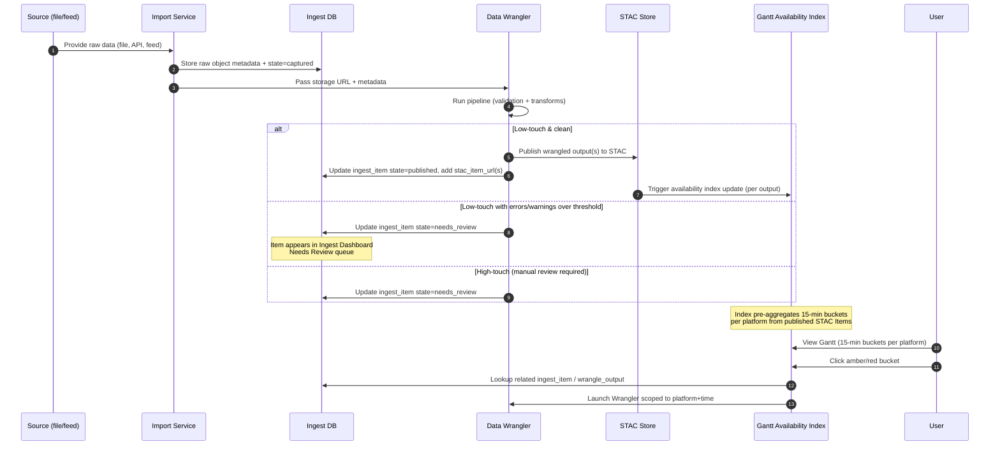
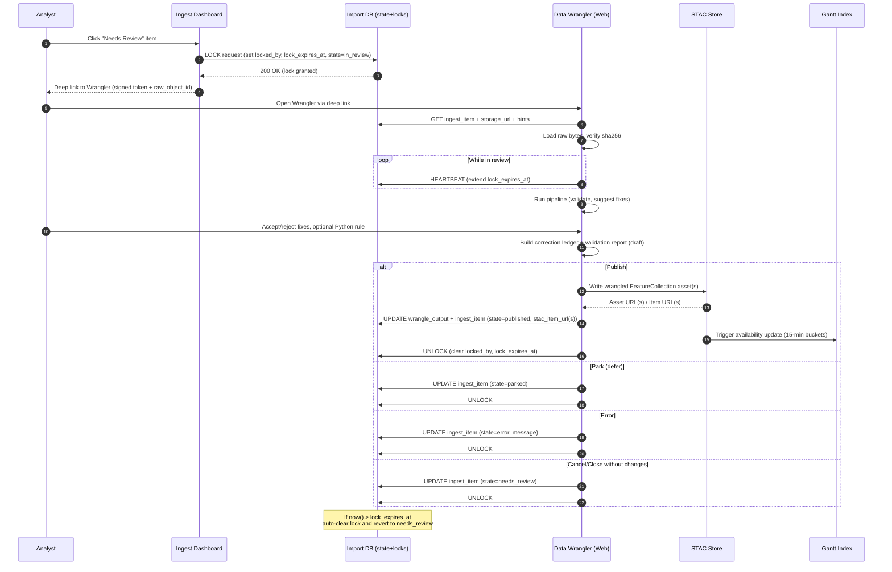
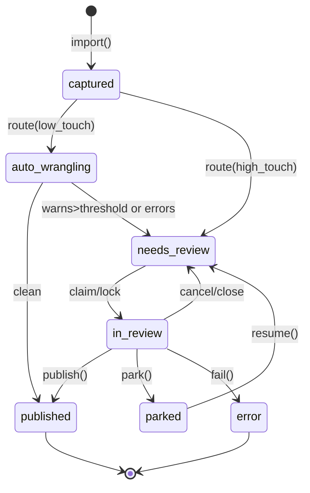
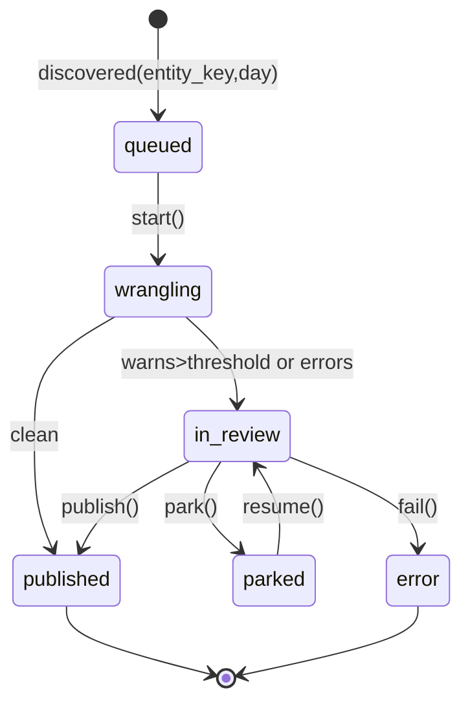

## Import-Wrangling Process




## High-touch review loop (for ingests that require human input)


## Import pipeline states

### Ingest item (parent)


### Wrangler output (child per platform/day)


Legend (concise):
*	clean = validation passes within thresholds → straight‑through
* warns>threshold / errors = gated to Needs Review.
* park() = defer without publishing; resume() returns to review.
* Locks/timeouts handled outside the diagram (as per the sequence flow you approved).

### Twin pipelines
```mermaid
flowchart LR
    subgraph Import["Import Stage"]
        I[Import Service\n(capture raw file + metadata)]
        IP[Ingest Pipeline\n(parse, normalise, validate, enrich, split)]
    end

    subgraph Storage["Data Store"]
        STAC[STAC Store\n(wrangled FeatureCollections + metadata)]
    end

    subgraph Analysis["Analysis Stage"]
        AP[Analysis Pipeline\n(derive, calculate, model, visualise)]
        OUT[Outputs\n(reports, dashboards, derived datasets)]
    end

    I --> IP
    IP -- Clean --> STAC
    IP -- Errors/Warnings -->|Needs Review| IP
    STAC --> AP
    AP --> STAC
    AP --> OUT
```