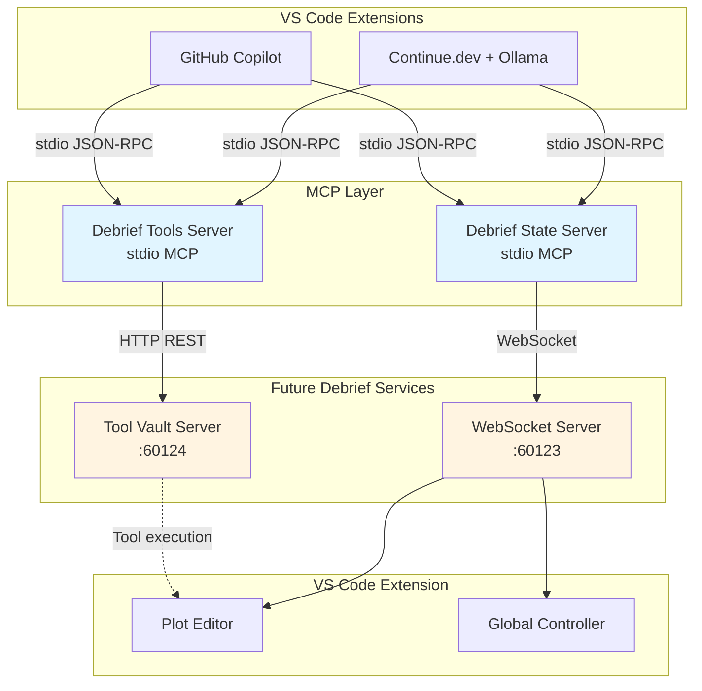
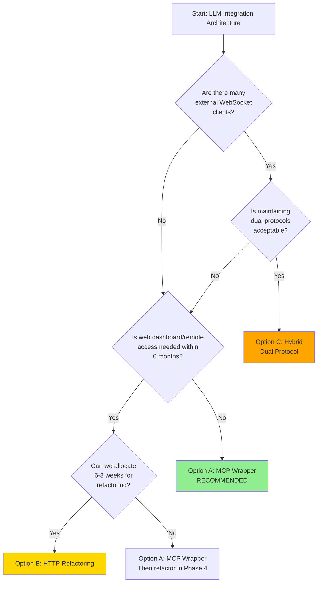
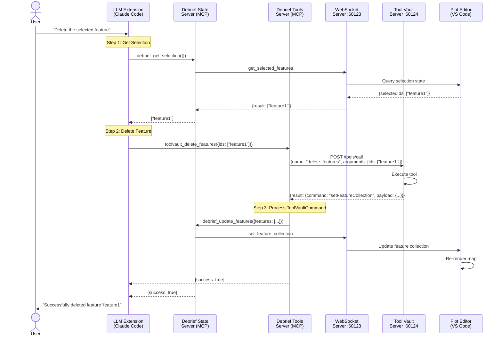

# LLM Integration Architecture for Future Debrief

## Executive Summary

This document presents a comprehensive architectural plan for enabling LLM extensions (Claude Code, GitHub Copilot, local LLMs via Ollama/LM Studio) to orchestrate multi-step maritime analysis workflows through Future Debrief's existing infrastructure.

**Key Challenge**: LLM extensions cannot directly interact with WebSockets, requiring adapter/wrapper technologies to expose Future Debrief's WebSocket server (port 60123) and Tool Vault server (port 60124) through LLM-accessible interfaces.

**Recommended Solution**: Model Context Protocol (MCP) stdio-based server architecture with dual-service integration pattern.

**Target Platforms**: VS Code extensions (Continue.dev with Ollama, GitHub Copilot) - designed for naval analysts working within VS Code, not CLI developers.

---

## Table of Contents

1. [Technology Research & Survey](#1-technology-research--survey)
2. [Wrapper Architecture Design](#2-wrapper-architecture-design)
3. [Integration Patterns & Orchestration](#3-integration-patterns--orchestration)
4. [Security & Operational Constraints](#4-security--operational-constraints)
5. [Implementation Phases & Rollout](#5-implementation-phases--rollout)
6. [Proof of Concept Design Specification](#6-proof-of-concept-design-specification)
7. [Recommendations & Next Steps](#7-recommendations--next-steps)

---

## 1. Technology Research & Survey

### 1.1 MCP Server Architectures

#### Model Context Protocol Overview

The Model Context Protocol (MCP) is an open-source standard for AI-tool integrations that enables LLM extensions to access external tools, databases, and APIs. As of 2025, MCP has become the de facto standard for LLM extension integration.

**Key Characteristics:**
- **Transport Protocols**: stdio (local processes), SSE (Server-Sent Events), HTTP (request/response)
- **Message Format**: JSON-RPC 2.0 for command/response patterns
- **Tool Interface**: Standardized schema-based tool discovery and execution
- **State Management**: Supports both stateless and stateful interactions

#### Stdio-Based MCP Servers

Stdio servers are the **primary integration pattern for locally-run MCP servers**:

**Advantages:**
- ✅ Native support in Claude Code (`claude mcp add`)
- ✅ Direct process spawning with full lifecycle control
- ✅ Secure by default (local-only, no network exposure)
- ✅ Simple configuration in `.claude.json`
- ✅ Minimal latency (IPC vs network overhead)

**Configuration Example:**
```json
{
  "mcpServers": {
    "debrief-bridge": {
      "type": "stdio",
      "command": "node",
      "args": ["/path/to/debrief-mcp-server.js"],
      "env": {
        "WEBSOCKET_PORT": "60123",
        "TOOLVAULT_PORT": "60124"
      }
    }
  }
}
```

**Process Lifecycle:**
- Extension spawns server process with specified command
- Server communicates via stdin/stdout using JSON-RPC
- Extension manages server lifecycle (start/stop/restart)
- Automatic cleanup on extension shutdown

### 1.2 Wrapper Technologies Comparison

| Technology | Pros | Cons | LLM Compatibility | Effort |
|------------|------|------|------------------|--------|
| **MCP Stdio Server** | Native integration, secure, simple config | Requires Node.js/Python runtime | ✅ Claude Code<br>✅ GitHub Copilot CLI<br>✅ Ollama (via bridge) | Medium |
| **HTTP REST Gateway** | Universal access, language agnostic | Network overhead, auth complexity | ✅ All platforms<br>(via HTTP tool) | Medium-High |
| **CLI Tool Wrapper** | Simple bash integration | Limited state management, text parsing | ✅ All platforms<br>(via Bash tool) | Low-Medium |
| **WebSocket Proxy** | Direct protocol translation | Additional service, port management | ❌ Not directly accessible | High |
| **Refactoring Services** | Native HTTP support, cleaner architecture | Major code changes, testing burden | ✅ All platforms | Very High |

### 1.3 VS Code Extension Capabilities Matrix

**Context**: Naval analysts will interact with LLMs through VS Code extensions, not CLI tools. Focus on extension-based integration.

| Capability | GitHub Copilot (Extension) | Continue.dev + Ollama | Cline (Claude Dev) |
|------------|---------------------------|----------------------|-------------------|
| **MCP Stdio Servers** | ✅ Native support (coming) | ✅ Native support | ✅ Native support |
| **VS Code Integration** | ✅ Native extension | ✅ Native extension | ✅ Native extension |
| **Local Operation** | ❌ Cloud-only | ✅ 100% local | ⚠️ API key required |
| **Multi-step Workflows** | ✅ Agentic mode | ✅ Tool orchestration | ✅ Agentic mode |
| **User Experience** | Chat panel + inline | Chat panel + inline | Chat panel + commands |
| **Setup Complexity** | Low (built-in) | Low (+ Ollama install) | Medium (API setup) |
| **Cost** | Subscription | Free (local) | Usage-based |

#### Recommended Platform: Continue.dev + Ollama

**Why Continue.dev for Naval Analysts**:
- ✅ **100% local operation**: No data leaves the machine (security/privacy)
- ✅ **Free and open source**: No subscription costs
- ✅ **Simple setup**: Extension + Ollama installation
- ✅ **Native MCP support**: Works with our MCP servers out of the box
- ✅ **Good UX**: Chat panel familiar to GitHub Copilot users
- ✅ **Multiple models**: Easy to switch between Qwen, Llama, etc.

**Setup for Naval Analysts**:
1. Install Continue.dev extension in VS Code
2. Install Ollama: `curl -fsSL https://ollama.com/install.sh | sh`
3. Pull recommended model: `ollama pull qwen2.5:7b-instruct`
4. Configure MCP servers (automatic via workspace settings)

**Continue.dev Configuration**:
```json
// ~/.continue/config.json (auto-configured by workspace)
{
  "models": [
    {
      "title": "Qwen 2.5 (Recommended)",
      "provider": "ollama",
      "model": "qwen2.5:7b-instruct",
      "apiBase": "http://localhost:11434"
    }
  ],
  "mcpServers": {
    "debrief-state": {
      "command": "node",
      "args": ["${workspaceFolder}/node_modules/@debrief/mcp-servers/dist/debrief-state-server/index.js"],
      "env": {
        "DEBRIEF_WS_PORT": "60123"
      }
    },
    "debrief-tools": {
      "command": "node",
      "args": ["${workspaceFolder}/node_modules/@debrief/mcp-servers/dist/debrief-tools-server/index.js"],
      "env": {
        "TOOLVAULT_PORT": "60124"
      }
    }
  }
}
```

**Alternative: GitHub Copilot (Extension)**
- **For users with GitHub Copilot subscription**
- **Setup**: Install extension, authenticate with GitHub
- **MCP Support**: Coming in 2025 (currently in preview)
- **Trade-off**: Cloud-based (data leaves machine) but more capable model

### 1.4 Authentication Patterns

#### For Local Services (Current Architecture)

**Current State:**
- WebSocket server (60123): No authentication (localhost-only)
- Tool Vault server (60124): No authentication (localhost-only)

**Security Model:**
- Services bound to localhost interface only
- VS Code extension manages service lifecycle
- Network isolation provides security boundary

#### For LLM-Initiated Operations

**Recommended Pattern: No Additional Authentication (Phase 1)**

**Rationale:**
1. **Trust Boundary**: LLM extensions run in user's environment with full user privileges
2. **Service Architecture**: Services already localhost-only with no external exposure
3. **Operational Simplicity**: No auth reduces complexity for initial rollout
4. **Lifecycle Management**: VS Code extension controls service lifecycle

**Future Enhancement (Phase 2+):**
- **Audit Logging**: Track all LLM-initiated operations for debugging
- **Rate Limiting**: Prevent accidental resource exhaustion
- **API Keys (Optional)**: For multi-tenant or remote deployment scenarios
- **Role-Based Access**: If exposing to external systems

---

## 2. Wrapper Architecture Design

### 2.1 Recommended Architecture: Dual MCP Stdio Servers

The recommended approach is to create **two separate MCP stdio servers** that wrap existing services:

1. **Debrief State Server** (WebSocket adapter)
2. **Debrief Tools Server** (Tool Vault proxy)

#### Architecture Diagram



### 2.2 Debrief State Server (WebSocket Adapter)

**Purpose**: Wrap WebSocket server to provide LLM-accessible state management.

**Implementation Language**: TypeScript/Node.js (matches existing codebase)

**MCP Tool Schema**:

```typescript
// Tool: get_feature_collection
{
  name: "debrief_get_features",
  description: "Get all features from the active plot",
  inputSchema: {
    type: "object",
    properties: {
      filename: {
        type: "string",
        description: "Optional plot filename. If omitted, uses active plot."
      }
    }
  }
}

// Tool: get_selected_features
{
  name: "debrief_get_selection",
  description: "Get currently selected feature IDs",
  inputSchema: {
    type: "object",
    properties: {
      filename: { type: "string", description: "Optional plot filename" }
    }
  }
}

// Tool: set_selected_features
{
  name: "debrief_set_selection",
  description: "Update selected features",
  inputSchema: {
    type: "object",
    properties: {
      selectedIds: {
        type: "array",
        items: { type: "string" },
        description: "Array of feature IDs to select"
      },
      filename: { type: "string", description: "Optional plot filename" }
    },
    required: ["selectedIds"]
  }
}

// Tool: update_features
{
  name: "debrief_update_features",
  description: "Update existing features",
  inputSchema: {
    type: "object",
    properties: {
      features: {
        type: "array",
        items: { type: "object" },
        description: "Array of GeoJSON features to update"
      },
      filename: { type: "string" }
    },
    required: ["features"]
  }
}

// Additional tools: delete_features, add_features, get_time, set_time,
// get_viewport, set_viewport, zoom_to_selection, list_open_plots
```

**Connection Management**:
- Establish persistent WebSocket connection on server startup
- Implement reconnection logic with exponential backoff
- Handle MULTIPLE_PLOTS errors gracefully with user prompts
- Maintain connection pool for multiple plot files

### 2.3 Debrief Tools Server (Tool Vault Proxy)

**Purpose**: Expose Tool Vault's maritime analysis tools through MCP interface.

**Implementation Language**: TypeScript/Node.js (consistency with State Server)

**Tool Discovery Pattern**:
```typescript
// Dynamic tool discovery from Tool Vault
async function discoverTools(): Promise<MCPTool[]> {
  const response = await fetch('http://localhost:60124/tools/list');
  const { tools } = await response.json();

  // Transform Tool Vault schema to MCP schema
  return tools.map(tool => ({
    name: `toolvault_${tool.name}`,
    description: tool.description,
    inputSchema: tool.inputSchema
  }));
}
```

**Tool Execution Pattern**:
```typescript
async function executeTool(name: string, args: Record<string, unknown>) {
  const toolName = name.replace('toolvault_', '');

  const response = await fetch('http://localhost:60124/tools/call', {
    method: 'POST',
    headers: { 'Content-Type': 'application/json' },
    body: JSON.stringify({ name: toolName, arguments: args })
  });

  const result = await response.json();

  // Handle ToolVaultCommand results
  if (result.result?.command) {
    return {
      content: [
        {
          type: "text",
          text: `Tool executed: ${result.result.command}`
        },
        {
          type: "resource",
          resource: {
            uri: "tool://vault/command",
            data: result.result
          }
        }
      ]
    };
  }

  return result;
}
```

### 2.4 Refactoring vs Wrapping Trade-Off Analysis

| Aspect | Refactoring to HTTP | MCP Wrapper Approach |
|--------|-------------------|---------------------|
| **Implementation Effort** | Very High (6-8 weeks) | Medium (2-3 weeks) |
| **Breaking Changes** | High (existing Python clients) | None (wrapper is additive) |
| **Testing Burden** | High (full regression) | Medium (wrapper + integration) |
| **Architecture Cleanliness** | Better (native HTTP) | Good (clean abstraction) |
| **Multi-Platform Support** | Immediate | Immediate |
| **Maintenance** | Single codebase | Additional layer |
| **Deployment** | Replace existing service | Add new service |
| **Rollback Risk** | High | Low (disable MCP server) |

**Recommendation**: **MCP Wrapper Approach** for Phase 1

**Rationale**:
1. **Non-Breaking**: Preserves existing Python WebSocket clients
2. **Faster Time-to-Market**: 2-3 weeks vs 6-8 weeks
3. **Lower Risk**: Wrapper can be disabled without affecting core services
4. **Incremental**: Can still refactor services later if needed
5. **Separation of Concerns**: MCP logic separate from core services

**Future Consideration**: If HTTP becomes a requirement for other use cases (remote access, web dashboards), refactoring the WebSocket server to HTTP+WebSocket could be evaluated in Phase 2+.

### 2.5 MCP Server Implementation Details

#### Package Structure

```
libs/mcp-servers/
├── package.json
├── tsconfig.json
├── src/
│   ├── debrief-state-server/
│   │   ├── index.ts           # MCP server entry point
│   │   ├── websocket-client.ts # WebSocket connection manager
│   │   ├── tools.ts            # Tool definitions
│   │   └── error-handler.ts    # Error translation
│   ├── debrief-tools-server/
│   │   ├── index.ts           # MCP server entry point
│   │   ├── toolvault-client.ts # HTTP client for Tool Vault
│   │   ├── tool-discovery.ts  # Dynamic tool loading
│   │   └── command-handler.ts # ToolVaultCommand processor
│   └── shared/
│       ├── types.ts           # Shared type definitions
│       └── logging.ts         # Structured logging
└── dist/                      # Compiled output
```

#### Configuration Management

**User Configuration** (`.claude.json`):
```json
{
  "mcpServers": {
    "debrief-state": {
      "type": "stdio",
      "command": "node",
      "args": [
        "${workspaceFolder}/node_modules/@debrief/mcp-servers/dist/debrief-state-server/index.js"
      ],
      "env": {
        "DEBRIEF_WS_PORT": "60123",
        "LOG_LEVEL": "info"
      }
    },
    "debrief-tools": {
      "type": "stdio",
      "command": "node",
      "args": [
        "${workspaceFolder}/node_modules/@debrief/mcp-servers/dist/debrief-tools-server/index.js"
      ],
      "env": {
        "TOOLVAULT_PORT": "60124",
        "LOG_LEVEL": "info"
      }
    }
  }
}
```

#### Error Handling Strategy

**WebSocket Connection Errors**:
```typescript
class WebSocketConnectionError extends Error {
  constructor(message: string, public code: string) {
    super(message);
    this.name = 'WebSocketConnectionError';
  }
}

async function connectWithRetry(
  url: string,
  maxRetries: number = 3
): Promise<WebSocket> {
  let lastError: Error;

  for (let i = 0; i < maxRetries; i++) {
    try {
      return await connect(url);
    } catch (error) {
      lastError = error;
      await sleep(Math.pow(2, i) * 1000); // Exponential backoff
    }
  }

  throw new WebSocketConnectionError(
    `Failed to connect after ${maxRetries} attempts: ${lastError.message}`,
    'CONNECTION_FAILED'
  );
}
```

**Tool Execution Errors**:
```typescript
interface MCPError {
  code: number;
  message: string;
  data?: unknown;
}

function translateDebriefError(error: DebriefAPIError): MCPError {
  if (error.code === 'MULTIPLE_PLOTS') {
    return {
      code: -32001,
      message: error.message,
      data: error.available_plots
    };
  }

  if (error.code === 404) {
    return {
      code: -32002,
      message: 'Plot file not found or not open'
    };
  }

  return {
    code: -32000,
    message: error.message
  };
}
```

---

## 3. Integration Patterns & Orchestration

### 3.1 Multi-Step Workflow Coordination

#### Example: Delete Selected Feature Workflow

**Objective**: Delete a selected maritime feature using LLM automation

**Steps**:
1. **Retrieve**: Get first selected feature ID from State Server
2. **Process**: Pass feature ID to Tool Vault's `delete-features` tool
3. **Update**: Refresh feature collection from State Server

**LLM Orchestration (Claude Code Example)**:

```typescript
// Step 1: Get selection
const selection = await callTool('debrief_get_selection', {});
const selectedIds = selection.selectedIds;

if (selectedIds.length === 0) {
  return { error: "No features selected" };
}

const featureId = selectedIds[0];

// Step 2: Delete feature via Tool Vault
const deleteResult = await callTool('toolvault_delete_features', {
  ids: [featureId]
});

// Step 3: Handle ToolVaultCommand result
if (deleteResult.command === 'setFeatureCollection') {
  // Tool Vault returns updated feature collection
  await callTool('debrief_update_features', {
    features: deleteResult.payload.features
  });
}

return { success: true, deletedId: featureId };
```

### 3.2 Standardized Request/Response Formats

#### MCP JSON-RPC Request Format

```json
{
  "jsonrpc": "2.0",
  "id": 1,
  "method": "tools/call",
  "params": {
    "name": "debrief_get_selection",
    "arguments": {
      "filename": "mission1.plot.json"
    }
  }
}
```

#### MCP JSON-RPC Response Format

**Success**:
```json
{
  "jsonrpc": "2.0",
  "id": 1,
  "result": {
    "content": [
      {
        "type": "text",
        "text": "Selected features: [\"feature1\", \"feature2\"]"
      }
    ]
  }
}
```

**Error**:
```json
{
  "jsonrpc": "2.0",
  "id": 1,
  "error": {
    "code": -32002,
    "message": "Plot file not found or not open",
    "data": {
      "filename": "mission1.plot.json"
    }
  }
}
```

### 3.3 ToolVaultCommand Result Handling

**Pattern**: Tool Vault tools may return `ToolVaultCommand` objects that instruct the UI to perform actions.

**Command Types**:
- `setFeatureCollection`: Update entire feature collection
- `showText`: Display notification to user
- `highlightFeatures`: Select/highlight specific features
- `updateViewport`: Adjust map viewport

**Integration Pattern**:

```typescript
async function executeToolVaultTool(
  name: string,
  args: Record<string, unknown>
): Promise<MCPResult> {
  const result = await callToolVault(name, args);

  // Check if result contains ToolVaultCommand
  if (result.command) {
    switch (result.command) {
      case 'setFeatureCollection':
        // Update feature collection via State Server
        await callTool('debrief_update_features', {
          features: result.payload.features
        });
        return {
          content: [{
            type: "text",
            text: `Updated feature collection with ${result.payload.features.length} features`
          }]
        };

      case 'showText':
        return {
          content: [{
            type: "text",
            text: result.payload
          }]
        };

      default:
        return {
          content: [{
            type: "text",
            text: `Command: ${result.command}`
          }, {
            type: "resource",
            resource: { uri: "tool://vault/command", data: result }
          }]
        };
    }
  }

  return result;
}
```

### 3.4 Multi-Plot Scenario Handling

**Challenge**: Multiple plot files may be open simultaneously.

**Solution Strategy**:

1. **Explicit Filename Parameter** (Preferred):
   ```typescript
   await callTool('debrief_get_selection', {
     filename: 'mission1.plot.json'
   });
   ```

2. **Interactive Selection** (Fallback):
   ```typescript
   // MCP server detects MULTIPLE_PLOTS error
   // Returns list of available plots as error data
   {
     "error": {
       "code": -32001,
       "message": "Multiple plots open, please specify filename",
       "data": {
         "available_plots": [
           { "filename": "mission1.plot.json", "title": "Mission 1" },
           { "filename": "mission2.plot.json", "title": "Mission 2" }
         ]
       }
     }
   }

   // LLM can then prompt user or use first plot
   ```

3. **Active Plot Heuristic** (Future Enhancement):
   - Track most recently focused plot in State Server
   - Use as default when filename omitted

### 3.5 Error Handling Patterns

#### Connection Failures

**Scenario**: WebSocket server not running

**Pattern**:
```typescript
try {
  await connectWebSocket('ws://localhost:60123');
} catch (error) {
  if (error instanceof WebSocketConnectionError) {
    return {
      error: {
        code: -32003,
        message: "Debrief WebSocket server not available. Ensure VS Code extension is running.",
        data: { port: 60123 }
      }
    };
  }
  throw error;
}
```

#### Tool Execution Failures

**Scenario**: Tool Vault returns error

**Pattern**:
```typescript
const result = await callToolVault('word_count', { text: 'hello' });

if (result.isError) {
  return {
    error: {
      code: -32004,
      message: `Tool execution failed: ${result.error}`,
      data: { toolName: 'word_count', originalError: result.error }
    }
  };
}
```

#### Retry Logic

**Pattern**: Exponential backoff for transient failures

```typescript
async function callWithRetry<T>(
  fn: () => Promise<T>,
  maxRetries: number = 3,
  baseDelay: number = 1000
): Promise<T> {
  for (let attempt = 0; attempt < maxRetries; attempt++) {
    try {
      return await fn();
    } catch (error) {
      if (attempt === maxRetries - 1) throw error;

      // Only retry on specific error codes
      if (isRetryableError(error)) {
        const delay = baseDelay * Math.pow(2, attempt);
        await sleep(delay);
        continue;
      }

      throw error;
    }
  }
}

function isRetryableError(error: unknown): boolean {
  return error instanceof WebSocketConnectionError ||
         (error instanceof ToolVaultError && error.code === 503);
}
```

---

## 4. Security & Operational Constraints

### 4.1 Authentication/Authorization Model

#### Phase 1: Localhost-Only Security Model

**No Additional Authentication Required**

**Security Boundaries**:
1. **Network Isolation**: Services bound to `127.0.0.1` interface only
2. **Process Isolation**: VS Code extension manages service lifecycle
3. **User Context**: LLM extensions run with user's OS permissions
4. **Trust Model**: User trusts their own LLM extensions

**Threat Model**:
- ✅ Protected: External network access (localhost-only)
- ✅ Protected: Unauthorized process access (OS-level permissions)
- ⚠️ Assumed: User trusts LLM extensions they install
- ⚠️ Assumed: No malicious processes on user's machine

#### Phase 2+: Enhanced Security (Optional)

**API Key Authentication**:
```typescript
// Generate API key on extension startup
const apiKey = crypto.randomBytes(32).toString('hex');

// Store in environment variable for MCP servers
process.env.DEBRIEF_API_KEY = apiKey;

// MCP server validates on each request
function validateApiKey(request: MCPRequest): boolean {
  return request.apiKey === process.env.DEBRIEF_API_KEY;
}
```

**Benefits**:
- Enables multi-tenant scenarios (future)
- Provides audit trail for API usage
- Allows rate limiting per client

**Trade-offs**:
- Increased complexity
- Key management overhead
- Not needed for Phase 1 localhost deployment

### 4.2 Rate Limiting Strategies

#### Purpose
Prevent accidental resource exhaustion from LLM-initiated operations (e.g., infinite loops, rapid polling).

#### Implementation Pattern

**Token Bucket Algorithm**:
```typescript
class RateLimiter {
  private tokens: number;
  private lastRefill: number;

  constructor(
    private maxTokens: number = 100,
    private refillRate: number = 10 // tokens per second
  ) {
    this.tokens = maxTokens;
    this.lastRefill = Date.now();
  }

  async acquire(): Promise<boolean> {
    this.refill();

    if (this.tokens >= 1) {
      this.tokens -= 1;
      return true;
    }

    return false;
  }

  private refill(): void {
    const now = Date.now();
    const elapsed = (now - this.lastRefill) / 1000;
    const tokensToAdd = elapsed * this.refillRate;

    this.tokens = Math.min(this.maxTokens, this.tokens + tokensToAdd);
    this.lastRefill = now;
  }
}
```

**Configuration**:
```typescript
const rateLimiter = new RateLimiter(
  100,  // max 100 requests in bucket
  10    // refill 10 requests/second
);

// In MCP tool handler
if (!await rateLimiter.acquire()) {
  return {
    error: {
      code: -32005,
      message: "Rate limit exceeded. Please slow down requests."
    }
  };
}
```

**Recommended Limits**:
- **Default**: 10 requests/second, burst of 100
- **Feature Updates**: 5 requests/second (more expensive operations)
- **Tool Vault Calls**: 2 requests/second (external service dependency)

### 4.3 Resource Sandboxing

#### Memory Limits

**Node.js Process Limits**:
```json
{
  "command": "node",
  "args": [
    "--max-old-space-size=512",  // 512MB heap limit
    "./dist/debrief-state-server/index.js"
  ]
}
```

#### Connection Pooling

**WebSocket Connection Management**:
```typescript
class ConnectionPool {
  private connections = new Map<string, WebSocket>();
  private readonly maxConnections = 5;

  async getConnection(filename?: string): Promise<WebSocket> {
    const key = filename || 'default';

    if (this.connections.size >= this.maxConnections) {
      // Close oldest connection
      const [oldestKey] = this.connections.keys();
      this.connections.get(oldestKey)?.close();
      this.connections.delete(oldestKey);
    }

    if (!this.connections.has(key)) {
      this.connections.set(key, await this.createConnection());
    }

    return this.connections.get(key)!;
  }
}
```

#### Timeout Protection

**Request Timeouts**:
```typescript
async function callWithTimeout<T>(
  fn: () => Promise<T>,
  timeoutMs: number = 30000
): Promise<T> {
  return Promise.race([
    fn(),
    new Promise<never>((_, reject) =>
      setTimeout(() => reject(new Error('Request timeout')), timeoutMs)
    )
  ]);
}
```

### 4.4 Audit Logging Specification

#### Log Levels

- **DEBUG**: Detailed protocol messages, state transitions
- **INFO**: Tool calls, successful operations, connection events
- **WARN**: Retries, rate limiting, deprecation warnings
- **ERROR**: Failures, exceptions, connection errors

#### Structured Logging Format

```typescript
interface LogEntry {
  timestamp: string;      // ISO 8601
  level: 'DEBUG' | 'INFO' | 'WARN' | 'ERROR';
  service: string;        // 'debrief-state' | 'debrief-tools'
  operation: string;      // e.g., 'tool_call', 'websocket_connect'
  toolName?: string;      // MCP tool name
  duration?: number;      // milliseconds
  success: boolean;
  error?: {
    code: string;
    message: string;
  };
  metadata?: Record<string, unknown>;
}
```

#### Example Log Entries

```json
{
  "timestamp": "2025-10-03T14:23:45.123Z",
  "level": "INFO",
  "service": "debrief-state",
  "operation": "tool_call",
  "toolName": "debrief_get_selection",
  "duration": 45,
  "success": true,
  "metadata": {
    "filename": "mission1.plot.json",
    "selectedCount": 2
  }
}

{
  "timestamp": "2025-10-03T14:23:50.456Z",
  "level": "ERROR",
  "service": "debrief-tools",
  "operation": "tool_call",
  "toolName": "toolvault_delete_features",
  "duration": 1200,
  "success": false,
  "error": {
    "code": "EXECUTION_FAILED",
    "message": "Tool execution failed: Feature ID not found"
  }
}
```

#### Log Storage

**Development**: Console output (captured by extension logs)

**Production**: Rotate logs to files
```typescript
import winston from 'winston';

const logger = winston.createLogger({
  level: process.env.LOG_LEVEL || 'info',
  format: winston.format.json(),
  transports: [
    new winston.transports.File({
      filename: 'debrief-mcp-error.log',
      level: 'error',
      maxsize: 5242880, // 5MB
      maxFiles: 5
    }),
    new winston.transports.File({
      filename: 'debrief-mcp-combined.log',
      maxsize: 5242880,
      maxFiles: 5
    }),
    new winston.transports.Console({
      format: winston.format.simple()
    })
  ]
});
```

### 4.5 Input Sanitization & Output Validation

#### Input Validation

**Use Shared Types**:
```typescript
import { SelectionState, FeatureCollection } from '@debrief/shared-types';

function validateSetSelectionInput(args: unknown): SelectionState {
  // Use Pydantic/Zod validation from shared-types
  return SelectionState.parse(args);
}
```

**Sanitize Filename Parameters**:
```typescript
function sanitizeFilename(filename?: string): string | undefined {
  if (!filename) return undefined;

  // Prevent path traversal
  const sanitized = filename.replace(/\.\./g, '').replace(/\//g, '');

  // Ensure .plot.json extension
  if (!sanitized.endsWith('.plot.json')) {
    throw new Error('Invalid filename: must end with .plot.json');
  }

  return sanitized;
}
```

#### Output Validation

**Validate WebSocket Responses**:
```typescript
function validateFeatureCollection(data: unknown): FeatureCollection {
  // Use shared-types validators
  if (!isFeatureCollection(data)) {
    throw new Error('Invalid FeatureCollection received from server');
  }
  return data;
}
```

---

## 5. Implementation Phases & Rollout

### 5.0 Phase 0: Architectural Decision Analysis (1 week)

**Goal**: Evaluate and decide between MCP wrapper approach vs HTTP refactoring approach

**Critical Question**: Should we wrap the existing WebSocket server with MCP adapters, or refactor the WebSocket server to HTTP/REST?

#### 5.0.1 Decision Criteria Matrix

| Criteria | Weight | MCP Wrapper | HTTP Refactoring | Winner |
|----------|--------|-------------|------------------|--------|
| **Time to Market** | High | ✅ 2-3 weeks | ❌ 6-8 weeks | Wrapper |
| **Breaking Changes** | High | ✅ None (additive) | ❌ Python clients break | Wrapper |
| **Long-term Maintainability** | Medium | ⚠️ Extra layer | ✅ Cleaner architecture | Refactor |
| **Architecture Simplicity** | Medium | ⚠️ Wrapper + original | ✅ Single HTTP service | Refactor |
| **Future Web Access** | Medium | ❌ Requires HTTP anyway | ✅ Native HTTP | Refactor |
| **Risk Level** | High | ✅ Low (can disable) | ❌ High (core service) | Wrapper |
| **Testing Burden** | Medium | ⚠️ Wrapper + integration | ❌ Full regression | Wrapper |
| **Bidirectional Sync** | Medium | ✅ WebSocket native | ⚠️ Polling/SSE needed | Wrapper |

#### 5.0.2 Architectural Options Detailed Comparison

##### Option A: MCP Wrapper Approach (Original Recommendation)

**Architecture**:
```
LLM Extension → MCP Stdio Server → WebSocket Client → WebSocket Server (existing)
```

**Pros**:
- ✅ **Fast delivery**: 2-3 weeks to working prototype
- ✅ **Zero breaking changes**: Python clients continue working
- ✅ **Low risk**: Can disable MCP servers without affecting core
- ✅ **Incremental**: Can still refactor later if HTTP needed
- ✅ **Bidirectional sync**: WebSocket push notifications work natively

**Cons**:
- ❌ **Extra layer**: Adds complexity with wrapper maintenance
- ❌ **Doesn't eliminate WebSocket**: Still need WebSocket server
- ❌ **Future HTTP needs**: If web dashboard needed, requires refactor anyway
- ❌ **Performance overhead**: Extra hop in communication chain

**Best for**: Quick LLM integration with minimal disruption

##### Option B: HTTP Refactoring Approach

**Architecture**:
```
LLM Extension → MCP Stdio Server → HTTP Client → HTTP/REST Server (new)
Python Clients → HTTP Client → HTTP/REST Server (new)
```

**Pros**:
- ✅ **Cleaner architecture**: Single service, no wrapper layer
- ✅ **Future-proof**: Enables web dashboards, remote access, multi-user
- ✅ **Matches Tool Vault**: Consistent HTTP pattern across services
- ✅ **LLM-friendly**: HTTP is universal, no special adapters needed
- ✅ **Simpler MCP servers**: Direct HTTP calls, less translation

**Cons**:
- ❌ **Time investment**: 6-8 weeks for implementation + testing
- ❌ **Breaking changes**: Existing Python `debrief_api.py` must be rewritten
- ❌ **Testing burden**: Full regression testing of VS Code extension
- ❌ **Bidirectional sync**: Need polling, SSE, or WebSocket fallback for push
- ❌ **Higher risk**: Core service refactoring affects all clients

**Best for**: Long-term architectural improvement with broader access patterns

##### Option C: Hybrid Approach (Dual Protocol)

**Architecture**:
```
LLM Extension → MCP Server → HTTP Client → HTTP/REST Server (new)
Python Clients (legacy) → WebSocket Client → WebSocket Server (deprecated)
VS Code Extension → Direct HTTP or WebSocket (configurable)
```

**Pros**:
- ✅ **Gradual migration**: Both protocols available during transition
- ✅ **No immediate breaking changes**: WebSocket marked deprecated
- ✅ **Best of both worlds**: HTTP for new clients, WebSocket for legacy
- ✅ **Bidirectional options**: Choose per use case

**Cons**:
- ❌ **Highest complexity**: Maintaining two protocols simultaneously
- ❌ **Longest timeline**: 8-10 weeks (both implementations)
- ❌ **Technical debt**: Temporary dual-protocol maintenance burden
- ❌ **State sync complexity**: Keeping both protocols consistent

**Best for**: Large codebases with many WebSocket clients requiring gradual migration

#### 5.0.3 Decision Factors

**Choose MCP Wrapper (Option A) if**:
- ✅ Fast time-to-market is critical (3-4 weeks vs 6-8 weeks)
- ✅ Python WebSocket clients must continue working unchanged
- ✅ LLM integration is primary/only new use case
- ✅ VS Code extension bidirectional sync is critical
- ✅ Low risk tolerance for core service changes
- ✅ Team bandwidth is limited

**Choose HTTP Refactoring (Option B) if**:
- ✅ Web dashboard or remote access is planned within 6 months
- ✅ Willing to update Python clients as part of the work
- ✅ Long-term architecture cleanliness is priority
- ✅ Multiple new access patterns expected (CLI, web, mobile)
- ✅ Team has 6-8 weeks for implementation + testing
- ✅ Higher risk tolerance acceptable for better architecture

**Choose Hybrid Approach (Option C) if**:
- ✅ Many external WebSocket clients exist (beyond Python test clients)
- ✅ Cannot break existing integrations
- ✅ Need HTTP for new use cases but WebSocket for legacy
- ✅ Have 8-10 weeks for implementation
- ✅ Can accept temporary dual-protocol maintenance

#### 5.0.4 Recommendation Framework

**Decision Tree**:



#### 5.0.5 Phase 0 Deliverables

**Week 1 Tasks**:

1. **Stakeholder Survey** (Day 1-2):
   - [ ] Identify all WebSocket client dependencies (beyond test Python scripts)
   - [ ] Survey team for planned features requiring web/remote access
   - [ ] Assess timeline constraints and deadlines
   - [ ] Evaluate team bandwidth and skill sets

2. **Technical Spike** (Day 2-3):
   - [ ] Prototype minimal HTTP endpoint for `get_feature_collection`
   - [ ] Test bidirectional sync options (polling vs SSE vs WebSocket fallback)
   - [ ] Benchmark WebSocket vs HTTP latency in current architecture
   - [ ] Estimate effort for Python client migration

3. **Risk Assessment** (Day 3-4):
   - [ ] Document breaking changes impact
   - [ ] Test plan scope estimation
   - [ ] Rollback strategy for each option
   - [ ] Performance regression risk analysis

4. **Decision Meeting** (Day 4):
   - [ ] Present findings to team
   - [ ] Review decision criteria matrix with stakeholders
   - [ ] Make architectural decision
   - [ ] Document rationale in ADR

5. **Planning** (Day 5):
   - [ ] Create detailed implementation plan for chosen approach
   - [ ] Update this architecture document with final decision
   - [ ] Schedule implementation phases
   - [ ] Assign resources and responsibilities

#### 5.0.6 Success Criteria for Phase 0

- ✅ Clear architectural decision documented with rationale
- ✅ Stakeholder alignment on approach
- ✅ Detailed implementation plan for chosen option
- ✅ Risk mitigation strategies defined
- ✅ ADR created (e.g., ADR-016-llm-integration-protocol.md)
- ✅ Team understands trade-offs and timeline

#### 5.0.7 Key Questions to Answer

Before proceeding to Phase 1, answer these questions:

1. **Client Dependencies**: How many external WebSocket clients exist beyond `debrief_api.py`?
   - If 0-1: Strongly favor HTTP refactoring
   - If 2-5: Consider wrapper or hybrid
   - If 6+: Favor wrapper or hybrid

2. **Future Features**: Is web dashboard, remote access, or mobile app planned?
   - If yes within 6 months: Strongly favor HTTP refactoring
   - If yes within 12 months: Consider HTTP or hybrid
   - If no plans: Wrapper acceptable

3. **Timeline Pressure**: What's the deadline for LLM integration?
   - If <4 weeks: Must use wrapper
   - If 4-8 weeks: Both options viable
   - If >8 weeks: Favor HTTP refactoring

4. **Team Bandwidth**: How many engineering weeks available?
   - If <3 weeks: Must use wrapper
   - If 3-6 weeks: Wrapper recommended
   - If 6-10 weeks: HTTP refactoring viable

5. **Risk Tolerance**: How critical is the WebSocket server to daily operations?
   - If business-critical: Favor wrapper (lower risk)
   - If development tool: HTTP refactoring acceptable
   - If frequently changing: Favor wrapper (easier rollback)

---

### 5.1 Phase 1: Implementation (Timeline depends on Phase 0 decision)

**Note**: Phase 1 plan varies significantly based on Phase 0 architectural decision. See subsections below.

#### 5.1.A Phase 1: MCP Wrapper Implementation (2-3 weeks)

**Goal**: Enable basic LLM orchestration using wrapper approach

**Deliverables**:
1. **Debrief State Server** (stdio MCP)
   - Core tools: `get_selection`, `set_selection`, `get_features`, `update_features`
   - WebSocket connection with retry logic
   - Basic error handling and logging

2. **Debrief Tools Server** (stdio MCP)
   - Dynamic tool discovery from Tool Vault
   - Tool execution with ToolVaultCommand handling
   - HTTP client with timeout protection

3. **Documentation**
   - Installation guide for Claude Code
   - Example workflows (delete feature, update selection)
   - Troubleshooting guide

4. **Testing**
   - Integration tests for each MCP tool
   - End-to-end workflow tests with Claude Code
   - Error scenario testing (connection failures, invalid inputs)

**Success Criteria**:
- ✅ LLM can retrieve and update plot state via MCP tools
- ✅ LLM can execute Tool Vault tools and process results
- ✅ Multi-step workflows execute successfully
- ✅ Error handling provides clear feedback

#### 5.1.B Phase 1: HTTP Refactoring Implementation (6-8 weeks)

**Goal**: Refactor WebSocket server to HTTP/REST with backward compatibility

**Deliverables**:

**Week 1-2: HTTP Server Implementation**
- [ ] Design HTTP/REST API matching WebSocket commands
- [ ] Implement Express/Fastify HTTP server on port 60123
- [ ] Core endpoints: GET/POST for features, selection, time, viewport
- [ ] Error handling and standardized response formats

**Week 3-4: VS Code Extension Integration**
- [ ] Refactor `debriefWebSocketServer.ts` to `debriefHttpServer.ts`
- [ ] Update GlobalController to use HTTP client
- [ ] Implement SSE or polling for bidirectional sync (if needed)
- [ ] Maintain feature parity with WebSocket version

**Week 5-6: Python Client Migration**
- [ ] Rewrite `debrief_api.py` to use HTTP requests
- [ ] Maintain same public API (transparent to users)
- [ ] Update all test scripts
- [ ] Document migration guide

**Week 7-8: MCP Server + Testing**
- [ ] Implement MCP servers (simpler with direct HTTP)
- [ ] Full regression testing
- [ ] Performance benchmarking
- [ ] Documentation and examples

**Success Criteria**:
- ✅ HTTP server provides all WebSocket functionality
- ✅ VS Code extension works with HTTP server
- ✅ Python clients migrated and working
- ✅ MCP servers functional with HTTP backend
- ✅ Performance acceptable (<200ms p95)
- ✅ All tests passing

---

### 5.2 Phase 2: Enhanced Features (Timeline: +2-3 weeks after Phase 1)

**Goal**: Enable basic LLM orchestration of state and tool operations

**Deliverables**:
1. **Debrief State Server** (stdio MCP)
   - Core tools: `get_selection`, `set_selection`, `get_features`, `update_features`
   - WebSocket connection with retry logic
   - Basic error handling and logging

2. **Debrief Tools Server** (stdio MCP)
   - Dynamic tool discovery from Tool Vault
   - Tool execution with ToolVaultCommand handling
   - HTTP client with timeout protection

3. **Documentation**
   - Installation guide for Claude Code
   - Example workflows (delete feature, update selection)
   - Troubleshooting guide

4. **Testing**
   - Integration tests for each MCP tool
   - End-to-end workflow tests with Claude Code
   - Error scenario testing (connection failures, invalid inputs)

**Success Criteria**:
- ✅ LLM can retrieve and update plot state via MCP tools
- ✅ LLM can execute Tool Vault tools and process results
- ✅ Multi-step workflows execute successfully
- ✅ Error handling provides clear feedback

### 5.2 Phase 2: Enhanced Features (2-3 weeks)

**Goal**: Improve robustness, observability, and platform support

**Deliverables**:
1. **Additional State Tools**
   - Time state: `get_time`, `set_time`
   - Viewport state: `get_viewport`, `set_viewport`
   - Utility: `list_open_plots`, `zoom_to_selection`

2. **Advanced Error Handling**
   - Retry logic with exponential backoff
   - Graceful degradation for service unavailability
   - Enhanced error messages with remediation steps

3. **Audit Logging**
   - Structured JSON logging
   - Log rotation and retention
   - Performance metrics (latency, success rates)

4. **GitHub Copilot CLI Support**
   - Test and document integration
   - Platform-specific examples
   - Troubleshooting guide

5. **Testing & Validation**
   - Performance benchmarking
   - Stress testing (rate limiting, concurrent requests)
   - Platform compatibility testing (Claude Code, Copilot CLI)

**Success Criteria**:
- ✅ All WebSocket API commands available as MCP tools
- ✅ Comprehensive audit logging operational
- ✅ GitHub Copilot CLI integration verified
- ✅ Performance meets targets (<200ms p95 latency)

### 5.3 Phase 3: Local LLM Support & Optimization (2-3 weeks)

**Goal**: Enable Ollama/LM Studio integration and optimize performance

**Deliverables**:
1. **Ollama MCP Bridge Integration**
   - Documentation for ollama-mcp-bridge setup
   - Test with Qwen2.5-7B-Instruct model
   - Example workflows for local LLM usage

2. **Performance Optimization**
   - Connection pooling for multiple plots
   - Response caching (feature collections, tool schemas)
   - Batch operation support (update multiple features)

3. **Developer Experience**
   - VS Code extension integration (auto-configure MCP servers)
   - Command palette commands for diagnostics
   - Status bar indicators for MCP server health

4. **Documentation**
   - Complete API reference
   - Architecture diagrams
   - Video tutorials for common workflows

**Success Criteria**:
- ✅ Local LLMs (Ollama) can orchestrate workflows
- ✅ Tool call latency <100ms p95 (cached)
- ✅ VS Code extension auto-configures MCP servers
- ✅ Comprehensive documentation published

### 5.4 Phase 4: Advanced Features (Future)

**Potential Enhancements**:

1. **STAC Server Integration**
   - MCP resource provider for geospatial data
   - Tool for querying STAC catalog
   - Integration with plot visualization

2. **Batch Operations**
   - Bulk feature updates
   - Multi-plot operations
   - Transaction-like semantics

3. **Advanced Orchestration**
   - Workflow templates (common analysis patterns)
   - State persistence across sessions
   - Undo/redo support for LLM operations

4. **Remote Deployment**
   - SSE-based MCP servers for remote access
   - OAuth 2.0 authentication
   - Multi-user support

5. **Analytics & Monitoring**
   - Usage dashboards
   - Error rate tracking
   - Performance profiling

### 5.5 Rollout Strategy

#### Phase 1 Rollout (Week 1-3)

**Week 1: Core Implementation**
- Day 1-3: Debrief State Server implementation
- Day 4-5: Debrief Tools Server implementation
- Day 6-7: Integration testing and bug fixes

**Week 2: Testing & Documentation**
- Day 1-3: End-to-end workflow testing
- Day 4-5: Documentation and examples
- Day 6-7: Internal dogfooding with team

**Week 3: Validation & Release**
- Day 1-2: External beta testing (if applicable)
- Day 3-4: Bug fixes and polish
- Day 5: Release preparation
- Day 6-7: Phase 1 release and support

#### Deployment Checklist

- [ ] MCP server packages built and published to npm
- [ ] Installation documentation complete
- [ ] Example `.claude.json` configurations provided
- [ ] Integration tests passing
- [ ] Error scenarios documented
- [ ] Troubleshooting guide complete
- [ ] Changelog and release notes prepared
- [ ] Support channels established (GitHub Discussions)

#### Rollback Plan

**If critical issues arise:**
1. **Disable MCP servers**: Remove from `.claude.json`
2. **Existing services unaffected**: WebSocket and Tool Vault continue functioning
3. **Revert documentation**: Mark as experimental/alpha
4. **Address issues**: Fix in next release
5. **Re-enable**: After validation

**Criteria for Rollback**:
- Critical bugs affecting core functionality
- Data corruption or loss
- Security vulnerabilities
- Unacceptable performance degradation

---

## 6. Proof of Concept Design Specification

### 6.1 POC Objective

**Demonstrate**: Complete LLM-orchestrated workflow for deleting a selected maritime feature

**Target Platforms**: Claude Code, GitHub Copilot CLI, Ollama (Qwen2.5-7B)

**Success Metrics**:
- ✅ Workflow completes end-to-end without manual intervention
- ✅ All platforms successfully execute the workflow
- ✅ Error handling provides clear feedback
- ✅ Execution time <5 seconds

### 6.2 POC Workflow: Delete Selected Feature

#### Sequence Diagram



### 6.3 Test Scenarios

#### Scenario 1: Happy Path (Single Feature Selected)

**Setup**:
- Open plot file: `workspace/sample.plot.json`
- Select feature: "HMS Illustrious"

**Expected Behavior**:
1. LLM retrieves selection: ["feature1"]
2. LLM calls Tool Vault delete tool
3. Tool Vault returns updated feature collection
4. LLM updates plot editor state
5. Map re-renders without deleted feature

**Validation**:
- ✅ Feature removed from feature collection
- ✅ Map no longer displays feature
- ✅ Outline view updates
- ✅ LLM confirms deletion

#### Scenario 2: No Selection

**Setup**:
- Open plot file: `workspace/sample.plot.json`
- No features selected

**Expected Behavior**:
1. LLM retrieves selection: []
2. LLM detects empty selection
3. LLM responds: "No features selected. Please select a feature to delete."

**Validation**:
- ✅ LLM provides clear error message
- ✅ No state changes occur
- ✅ No errors logged

#### Scenario 3: Multiple Features Selected

**Setup**:
- Open plot file: `workspace/sample.plot.json`
- Select features: ["feature1", "feature2"]

**Expected Behavior**:
1. LLM retrieves selection: ["feature1", "feature2"]
2. LLM confirms deletion: "Delete 2 features?"
3. User confirms
4. LLM deletes all selected features

**Validation**:
- ✅ All selected features removed
- ✅ Map updates correctly
- ✅ LLM confirms count

#### Scenario 4: Multiple Plots Open

**Setup**:
- Open plots: `mission1.plot.json`, `mission2.plot.json`
- Select feature in `mission1.plot.json`

**Expected Behavior**:
1. LLM calls `debrief_get_selection({})` (no filename)
2. State Server returns MULTIPLE_PLOTS error with list
3. LLM prompts user: "Multiple plots open: mission1, mission2. Which plot?"
4. User selects `mission1.plot.json`
5. LLM retries with filename parameter
6. Workflow completes successfully

**Validation**:
- ✅ LLM handles MULTIPLE_PLOTS error gracefully
- ✅ User prompted for clarification
- ✅ Correct plot updated

#### Scenario 5: Service Unavailable

**Setup**:
- Stop WebSocket server (simulate crash)

**Expected Behavior**:
1. LLM calls `debrief_get_selection({})`
2. State Server attempts WebSocket connection
3. Connection fails after retries
4. State Server returns CONNECTION_FAILED error
5. LLM responds: "Cannot connect to Debrief. Please ensure VS Code extension is running."

**Validation**:
- ✅ Clear error message with remediation steps
- ✅ No exceptions thrown
- ✅ MCP server remains operational (reconnects when service restored)

### 6.4 Performance Benchmarks

#### Latency Targets

| Operation | Target (p50) | Target (p95) | Maximum Acceptable |
|-----------|-------------|--------------|-------------------|
| `get_selection` | <50ms | <100ms | <500ms |
| `get_features` | <100ms | <200ms | <1000ms |
| `update_features` | <150ms | <300ms | <2000ms |
| `toolvault_*` | <200ms | <500ms | <3000ms |
| **End-to-End Workflow** | <2s | <5s | <10s |

#### Benchmark Test Plan

```typescript
// Performance test suite
describe('MCP Server Performance', () => {
  test('get_selection latency <100ms p95', async () => {
    const latencies = await runMultiple(100, async () => {
      const start = Date.now();
      await callTool('debrief_get_selection', {});
      return Date.now() - start;
    });

    const p95 = percentile(latencies, 95);
    expect(p95).toBeLessThan(100);
  });

  test('end-to-end delete workflow <5s p95', async () => {
    const latencies = await runMultiple(50, async () => {
      const start = Date.now();
      await deleteSelectedFeatureWorkflow();
      return Date.now() - start;
    });

    const p95 = percentile(latencies, 95);
    expect(p95).toBeLessThan(5000);
  });
});
```

### 6.5 VS Code Extension Testing Plan

**User Context**: Naval analysts testing within VS Code environment

#### Continue.dev + Ollama Testing (Recommended)

**Environment**:
- VS Code with Continue.dev extension installed
- Ollama running locally (port 11434)
- Qwen2.5-7B-Instruct model

**Setup Steps for Analysts**:
1. Install Continue.dev extension from VS Code marketplace
2. Install Ollama (one-time): `curl -fsSL https://ollama.com/install.sh | sh`
3. Pull model (one-time): `ollama pull qwen2.5:7b-instruct`
4. Open Future Debrief workspace in VS Code (auto-configures MCP servers)

**Test Workflow**:
1. Open a `.plot.json` file in VS Code
2. Select a feature in the Plot Editor
3. Open Continue.dev chat panel (Cmd+L or Ctrl+L)
4. Type: "Delete the selected feature"
5. Continue.dev orchestrates via MCP servers
6. Verify feature deleted from plot

**Validation Checklist**:
- ✅ MCP servers start automatically when workspace opens
- ✅ Continue.dev can list available Debrief tools
- ✅ Multi-step workflow executes (get selection → delete → update plot)
- ✅ Map updates in real-time
- ✅ Error messages displayed clearly in chat panel
- ✅ No data leaves local machine (100% local operation)

**Troubleshooting for Analysts**:
- If Ollama not responding: Check `ollama serve` is running
- If MCP servers not found: Verify workspace opened at repository root
- If tools not working: Ensure VS Code extension running (check Debug Console)

#### GitHub Copilot Extension Testing (Alternative)

**Environment**:
- VS Code with GitHub Copilot extension
- GitHub account with Copilot subscription
- MCP support (requires Copilot with MCP preview enabled)

**Setup Steps for Analysts**:
1. Install GitHub Copilot extension
2. Authenticate with GitHub
3. Enable MCP preview in Copilot settings
4. Open Future Debrief workspace (auto-configures MCP servers)

**Test Workflow**:
1. Open a `.plot.json` file
2. Select a feature
3. Open Copilot chat panel
4. Type: "Delete the selected feature"
5. Copilot orchestrates via MCP servers
6. Verify feature deleted

**Validation Checklist**:
- ✅ Copilot recognizes Debrief-specific tools
- ✅ Multi-step workflows execute
- ✅ Error handling works
- ✅ More capable than local LLM (better reasoning)

**Trade-offs**:
- ⚠️ Requires internet connection
- ⚠️ Data sent to GitHub/OpenAI (consider security policy)
- ⚠️ Requires paid subscription

#### Performance Benchmarks (From Analyst Perspective)

| Operation | Continue.dev (Local) | GitHub Copilot (Cloud) |
|-----------|---------------------|------------------------|
| First response | 5-10s | 2-5s |
| Simple tool call | 1-2s | 0.5-1s |
| Multi-step workflow | 10-20s | 5-10s |
| Cold start | 15-30s (model load) | <1s |
| Network required | ❌ No | ✅ Yes |

**Recommendation for Analysts**: Start with Continue.dev (local, private, free). Switch to Copilot if response time or capability becomes limiting.

---

## 7. Recommendations & Next Steps

### 7.1 Recommended Approach Summary

**Primary Recommendation: Execute Phase 0 Decision Analysis First**

**Phase 0** (1 week): Structured decision-making process to choose between:
- **Option A**: MCP Wrapper (2-3 weeks, low risk, preserves existing services)
- **Option B**: HTTP Refactoring (6-8 weeks, cleaner architecture, future-proof)
- **Option C**: Hybrid Approach (8-10 weeks, both protocols during migration)

**Default Recommendation** (if no web dashboard planned in 6 months): **Option A - MCP Wrapper**

**Rationale for starting with Phase 0**:
- ✅ **Informed decision**: Data-driven choice based on actual requirements
- ✅ **Stakeholder alignment**: Team agreement on trade-offs
- ✅ **Risk assessment**: Clear understanding of implications
- ✅ **Low cost**: 1 week investment prevents costly mistakes
- ✅ **Flexibility**: Can pivot early if requirements clarify

**When to skip Phase 0 and proceed directly**:
- If web dashboard/remote access confirmed within 6 months → Go directly to **Option B** (HTTP Refactoring)
- If LLM integration needed in <3 weeks with no other requirements → Go directly to **Option A** (MCP Wrapper)

### 7.2 Critical Success Factors

1. **Clear Error Messages**: LLM-friendly error messages with remediation steps
2. **Robust Connection Handling**: Automatic reconnection and retry logic
3. **Comprehensive Documentation**: Installation guides, examples, troubleshooting
4. **Performance**: Sub-second tool calls for responsive workflows
5. **Platform Testing**: Verify on all target LLM platforms

### 7.3 Immediate Next Steps

#### Week 1: Foundation
- [ ] Create `libs/mcp-servers` package structure
- [ ] Implement Debrief State Server (WebSocket adapter)
- [ ] Implement Debrief Tools Server (Tool Vault proxy)
- [ ] Write unit tests for core functionality

#### Week 2: Integration
- [ ] End-to-end testing with Claude Code
- [ ] Implement retry logic and error handling
- [ ] Write installation and usage documentation
- [ ] Create example workflows (delete feature, update selection)

#### Week 3: Validation
- [ ] Performance benchmarking
- [ ] Multi-plot scenario testing
- [ ] Error scenario testing
- [ ] Documentation review and polish
- [ ] Phase 1 release

### 7.4 Open Questions for Clarification

1. **Deployment Strategy**: Should MCP servers be:
   - Published as separate npm package (`@debrief/mcp-servers`)?
   - Bundled with VS Code extension?
   - Both (package for CLI users, bundled for extension users)?

2. **STAC Server Timing**: When should STAC server MCP integration be prioritized?
   - Phase 2 (alongside enhanced features)?
   - Phase 3 (alongside performance optimization)?
   - Phase 4 (future enhancement)?

3. **Security Depth**: Is Phase 1 localhost-only security sufficient, or should API key authentication be implemented from the start?

4. **Platform Priority**: Should all platforms (Claude Code, Copilot CLI, Ollama) be supported in Phase 1, or focus on Claude Code first?

### 7.5 Future Architectural Considerations

#### Potential Refactoring to HTTP (Phase 4+)

If future requirements demand HTTP access (web dashboards, remote access, multi-user):

**Approach**:
1. **Dual Protocol Support**: WebSocket + HTTP endpoints
2. **Shared State Management**: Common state layer for both protocols
3. **Backward Compatibility**: Preserve WebSocket API for existing Python clients
4. **Migration Path**: MCP servers switch to HTTP endpoints, Python clients can migrate gradually

**Benefits**:
- Eliminates adapter layer (MCP servers call HTTP directly)
- Enables web-based tools and dashboards
- Simplifies remote deployment (no WebSocket tunnel needed)

**Trade-offs**:
- Significant refactoring effort (6-8 weeks)
- Testing burden (full regression)
- Breaking changes for existing clients (if WebSocket deprecated)

**Recommendation**: Evaluate in Phase 4 after MCP integration proven successful and if HTTP access becomes a clear requirement.

---

## Appendix A: Technology Reference Links

### Model Context Protocol
- **MCP Specification**: https://modelcontextprotocol.io/
- **MCP SDK (TypeScript)**: https://github.com/modelcontextprotocol/typescript-sdk
- **MCP SDK (Python)**: https://github.com/modelcontextprotocol/python-sdk

### LLM Platform Documentation
- **Claude Code MCP Integration**: https://docs.claude.com/en/docs/claude-code/mcp
- **GitHub Copilot CLI**: https://github.com/features/copilot/cli/
- **Ollama MCP Bridge**: https://github.com/patruff/ollama-mcp-bridge
- **MCP Client for Ollama**: https://github.com/jonigl/mcp-client-for-ollama

### Wrapper Technologies
- **WebSocket Node.js Client**: https://github.com/websockets/ws
- **Nginx WebSocket Proxy**: https://nginx.org/en/docs/http/websocket.html
- **Node.js HTTP Client (Fetch API)**: https://nodejs.org/api/globals.html#fetch

### Future Debrief References
- **WebSocket API Documentation**: `apps/vs-code/README.md` (lines 251-433)
- **Tool Vault Architecture**: `libs/tool-vault-packager/DEVELOPERS.md`
- **Python WebSocket Client**: `apps/vs-code/workspace/tests/debrief_api.py`
- **Shared Types**: `libs/shared-types/`

---

## Appendix B: Glossary

**Terms**:

- **MCP**: Model Context Protocol - open standard for LLM-tool integrations
- **stdio**: Standard input/output - IPC mechanism for local process communication
- **JSON-RPC**: Remote procedure call protocol using JSON encoding
- **Tool Vault**: Future Debrief's maritime analysis tool packaging system
- **ToolVaultCommand**: Result format from Tool Vault tools instructing UI actions
- **WebSocket Bridge**: MCP adapter that translates stdio to WebSocket protocol
- **State Server**: MCP server providing access to plot editor state (selection, features, time, viewport)
- **Tools Server**: MCP server providing access to Tool Vault maritime analysis tools
- **Feature Collection**: GeoJSON collection of maritime features (tracks, points, annotations)
- **Plot File**: `.plot.json` file containing maritime analysis data

---

## Document Metadata

**Author**: Claude Code (APM Architecture Planning Agent)
**Date**: 2025-10-03
**Version**: 1.0
**Status**: Complete - Pending Review
**Related Issue**: #205
**Reviewers**: Project Maintainers
**Next Review**: After Phase 1 implementation

---

**End of Document**
