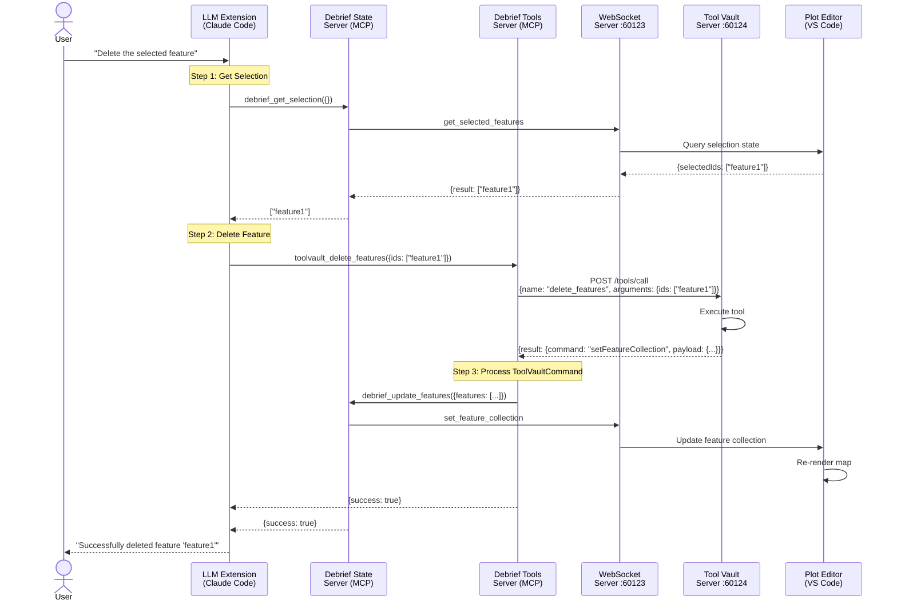

# LLM Integration Architecture for Future Debrief

## Executive Summary

This document presents a comprehensive architectural plan for enabling LLM integrations to orchestrate multi-step maritime analysis workflows through Future Debrief's existing infrastructure.

**Key Challenge**: LLM extensions require standardized MCP (Model Context Protocol) interfaces to interact with Future Debrief's services. Both the Debrief State Server (port 60123) and Tool Vault server (port 60124) need MCP-compatible endpoints.

**Recommended Solution**: Model Context Protocol (MCP) streamable-http transport - a modern HTTP-based protocol that leverages existing HTTP server infrastructure with optional Server-Sent Events (SSE) streaming.

**Target Platforms**: VS Code-native LLM integrations - designed for naval analysts working within VS Code:
- **Phase 1 (Initial)**: GitHub Copilot - easy setup, built into VS Code
- **Phase 2 (Offline)**: together.dev - local LLM support, offline-capable, VS Code integration

---

## Table of Contents

1. [Technology Research & Survey](#1-technology-research--survey)
2. [Wrapper Architecture Design](#2-wrapper-architecture-design)
3. [Integration Patterns & Orchestration](#3-integration-patterns--orchestration)
4. [Security & Operational Constraints](#4-security--operational-constraints)
5. [Implementation Phases & Rollout](#5-implementation-phases--rollout)
6. [Proof of Concept Design Specification](#6-proof-of-concept-design-specification)
7. [Recommendations & Next Steps](#7-recommendations--next-steps)

---

## 1. Technology Research & Survey

### 1.1 MCP Server Architectures

#### Model Context Protocol Overview

The Model Context Protocol (MCP) is an open-source standard for AI-tool integrations that enables LLM extensions to access external tools, databases, and APIs. As of 2025, MCP has become the de facto standard for LLM extension integration.

**Key Characteristics:**
- **Transport Protocols**: streamable-http (modern, HTTP-based), stdio (local processes), SSE (legacy, deprecated)
- **Message Format**: JSON-RPC 2.0 for command/response patterns
- **Tool Interface**: Standardized schema-based tool discovery and execution
- **State Management**: Supports both stateless and stateful interactions

**Transport Protocol Evolution:**
- **stdio**: Original transport for local processes (1:1 client-server, desktop apps)
- **SSE**: Early HTTP transport (deprecated as of 2025-03-26)
- **streamable-http**: Modern HTTP transport (introduced 2025-03-26) - **recommended for production**

#### Streamable-HTTP MCP Transport

**Introduced 2025-03-26** as the modern replacement for SSE transport. Streamable-http is the **recommended transport for production deployments**.

**Advantages:**
- ✅ **Production-ready**: Designed for web applications and remote deployments
- ✅ **Multiple concurrent clients**: Unlike stdio (1:1), supports many clients simultaneously
- ✅ **Leverages existing infrastructure**: Uses standard HTTP servers (Express, FastAPI, etc.)
- ✅ **Optional SSE streaming**: Server-to-client notifications and multi-message responses
- ✅ **Native VS Code extension support**: Continue.dev, GitHub Copilot (2025+)
- ✅ **Simple configuration**: Just a URL endpoint
- ✅ **Language agnostic**: Any HTTP server can implement it

**Configuration Example:**
```json
{
  "mcpServers": {
    "debrief-state": {
      "type": "streamable-http",
      "url": "http://localhost:60123/mcp"
    },
    "tool-vault": {
      "type": "streamable-http",
      "url": "http://localhost:60124/mcp"
    }
  }
}
```

**Protocol Flow:**
- **POST /mcp**: Client sends JSON-RPC 2.0 request
- **GET /mcp**: Optional SSE endpoint for server-initiated messages
- **Response**: JSON-RPC 2.0 response (immediate or streamed)
- **Lifecycle**: Server runs independently, clients connect via HTTP

**Key Architectural Fit:**
- ✅ Debrief State Server (60123) is already HTTP-based
- ✅ Tool Vault server (60124) already runs FastAPI
- ✅ **No additional processes needed** - just add MCP endpoints to existing servers!

### 1.2 Wrapper Technologies Comparison

| Technology | Pros | Cons | LLM Compatibility | Effort |
|------------|------|------|------------------|--------|
| **MCP streamable-http** | ✅ **RECOMMENDED**<br>Leverages existing HTTP servers<br>Multiple concurrent clients<br>Production-ready | Slightly more complex than stdio | ✅ GitHub Copilot<br>✅ together.dev<br>✅ All MCP clients | **Low**<br>(add endpoints to existing servers) |
| **MCP stdio** | Simple for single-client desktop apps | 1:1 client-server only<br>Requires process management | ✅ GitHub Copilot<br>✅ together.dev | Medium |
| **HTTP REST (non-MCP)** | Universal access, language agnostic | No standardized schema discovery | ⚠️ Via HTTP tool<br>(less efficient) | Medium |
| **CLI Tool Wrapper** | Simple bash integration | Limited state management, text parsing | ⚠️ Via Bash tool<br>(inefficient) | Low |

### 1.3 VS Code LLM Integration Platforms

**Context**: Naval analysts will interact with LLMs from INSIDE VS Code (Future Debrief extension), not external tools. All platforms must integrate natively within VS Code.

| Capability | GitHub Copilot | together.dev | Cline (Claude Dev) |
|------------|----------------|--------------|-------------------|
| **MCP streamable-http** | ✅ Native support | ✅ Native support | ✅ Native support |
| **MCP stdio** | ✅ Native support | ✅ Native support | ✅ Native support |
| **VS Code Integration** | ✅ Built-in extension | ✅ VS Code extension | ✅ VS Code extension |
| **Local Operation** | ❌ Cloud-only | ✅ 100% local/offline | ⚠️ API key required |
| **Multi-step Workflows** | ✅ Agentic mode | ✅ Tool orchestration | ✅ Agentic mode |
| **User Experience** | Chat panel + inline | Chat panel + inline | Chat panel + commands |
| **Setup Complexity** | **Low** (built-in) | Medium (local LLM config) | Medium (API setup) |
| **Cost** | Subscription | Free (local) | Usage-based |
| **Data Privacy** | ⚠️ Cloud (data leaves machine) | ✅ 100% local | ⚠️ Cloud |

#### Phase 1 (Initial): GitHub Copilot

**Why GitHub Copilot First**:
- ✅ **Built into VS Code**: Already installed for most developers
- ✅ **Easy setup**: Just authenticate with GitHub account
- ✅ **Native MCP support**: streamable-http endpoints work out of the box
- ✅ **Good UX**: Familiar chat panel + inline suggestions
- ✅ **Fast testing**: Quick validation of MCP server integration
- ⚠️ **Trade-off**: Cloud-based, requires internet connection, subscription cost

**Setup for Naval Analysts**:
1. Ensure GitHub Copilot extension is installed (built into VS Code)
2. Authenticate with GitHub account (requires Copilot subscription)
3. Configure MCP servers in VS Code settings
4. Start using LLM within Future Debrief!

**GitHub Copilot Configuration** (VS Code settings.json):
```json
{
  "github.copilot.advanced": {
    "mcpServers": {
      "debrief-state": {
        "type": "streamable-http",
        "url": "http://localhost:60123/mcp"
      },
      "tool-vault": {
        "type": "streamable-http",
        "url": "http://localhost:60124/mcp"
      }
    }
  }
}
```

#### Phase 2 (Offline): together.dev

**Why together.dev for Offline/Local**:
- ✅ **100% local operation**: No data leaves the machine (security/privacy)
- ✅ **Offline-capable**: Works without internet connection
- ✅ **VS Code integration**: Native extension for Future Debrief
- ✅ **MCP streamable-http support**: Works with our MCP servers
- ✅ **Local LLM support**: Connect to locally-running LLMs
- ✅ **Multiple models**: Easy to switch between different local models

**Setup for Naval Analysts** (TBD - Phase 2):
1. Install together.dev extension in VS Code
2. Configure local LLM backend (details TBD based on together.dev documentation)
3. Configure MCP servers (similar to Copilot)
4. Fully offline LLM orchestration within Future Debrief!

**together.dev Configuration** (expected format):
```json
{
  "together": {
    "mcpServers": {
      "debrief-state": {
        "type": "streamable-http",
        "url": "http://localhost:60123/mcp"
      },
      "tool-vault": {
        "type": "streamable-http",
        "url": "http://localhost:60124/mcp"
      }
    }
  }
}
```

### 1.4 Authentication Patterns

#### For Local Services (Current Architecture)

**Current State:**
- WebSocket server (60123): No authentication (localhost-only)
- Tool Vault server (60124): No authentication (localhost-only)

**Security Model:**
- Services bound to localhost interface only
- VS Code extension manages service lifecycle
- Network isolation provides security boundary

#### For LLM-Initiated Operations

**Recommended Pattern: No Additional Authentication (Phase 1)**

**Rationale:**
1. **Trust Boundary**: LLM extensions run in user's environment with full user privileges
2. **Service Architecture**: Services already localhost-only with no external exposure
3. **Operational Simplicity**: No auth reduces complexity for initial rollout
4. **Lifecycle Management**: VS Code extension controls service lifecycle

**Future Enhancement (Phase 2+):**
- **Audit Logging**: Track all LLM-initiated operations for debugging
- **Rate Limiting**: Prevent accidental resource exhaustion
- **API Keys (Optional)**: For multi-tenant or remote deployment scenarios
- **Role-Based Access**: If exposing to external systems

---

## 2. Wrapper Architecture Design

### 2.1 Recommended Architecture: Native streamable-http MCP Endpoints

**UPDATED RECOMMENDATION** (Based on streamable-http discovery):

Given that:
1. Both servers (Debrief State :60123, Tool Vault :60124) already run HTTP
2. streamable-http is the modern, production-ready MCP transport (introduced 2025-03-26)
3. No process management needed - just add `/mcp` endpoints to existing servers
4. Supports multiple concurrent LLM clients (unlike stdio's 1:1 limitation)

The recommended approach is **maximally simplified**:

1. **Debrief State Server** - Add `/mcp` endpoint to existing HTTP/WebSocket server
2. **Tool Vault Server** - Add `/mcp` endpoint to existing FastAPI server

**Architecture Benefits**:

✅ **Minimal code changes** - Add one endpoint to each existing server
✅ **No new processes** - Servers already running on ports 60123 and 60124
✅ **Production-ready** - streamable-http designed for web deployments
✅ **Multiple clients** - GitHub Copilot + together.dev + custom scripts simultaneously
✅ **Future-proof** - HTTP-based protocol supports remote deployments if needed

**Key Insight**: Both servers already have the infrastructure needed. Just add MCP-compliant `/mcp` POST endpoint that speaks JSON-RPC 2.0.

#### Architecture Diagram

```mermaid
graph TB
    subgraph "VS Code LLM Integrations"
        GH[GitHub Copilot<br/>Phase 1: Initial]
        TOG[together.dev<br/>Phase 2: Offline]
    end

    subgraph "Debrief State Server :60123"
        MCP_DS[/mcp endpoint<br/>MCP JSON-RPC 2.0]
        WS[WebSocket<br/>Legacy API]
        HANDLER_DS[Command Handler<br/>Shared Logic]
    end

    subgraph "Tool Vault Server :60124"
        MCP_TV[/mcp endpoint<br/>MCP JSON-RPC 2.0]
        REST_TV[REST API<br/>Legacy endpoints]
        HANDLER_TV[Tool Execution<br/>Handler]
    end

    subgraph "VS Code Extension"
        PE[Plot Editor]
        GM[Global Controller]
    end

    subgraph "User Code"
        PYSCRIPT[Python Scripts<br/>debrief_api.py]
        TSCODE[TypeScript/JS<br/>Custom tools]
    end

    GH -->|HTTP POST /mcp| MCP_DS
    GH -->|HTTP POST /mcp| MCP_TV
    TOG -->|HTTP POST /mcp| MCP_DS
    TOG -->|HTTP POST /mcp| MCP_TV

    MCP_DS --> HANDLER_DS
    WS --> HANDLER_DS
    PYSCRIPT -->|WebSocket or HTTP| WS
    TSCODE -->|HTTP| MCP_DS

    MCP_TV --> HANDLER_TV
    REST_TV --> HANDLER_TV

    HANDLER_DS -->|Update state| PE
    HANDLER_DS -->|Update state| GM

    style MCP_DS fill:#90EE90
    style MCP_TV fill:#90EE90
    style HANDLER_DS fill:#e1f5ff
    style HANDLER_TV fill:#e1f5ff
    style WS fill:#FFE4B5
    style REST_TV fill:#FFE4B5
    style PE fill:#fff4e1
    style GM fill:#fff4e1
```

### 2.2 Debrief State Server (Native MCP streamable-http)

**Purpose**: Plot state management server with MCP endpoint.

**Implementation Language**: TypeScript/Node.js (matches existing codebase in `apps/vs-code/src/services/debriefWebSocketServer.ts`)

**Architecture**: Single server with dual interfaces:
- **`POST /mcp` endpoint**: For LLM extensions (MCP JSON-RPC 2.0 over streamable-http)
- **WebSocket/HTTP interface**: For existing clients (`debrief_api.py`, VS Code extension)
- **Shared command handler**: Same logic for both interfaces

**Key Simplification**: No separate MCP server package needed - just add one endpoint to existing server.

**MCP Tool Schema**:

```typescript
// Tool: get_feature_collection
{
  name: "debrief_get_features",
  description: "Get all features from the active plot",
  inputSchema: {
    type: "object",
    properties: {
      filename: {
        type: "string",
        description: "Optional plot filename. If omitted, uses active plot."
      }
    }
  }
}

// Tool: get_selected_features
{
  name: "debrief_get_selection",
  description: "Get currently selected feature IDs",
  inputSchema: {
    type: "object",
    properties: {
      filename: { type: "string", description: "Optional plot filename" }
    }
  }
}

// Tool: apply_debrief_command (NEW - KEY INTEGRATION POINT)
{
  name: "debrief_apply_command",
  description: "Apply a DebriefCommand result to update plot state",
  inputSchema: {
    type: "object",
    properties: {
      command: {
        type: "object",
        description: "DebriefCommand object from Tool Vault execution (currently named ToolVaultCommand in schemas - to be refactored)",
        properties: {
          command: { type: "string", enum: ["setFeatureCollection", "showText", "highlightFeatures", "updateViewport"] },
          payload: { type: "object", description: "Command-specific payload" }
        },
        required: ["command", "payload"]
      },
      filename: { type: "string", description: "Optional plot filename" }
    },
    required: ["command"]
  }
}

// Tool: set_selected_features
{
  name: "debrief_set_selection",
  description: "Update selected features",
  inputSchema: {
    type: "object",
    properties: {
      selectedIds: {
        type: "array",
        items: { type: "string" },
        description: "Array of feature IDs to select"
      },
      filename: { type: "string", description: "Optional plot filename" }
    },
    required: ["selectedIds"]
  }
}

// Additional tools: get_time, set_time, get_viewport, set_viewport,
// zoom_to_selection, list_open_plots
```

**Key Design**: The `debrief_apply_command` tool is the **universal integration point** for plot manipulation. Any code can produce `DebriefCommand` objects (currently named `ToolVaultCommand` in schemas), which the State Server executes to update plot state.

**Schema Refactoring**: A separate task will rename `ToolVaultCommand` → `DebriefCommand` in `libs/shared-types/` to reflect accurate terminology.

**Architectural Benefit**: Once the Debrief server accepts `DebriefCommand`, it becomes a universal protocol:
- Tool Vault tools produce commands
- User Python scripts produce commands (via `debrief_api.py`)
- User TypeScript/JavaScript produces commands
- LLM-generated code produces commands
- **Single command format, multiple producers**

**Implementation Details**:

```typescript
// apps/vs-code/src/services/debriefStateServer.ts

import express from 'express';
import { handleCommand } from './commandHandler';
import toolIndex from '../../dist/mcp-tools.json'; // Pre-cached at build

const app = express();
app.use(express.json());

// MCP streamable-http endpoint (for LLM extensions)
app.post('/mcp', async (req, res) => {
  const request = req.body; // JSON-RPC 2.0 request

  try {
    switch (request.method) {
      case 'tools/list':
        // Return pre-cached tool index
        res.json({
          jsonrpc: '2.0',
          id: request.id,
          result: { tools: toolIndex.tools }
        });
        break;

      case 'tools/call':
        // Route to shared command handler
        const result = await handleCommand(
          request.params.name,
          request.params.arguments
        );
        res.json({
          jsonrpc: '2.0',
          id: request.id,
          result
        });
        break;

      default:
        res.status(400).json({
          jsonrpc: '2.0',
          id: request.id,
          error: {
            code: -32601,
            message: `Method not found: ${request.method}`
          }
        });
    }
  } catch (error) {
    res.status(500).json({
      jsonrpc: '2.0',
      id: request.id,
      error: {
        code: -32603,
        message: error.message
      }
    });
  }
});

// Legacy WebSocket/HTTP interface (for existing clients)
app.post('/api/command', async (req, res) => {
  const result = await handleCommand(req.body.command, req.body.params);
  res.json(result);
});

app.listen(60123, () => console.log('Debrief State Server on :60123 (MCP + WebSocket)'));
```

**Pre-cached Tool Index** (generated during build):
```typescript
// Build script: apps/vs-code/scripts/generate-mcp-tools.ts
const tools = [
  {
    name: "debrief_get_selection",
    description: "Get currently selected feature IDs",
    inputSchema: { /* ... */ }
  },
  {
    name: "debrief_apply_command",
    description: "Apply a DebriefCommand to update plot state",
    inputSchema: { /* ... */ }
  },
  // ... all tools
];

fs.writeFileSync('dist/mcp-tools.json', JSON.stringify({ tools }));
```

**Shared Command Handler** (Reuses existing ToolVaultCommandHandler):
```typescript
// apps/vs-code/src/services/commandHandler.ts
import { ToolVaultCommandHandler } from '@debrief/web-components/services';

// Singleton instance (already exists in VS Code extension)
const commandHandler = new ToolVaultCommandHandler(stateSetter);

export async function handleCommand(command: string, params: any) {
  switch (command) {
    case 'debrief_get_selection':
      return globalController.getSelection(params.filename);

    case 'debrief_apply_command':
      // Delegate to existing ToolVaultCommandHandler!
      // No duplication - same logic used by tool-vault tools
      const results = await commandHandler.processCommands(
        [params.command],  // Array of DebriefCommands
        currentFeatureCollection
      );
      return results[0];

    case 'debrief_get_features':
      return globalController.getFeatureCollection(params.filename);

    // ... other commands
  }
}
```

**Key Refactoring**: The Debrief State Server **reuses** the existing `ToolVaultCommandHandler` from `@debrief/web-components` instead of duplicating command processing logic. This ensures:
- ✅ **No duplication** - Same code handles commands from both tool-vault tools and MCP tools
- ✅ **Consistent behavior** - Identical command execution regardless of source
- ✅ **Simpler maintenance** - Single implementation to test and update

**Benefits**:
- ✅ **No wrapper layer** - Single server with dual interface
- ✅ **Shared handlers** - Same logic for MCP and legacy APIs
- ✅ **Pre-cached index** - Tool list generated at build time (fast startup)
- ✅ **Minimal new code** - Just one POST endpoint with JSON-RPC routing
- ✅ **No separate package** - Part of VS Code extension
- ✅ **Multiple clients** - LLM extensions + scripts + VS Code all access same server

### 2.3 Tool Vault Server (Native MCP streamable-http)

**Purpose**: Expose Tool Vault's maritime analysis tools through MCP endpoint.

**Implementation Language**: Python/FastAPI (existing codebase in `libs/tool-vault-packager/server.py`)

**Architecture**: Add `/mcp` endpoint to existing FastAPI server (port 60124)

**Key Advantage**: Tool Vault already has `/tools/list` and `/tools/call` endpoints - MCP endpoint just wraps them in JSON-RPC 2.0 format!

**Implementation Details**:

```python
# libs/tool-vault-packager/server.py

from fastapi import FastAPI
from discovery import discover_tools

app = FastAPI()
tools_cache = discover_tools("./tools")  # Load once at startup

# MCP streamable-http endpoint (NEW)
@app.post("/mcp")
async def mcp_endpoint(request: dict):
    """MCP JSON-RPC 2.0 endpoint for LLM extensions."""
    try:
        method = request.get("method")
        request_id = request.get("id")

        if method == "tools/list":
            # Return tools in MCP format (already compatible!)
            return {
                "jsonrpc": "2.0",
                "id": request_id,
                "result": {
                    "tools": [
                        {
                            "name": tool["name"],
                            "description": tool["description"],
                            "inputSchema": tool["inputSchema"]
                        }
                        for tool in tools_cache
                    ]
                }
            }

        elif method == "tools/call":
            # Call tool and return result
            tool_name = request["params"]["name"]
            arguments = request["params"]["arguments"]

            result = await call_tool(tool_name, arguments)

            return {
                "jsonrpc": "2.0",
                "id": request_id,
                "result": result
            }

        else:
            return {
                "jsonrpc": "2.0",
                "id": request_id,
                "error": {
                    "code": -32601,
                    "message": f"Method not found: {method}"
                }
            }

    except Exception as e:
        return {
            "jsonrpc": "2.0",
            "id": request.get("id"),
            "error": {
                "code": -32603,
                "message": str(e)
            }
        }

# Existing REST endpoints (unchanged)
@app.get("/tools/list")
async def list_tools():
    return {"tools": tools_cache}

@app.post("/tools/call")
async def call_tool_rest(request: dict):
    return await call_tool(request["name"], request["arguments"])
```

**Benefits**:
- ✅ **Minimal code** - Just one new endpoint wrapping existing logic
- ✅ **No transformation needed** - Tool Vault schema already MCP-compatible
- ✅ **Existing infrastructure** - FastAPI server already running
- ✅ **Zero downtime** - Add MCP without touching existing endpoints

### 2.4 Architectural Decision: streamable-http vs stdio

With the discovery of streamable-http transport, the architectural decision is simplified:

| Aspect | streamable-http (CHOSEN) | stdio |
|--------|--------------------------|-------|
| **Implementation Effort** | **Low** (add endpoints to existing servers) | Medium (new stdio wrappers) |
| **Server Infrastructure** | ✅ Use existing HTTP servers | ❌ Requires new process management |
| **Multiple Clients** | ✅ Supports concurrent clients | ❌ 1:1 client-server only |
| **Production Readiness** | ✅ Designed for web deployments | ⚠️ Desktop app focused |
| **Code Changes** | ✅ Additive only (new endpoints) | Additive (new processes) |
| **Deployment** | ✅ No new services | Requires process lifecycle management |
| **Future-Proof** | ✅ Supports remote access | Local-only |

**Recommendation**: **streamable-http for both servers**

**Rationale**:
1. **Minimal effort**: Both servers already run HTTP - just add `/mcp` endpoint
2. **Production-ready**: Modern transport designed for web applications
3. **No new infrastructure**: Uses existing FastAPI (Tool Vault) and Express (Debrief State)
4. **Multiple clients**: LLM extensions can connect simultaneously
5. **Non-breaking**: Legacy APIs remain unchanged

### 2.5 MCP Configuration and Deployment

#### User Configuration

**Workspace Configuration** (auto-configured when Future Debrief extension activates):

VS Code will automatically configure MCP servers in workspace settings when the Future Debrief extension starts. Analysts don't need to manually configure these endpoints.

**Manual Configuration** (if needed - VS Code settings.json):
```json
{
  "github.copilot.advanced": {
    "mcpServers": {
      "debrief-state": {
        "type": "streamable-http",
        "url": "http://localhost:60123/mcp"
      },
      "tool-vault": {
        "type": "streamable-http",
        "url": "http://localhost:60124/mcp"
      }
    }
  }
}
```

#### Deployment Architecture

**No additional services needed!** Both servers already running:
- Debrief State Server (port 60123) - Started by VS Code extension
- Tool Vault Server (port 60124) - Started by VS Code extension or standalone

**Startup sequence**:
1. VS Code extension activates
2. Starts Debrief State Server with `/mcp` endpoint
3. Starts Tool Vault Server (if not already running) with `/mcp` endpoint
4. LLM extensions connect via HTTP to both endpoints
5. Ready to orchestrate maritime workflows!

#### Error Handling Strategy

**JSON-RPC 2.0 Error Codes**:
```typescript
// Standard JSON-RPC error codes
const JSON_RPC_ERRORS = {
  PARSE_ERROR: -32700,      // Invalid JSON
  INVALID_REQUEST: -32600,  // Invalid request object
  METHOD_NOT_FOUND: -32601, // Method does not exist
  INVALID_PARAMS: -32602,   // Invalid method parameters
  INTERNAL_ERROR: -32603,   // Internal server error

  // Application-specific codes
  MULTIPLE_PLOTS: -32001,   // Multiple plots open (user must specify)
  PLOT_NOT_FOUND: -32002,   // Plot file not found or not open
  FEATURE_NOT_FOUND: -32003 // Feature ID not found
};
```

**Error Response Format**:
```json
{
  "jsonrpc": "2.0",
  "id": 1,
  "error": {
    "code": -32001,
    "message": "Multiple plots open, please specify filename",
    "data": {
      "available_plots": [
        {"filename": "mission1.plot.json", "title": "Mission 1"},
        {"filename": "mission2.plot.json", "title": "Mission 2"}
      ]
    }
  }
}
```

**Server Health Checks**:
```typescript
// Health check endpoint for both servers
app.get('/health', (req, res) => {
  res.json({
    status: 'ok',
    server: 'debrief-state',
    mcp_endpoint: '/mcp',
    port: 60123
  });
});
```

---

## 3. Integration Patterns & Orchestration

### 3.1 Multi-Step Workflow Coordination

#### Example: Delete Selected Feature Workflow

**Objective**: Delete a selected maritime feature using LLM automation

**Steps**:
1. **Retrieve**: Get first selected feature ID from State Server
2. **Process**: Pass feature ID to Tool Vault's `delete-features` tool (returns `ToolVaultCommand`)
3. **Apply**: Pass `ToolVaultCommand` directly to State Server (no redundant fetch!)

**LLM Orchestration Example** (applies to both GitHub Copilot and together.dev):

```typescript
// Step 1: Get selection
const selection = await callTool('debrief_get_selection', {});
const selectedIds = selection.selectedIds;

if (selectedIds.length === 0) {
  return { error: "No features selected" };
}

const featureId = selectedIds[0];

// Step 2: Delete feature via Tool Vault CLI
const deleteResult = await callBash(
  `python toolvault.pyz call-tool delete_features '{"ids": ["${featureId}"]}'`
);

// Step 3: Apply ToolVaultCommand directly to State Server
if (deleteResult.command === 'setFeatureCollection') {
  // Pass the ToolVaultCommand to State Server for execution
  await callTool('debrief_apply_command', {
    command: deleteResult
  });
}

return { success: true, deletedId: featureId };
```

**Key Efficiency**: Tool Vault returns the **new state** (updated feature collection), which we pass directly to the State Server. No need to fetch the feature collection again!

### 3.2 Standardized Request/Response Formats

#### MCP JSON-RPC Request Format

```json
{
  "jsonrpc": "2.0",
  "id": 1,
  "method": "tools/call",
  "params": {
    "name": "debrief_get_selection",
    "arguments": {
      "filename": "mission1.plot.json"
    }
  }
}
```

#### MCP JSON-RPC Response Format

**Success**:
```json
{
  "jsonrpc": "2.0",
  "id": 1,
  "result": {
    "content": [
      {
        "type": "text",
        "text": "Selected features: [\"feature1\", \"feature2\"]"
      }
    ]
  }
}
```

**Error**:
```json
{
  "jsonrpc": "2.0",
  "id": 1,
  "error": {
    "code": -32002,
    "message": "Plot file not found or not open",
    "data": {
      "filename": "mission1.plot.json"
    }
  }
}
```

### 3.3 DebriefCommand Result Handling

**Pattern**: `DebriefCommand` is a **universal command protocol** for plot manipulation.

**TERMINOLOGY NOTE**: These commands are currently called `ToolVaultCommand` in the codebase, but **should be renamed to `DebriefCommand`** to reflect their true purpose:
- ✅ **Produced by**: Tool Vault tools, user Python scripts, user TypeScript/JavaScript code, LLM-generated code
- ✅ **Applied to**: Debrief State Server
- ✅ **Schema location**: `libs/shared-types/` (affects both systems)
- ✅ **Universal interface**: Any code can generate DebriefCommands to manipulate plots

**Prerequisite Task**: Refactor `ToolVaultCommand` → `DebriefCommand` in shared-types schemas (separate issue to be created).

**Command Producers** (multiple sources):
1. **Tool Vault tools**: Maritime analysis tools returning plot updates
2. **User workspace scripts**: Python/JavaScript scripts in `workspace/` directory
3. **VS Code extensions**: User-authored extensions manipulating plots
4. **LLM-generated code**: Code written by LLMs and executed in workspace

**Command Types**:
- `setFeatureCollection`: Update entire feature collection
- `showText`: Display notification to user
- `highlightFeatures`: Select/highlight specific features
- `updateViewport`: Adjust map viewport

**Efficient Integration Pattern** (Direct pass-through):

```typescript
// LLM Extension orchestrates the workflow
async function deleteSelectedFeature() {
  // Step 1: Get selection
  const selection = await callTool('debrief_get_selection', {});
  const featureId = selection.selectedIds[0];

  // Step 2: Call Tool Vault via CLI
  const deleteResult = await callBash(
    `python toolvault.pyz call-tool delete_features '{"ids": ["${featureId}"]}'`
  );
  // Returns: { command: "setFeatureCollection", payload: { features: [...] } }
  // Note: This is a DebriefCommand (currently named ToolVaultCommand in schemas)

  // Step 3: Pass DebriefCommand directly to State Server
  await callTool('debrief_apply_command', {
    command: deleteResult
  });

  return { success: true };
}
```

**State Server Implementation** (`debrief_apply_command` tool):

```typescript
async function applyDebriefCommand(command: DebriefCommand, filename?: string) {
  switch (command.command) {
    case 'setFeatureCollection':
      // Apply feature collection update to plot
      await sendToDebriefAPI('set_feature_collection', {
        data: command.payload,
        filename
      });
      return { success: true, message: `Updated ${command.payload.features.length} features` };

    case 'highlightFeatures':
      // Update selection
      await sendToDebriefAPI('set_selected_features', {
        ids: command.payload.featureIds,
        filename
      });
      return { success: true, message: `Highlighted ${command.payload.featureIds.length} features` };

    case 'showText':
      // Return text for LLM to display
      return { success: true, message: command.payload };

    case 'updateViewport':
      // Update map viewport
      await sendToDebriefAPI('set_viewport', {
        viewportState: command.payload,
        filename
      });
      return { success: true, message: 'Viewport updated' };

    default:
      throw new Error(`Unknown DebriefCommand: ${command.command}`);
  }
}
```

**Key Efficiency**: Tool Vault returns the **new state** (as a `DebriefCommand`), State Server applies it directly. No redundant fetches!

**Implementation Note**: The current schemas use `ToolVaultCommand` - this will be refactored to `DebriefCommand` as a prerequisite or parallel task.

**Future Workflow Example** (User Python script):

```python
# User script in workspace/
from debrief_api import debrief

# Execute some analysis
analysis_result = analyze_track_data()

# Generate DebriefCommand to highlight results
highlight_command = {
    "command": "highlightFeatures",
    "payload": {
        "featureIds": analysis_result.interesting_features
    }
}

# Apply command via debrief_api
debrief.apply_command(highlight_command)
```

This makes `DebriefCommand` a **first-class API** for plot manipulation, not just an internal Tool Vault implementation detail.

### 3.4 Multi-Plot Scenario Handling

**Challenge**: Multiple plot files may be open simultaneously.

**Solution Strategy**:

1. **Explicit Filename Parameter** (Preferred):
   ```typescript
   await callTool('debrief_get_selection', {
     filename: 'mission1.plot.json'
   });
   ```

2. **Interactive Selection** (Fallback):
   ```typescript
   // MCP server detects MULTIPLE_PLOTS error
   // Returns list of available plots as error data
   {
     "error": {
       "code": -32001,
       "message": "Multiple plots open, please specify filename",
       "data": {
         "available_plots": [
           { "filename": "mission1.plot.json", "title": "Mission 1" },
           { "filename": "mission2.plot.json", "title": "Mission 2" }
         ]
       }
     }
   }

   // LLM can then prompt user or use first plot
   ```

3. **Active Plot Heuristic** (Future Enhancement):
   - Track most recently focused plot in State Server
   - Use as default when filename omitted

### 3.5 Error Handling Patterns

#### Connection Failures

**Scenario**: WebSocket server not running

**Pattern**:
```typescript
try {
  await connectWebSocket('ws://localhost:60123');
} catch (error) {
  if (error instanceof WebSocketConnectionError) {
    return {
      error: {
        code: -32003,
        message: "Debrief WebSocket server not available. Ensure VS Code extension is running.",
        data: { port: 60123 }
      }
    };
  }
  throw error;
}
```

#### Tool Execution Failures

**Scenario**: Tool Vault returns error

**Pattern**:
```typescript
const result = await callToolVault('word_count', { text: 'hello' });

if (result.isError) {
  return {
    error: {
      code: -32004,
      message: `Tool execution failed: ${result.error}`,
      data: { toolName: 'word_count', originalError: result.error }
    }
  };
}
```

#### Retry Logic

**Pattern**: Exponential backoff for transient failures

```typescript
async function callWithRetry<T>(
  fn: () => Promise<T>,
  maxRetries: number = 3,
  baseDelay: number = 1000
): Promise<T> {
  for (let attempt = 0; attempt < maxRetries; attempt++) {
    try {
      return await fn();
    } catch (error) {
      if (attempt === maxRetries - 1) throw error;

      // Only retry on specific error codes
      if (isRetryableError(error)) {
        const delay = baseDelay * Math.pow(2, attempt);
        await sleep(delay);
        continue;
      }

      throw error;
    }
  }
}

function isRetryableError(error: unknown): boolean {
  return error instanceof WebSocketConnectionError ||
         (error instanceof ToolVaultError && error.code === 503);
}
```

---

## 4. Security & Operational Constraints

### 4.1 Authentication/Authorization Model

#### Phase 1: Localhost-Only Security Model

**No Additional Authentication Required**

**Security Boundaries**:
1. **Network Isolation**: Services bound to `127.0.0.1` interface only
2. **Process Isolation**: VS Code extension manages service lifecycle
3. **User Context**: LLM extensions run with user's OS permissions
4. **Trust Model**: User trusts their own LLM extensions

**Threat Model**:
- ✅ Protected: External network access (localhost-only)
- ✅ Protected: Unauthorized process access (OS-level permissions)
- ⚠️ Assumed: User trusts LLM extensions they install
- ⚠️ Assumed: No malicious processes on user's machine

#### Phase 2+: Enhanced Security (Optional)

**API Key Authentication**:
```typescript
// Generate API key on extension startup
const apiKey = crypto.randomBytes(32).toString('hex');

// Store in environment variable for MCP servers
process.env.DEBRIEF_API_KEY = apiKey;

// MCP server validates on each request
function validateApiKey(request: MCPRequest): boolean {
  return request.apiKey === process.env.DEBRIEF_API_KEY;
}
```

**Benefits**:
- Enables multi-tenant scenarios (future)
- Provides audit trail for API usage
- Allows rate limiting per client

**Trade-offs**:
- Increased complexity
- Key management overhead
- Not needed for Phase 1 localhost deployment

### 4.2 Rate Limiting Strategies

#### Purpose
Prevent accidental resource exhaustion from LLM-initiated operations (e.g., infinite loops, rapid polling).

#### Implementation Pattern

**Token Bucket Algorithm**:
```typescript
class RateLimiter {
  private tokens: number;
  private lastRefill: number;

  constructor(
    private maxTokens: number = 100,
    private refillRate: number = 10 // tokens per second
  ) {
    this.tokens = maxTokens;
    this.lastRefill = Date.now();
  }

  async acquire(): Promise<boolean> {
    this.refill();

    if (this.tokens >= 1) {
      this.tokens -= 1;
      return true;
    }

    return false;
  }

  private refill(): void {
    const now = Date.now();
    const elapsed = (now - this.lastRefill) / 1000;
    const tokensToAdd = elapsed * this.refillRate;

    this.tokens = Math.min(this.maxTokens, this.tokens + tokensToAdd);
    this.lastRefill = now;
  }
}
```

**Configuration**:
```typescript
const rateLimiter = new RateLimiter(
  100,  // max 100 requests in bucket
  10    // refill 10 requests/second
);

// In MCP tool handler
if (!await rateLimiter.acquire()) {
  return {
    error: {
      code: -32005,
      message: "Rate limit exceeded. Please slow down requests."
    }
  };
}
```

**Recommended Limits**:
- **Default**: 10 requests/second, burst of 100
- **Feature Updates**: 5 requests/second (more expensive operations)
- **Tool Vault Calls**: 2 requests/second (external service dependency)

### 4.3 Resource Sandboxing

#### Memory Limits

**Node.js Process Limits**:
```json
{
  "command": "node",
  "args": [
    "--max-old-space-size=512",  // 512MB heap limit
    "./dist/debrief-state-server/index.js"
  ]
}
```

#### Connection Pooling

**WebSocket Connection Management**:
```typescript
class ConnectionPool {
  private connections = new Map<string, WebSocket>();
  private readonly maxConnections = 5;

  async getConnection(filename?: string): Promise<WebSocket> {
    const key = filename || 'default';

    if (this.connections.size >= this.maxConnections) {
      // Close oldest connection
      const [oldestKey] = this.connections.keys();
      this.connections.get(oldestKey)?.close();
      this.connections.delete(oldestKey);
    }

    if (!this.connections.has(key)) {
      this.connections.set(key, await this.createConnection());
    }

    return this.connections.get(key)!;
  }
}
```

#### Timeout Protection

**Request Timeouts**:
```typescript
async function callWithTimeout<T>(
  fn: () => Promise<T>,
  timeoutMs: number = 30000
): Promise<T> {
  return Promise.race([
    fn(),
    new Promise<never>((_, reject) =>
      setTimeout(() => reject(new Error('Request timeout')), timeoutMs)
    )
  ]);
}
```

### 4.4 Audit Logging Specification

#### Log Levels

- **DEBUG**: Detailed protocol messages, state transitions
- **INFO**: Tool calls, successful operations, connection events
- **WARN**: Retries, rate limiting, deprecation warnings
- **ERROR**: Failures, exceptions, connection errors

#### Structured Logging Format

```typescript
interface LogEntry {
  timestamp: string;      // ISO 8601
  level: 'DEBUG' | 'INFO' | 'WARN' | 'ERROR';
  service: string;        // 'debrief-state' | 'debrief-tools'
  operation: string;      // e.g., 'tool_call', 'websocket_connect'
  toolName?: string;      // MCP tool name
  duration?: number;      // milliseconds
  success: boolean;
  error?: {
    code: string;
    message: string;
  };
  metadata?: Record<string, unknown>;
}
```

#### Example Log Entries

```json
{
  "timestamp": "2025-10-03T14:23:45.123Z",
  "level": "INFO",
  "service": "debrief-state",
  "operation": "tool_call",
  "toolName": "debrief_get_selection",
  "duration": 45,
  "success": true,
  "metadata": {
    "filename": "mission1.plot.json",
    "selectedCount": 2
  }
}

{
  "timestamp": "2025-10-03T14:23:50.456Z",
  "level": "ERROR",
  "service": "debrief-tools",
  "operation": "tool_call",
  "toolName": "toolvault_delete_features",
  "duration": 1200,
  "success": false,
  "error": {
    "code": "EXECUTION_FAILED",
    "message": "Tool execution failed: Feature ID not found"
  }
}
```

#### Log Storage

**Development**: Console output (captured by extension logs)

**Production**: Rotate logs to files
```typescript
import winston from 'winston';

const logger = winston.createLogger({
  level: process.env.LOG_LEVEL || 'info',
  format: winston.format.json(),
  transports: [
    new winston.transports.File({
      filename: 'debrief-mcp-error.log',
      level: 'error',
      maxsize: 5242880, // 5MB
      maxFiles: 5
    }),
    new winston.transports.File({
      filename: 'debrief-mcp-combined.log',
      maxsize: 5242880,
      maxFiles: 5
    }),
    new winston.transports.Console({
      format: winston.format.simple()
    })
  ]
});
```

### 4.5 Input Sanitization & Output Validation

#### Input Validation

**Use Shared Types**:
```typescript
import { SelectionState, FeatureCollection } from '@debrief/shared-types';

function validateSetSelectionInput(args: unknown): SelectionState {
  // Use Pydantic/Zod validation from shared-types
  return SelectionState.parse(args);
}
```

**Sanitize Filename Parameters**:
```typescript
function sanitizeFilename(filename?: string): string | undefined {
  if (!filename) return undefined;

  // Prevent path traversal
  const sanitized = filename.replace(/\.\./g, '').replace(/\//g, '');

  // Ensure .plot.json extension
  if (!sanitized.endsWith('.plot.json')) {
    throw new Error('Invalid filename: must end with .plot.json');
  }

  return sanitized;
}
```

#### Output Validation

**Validate WebSocket Responses**:
```typescript
function validateFeatureCollection(data: unknown): FeatureCollection {
  // Use shared-types validators
  if (!isFeatureCollection(data)) {
    throw new Error('Invalid FeatureCollection received from server');
  }
  return data;
}
```

---

## 5. Implementation Phases & Rollout

### 5.0 Phase 0: ~~Architectural Decision Analysis~~ (OBSOLETE)

**Status**: ✅ **DECISION MADE** - streamable-http transport eliminates wrapper vs refactoring debate

**Discovery**: MCP's streamable-http transport (introduced 2025-03-26) fundamentally changes the architecture:
1. **No wrappers needed**: Both servers already run HTTP - just add `/mcp` POST endpoint
2. **No refactoring needed**: Keep existing WebSocket/REST APIs alongside MCP endpoint
3. **Minimal effort**: ~2-3 days per server (vs weeks for wrapper/refactoring approaches)
4. **Production-ready**: Modern transport designed for web applications

**Decision**: **Add native streamable-http endpoints to both existing servers**

This approach combines the best of both previous options:
- ✅ **Fast delivery** (like wrapper approach): Just add one endpoint
- ✅ **Clean architecture** (like refactoring): No extra layers
- ✅ **Non-breaking** (like wrapper): Existing APIs unchanged
- ✅ **Future-proof** (like HTTP refactoring): Production-ready HTTP transport

#### 5.0.1 Historical Context (For Reference)

**Previous Debate**: This document originally presented a detailed analysis of MCP wrapper vs HTTP refactoring approaches, with decision matrices, timelines, and trade-off comparisons.

**Resolution**: Discovery of streamable-http transport made this entire debate obsolete. Both approaches assumed either stdio wrappers or major refactoring was needed - streamable-http requires neither.

**Lesson**: Always research latest transport options before designing wrapper architectures!

---

### 5.0.2 Existing Code Impact Analysis

**CRITICAL**: This section identifies existing code that MUST be refactored for the streamable-http architecture.

#### Current Tool-Vault Integration Code

**Location**: `apps/vs-code/src/core/globalController.ts`

**Existing Flow**:
1. **Tool Execution**: `executeTool()` method (line 379-399) calls Tool Vault server
2. **Command Processing**: `processToolVaultCommands()` method (line 543-605) handles results
3. **State Updates**: Calls `this.updateState()` to modify editor state

**Current Implementation** (lines 543-605):
```typescript
public async processToolVaultCommands(result: unknown): Promise<void> {
    // Extract commands from tool result
    const commands = this.extractToolVaultCommands(result);

    // Get current feature collection
    const currentFeatureCollection = this.getFeatureCollection() || {
        type: 'FeatureCollection' as const,
        features: []
    };

    // Process commands using ToolVaultCommandHandler
    const results = await this.toolVaultCommandHandler.processCommands(
        commands,
        currentFeatureCollection
    );

    // Update state if commands modified features
    if (latestFeatureCollection) {
        this.updateState(activeEditorId, 'featureCollection', latestFeatureCollection);
        this.triggerDocumentUpdate(activeEditorId);
    }
}
```

**ToolVaultCommandHandler Instance** (line 71):
```typescript
this.toolVaultCommandHandler = new ToolVaultCommandHandler(this.createStateSetter());
```

#### Debrief WebSocket Server Code

**Location**: `apps/vs-code/src/services/debriefWebSocketServer.ts`

**Current Commands** (lines 301-343):
- `get_feature_collection` - Returns active plot's features
- `set_feature_collection` - Updates active plot's features
- `get_selected_features` - Returns selected feature IDs
- `set_selected_features` - Updates selection state
- `update_features`, `add_features`, `delete_features` - Feature manipulation
- `get_time`, `set_time` - Time state management
- `get_viewport`, `set_viewport` - Viewport management
- `zoom_to_selection` - Viewport adjustment
- `list_open_plots` - Multi-plot support

**Current Architecture**:
- WebSocket protocol on port 60123
- Each command has dedicated handler method
- Direct state manipulation via GlobalController

#### Required Refactoring Tasks

**1. Debrief State Server Refactoring**:
- [ ] **Refactor**: `debriefWebSocketServer.ts` → Add HTTP server alongside WebSocket
- [ ] **Add**: Express.js HTTP server with POST `/mcp` endpoint
- [ ] **Modify**: `handleCommand()` to be protocol-agnostic (callable from both WebSocket and HTTP)
- [ ] **Add**: MCP JSON-RPC 2.0 wrapper around existing command handlers
- [ ] **Test**: Ensure WebSocket commands still work (backward compatibility)

**File to modify**: `apps/vs-code/src/services/debriefWebSocketServer.ts`

**2. GlobalController Integration**:
- [ ] **Review**: `processToolVaultCommands()` logic (line 543-605)
- [ ] **Verify**: Existing ToolVaultCommandHandler usage is correct
- [ ] **NO CHANGE**: This code is already using ToolVaultCommandHandler correctly!
- [ ] **Test**: Verify command processing still works after server refactoring

**File to review**: `apps/vs-code/src/core/globalController.ts`

**3. Testing Requirements**:

**Unit Tests**:
- [ ] Test MCP endpoint returns proper JSON-RPC 2.0 responses
- [ ] Test each command via both WebSocket (legacy) and HTTP (new MCP)
- [ ] Test error handling for invalid JSON-RPC requests

**Integration Tests**:
- [ ] Test tool execution → command processing → state update flow
- [ ] Test ToolVaultCommandHandler processes commands correctly
- [ ] Test multi-plot scenarios (MULTIPLE_PLOTS error handling)
- [ ] Test backward compatibility (existing Python scripts via WebSocket)

**End-to-End Tests**:
- [ ] Test LLM extension connects to MCP endpoint
- [ ] Test workflow: get selection → call tool → apply command → verify state
- [ ] Test GitHub Copilot + together.dev integration
- [ ] Test error scenarios (server unavailable, invalid commands)

**Playwright Tests** (existing framework):
- [ ] Add MCP endpoint smoke tests to `apps/vs-code/tests/playwright/`
- [ ] Test HTTP POST /mcp alongside existing WebSocket tests
- [ ] Verify both protocols access same underlying state

**Location**: `apps/vs-code/workspace/tests/` (Python integration tests)

#### Code That Does NOT Need Refactoring

✅ **GlobalController.processToolVaultCommands()**: Already using ToolVaultCommandHandler correctly - no changes needed

✅ **ToolVaultCommandHandler** (`libs/web-components/src/services/ToolVaultCommandHandler.ts`): Reusable service works for both WebSocket and MCP - no changes needed

✅ **Tool Vault Server** (`libs/tool-vault-packager/server.py`): Just add `/mcp` endpoint - existing `/tools/call` unchanged

#### Architecture Clarification

**KEY INSIGHT**: The user identified that there's existing code consuming tool-vault output and submitting changes to the debrief state server. This code is in:

1. **GlobalController.executeTool()** → calls Tool Vault
2. **GlobalController.processToolVaultCommands()** → processes ToolVaultCommands
3. **ToolVaultCommandHandler.processCommands()** → applies commands to state

**The NEW architecture** adds MCP endpoints but **REUSES** this exact same code path:

```
LLM Extension
  ↓ (HTTP POST /mcp)
Debrief State Server (NEW /mcp endpoint)
  ↓ (routes to existing command handlers)
GlobalController.executeTool()
  ↓
Tool Vault Server (NEW /mcp endpoint or existing /tools/call)
  ↓ (returns ToolVaultCommands)
GlobalController.processToolVaultCommands()
  ↓
ToolVaultCommandHandler.processCommands()
  ↓
GlobalController.updateState()
```

**No duplication** - same command handling logic serves both WebSocket and MCP clients!

---

### 5.1 Phase 1: MCP Endpoint Implementation (3-5 days)

**Goal**: Add streamable-http MCP endpoints to both existing servers

**Timeline**: 3-5 days (much faster than original wrapper/refactoring estimates!)

**Deliverables**:

#### Week 1: Core Implementation (3-5 days)

**Debrief State Server** (apps/vs-code - TypeScript/Express):
- [ ] Add POST `/mcp` endpoint with JSON-RPC 2.0 handler
- [ ] Implement `tools/list` method (return pre-cached tool index)
- [ ] Implement `tools/call` method routing to existing command handlers
- [ ] Generate MCP tool index at build time (`scripts/generate-mcp-tools.ts`)
- [ ] Add health check endpoint
- [ ] Error handling with JSON-RPC error codes

**Tool Vault Server** (libs/tool-vault-packager - Python/FastAPI):
- [ ] Add POST `/mcp` endpoint with JSON-RPC 2.0 handler
- [ ] Implement `tools/list` method (wrap existing tool discovery)
- [ ] Implement `tools/call` method (wrap existing tool execution)
- [ ] Error handling with JSON-RPC error codes
- [ ] Update server startup to log MCP endpoint availability

**Documentation**:
- [ ] Update GitHub Copilot configuration guide for streamable-http
- [ ] Document together.dev setup for Phase 2
- [ ] Example workflows: delete feature, filter features, update selection
- [ ] Troubleshooting guide for MCP connection issues

**Testing**:
- [ ] Manual testing with GitHub Copilot
- [ ] Test each MCP tool individually
- [ ] End-to-end workflow testing (multi-step operations)
- [ ] Error scenario testing (invalid requests, server unavailable)
- [ ] Multiple concurrent client testing

#### Success Criteria

- ✅ Both servers expose `/mcp` endpoints responding to JSON-RPC 2.0
- ✅ GitHub Copilot can discover and call all tools
- ✅ Multi-step workflows execute successfully (e.g., get selection → delete → verify)
- ✅ Error responses use proper JSON-RPC error format
- ✅ Multiple LLM clients can connect simultaneously
- ✅ Legacy APIs (WebSocket, REST) continue working unchanged

#### Implementation Code References

**Debrief State Server** (`apps/vs-code/src/services/debriefStateServer.ts`):
```typescript
app.post('/mcp', async (req, res) => {
  const request = req.body;

  switch (request.method) {
    case 'tools/list':
      return res.json({
        jsonrpc: '2.0',
        id: request.id,
        result: { tools: mcpToolIndex.tools }
      });

    case 'tools/call':
      const result = await handleCommand(request.params.name, request.params.arguments);
      return res.json({ jsonrpc: '2.0', id: request.id, result });
  }
});
```

**Tool Vault Server** (`libs/tool-vault-packager/server.py`):
```python
@app.post("/mcp")
async def mcp_endpoint(request: dict):
    method = request.get("method")
    request_id = request.get("id")

    if method == "tools/list":
        return {
            "jsonrpc": "2.0",
            "id": request_id,
            "result": {"tools": tools_cache}
        }

    elif method == "tools/call":
        result = await call_tool(
            request["params"]["name"],
            request["params"]["arguments"]
        )
        return {"jsonrpc": "2.0", "id": request_id, "result": result}
```

---

### 5.2 Phase 2: Enhanced Features & Robustness (2-3 weeks)

**Goal**: Improve robustness, add remaining MCP tools, and enhance observability

**Deliverables**:

1. **Additional MCP Tools** (Debrief State Server)
   - Time state: `debrief_get_time`, `debrief_set_time`
   - Viewport state: `debrief_get_viewport`, `debrief_set_viewport`
   - Utility: `debrief_list_plots`, `debrief_zoom_to_selection`

2. **Advanced Error Handling**
   - Retry logic with exponential backoff
   - Graceful degradation for service unavailability
   - Enhanced error messages with remediation steps

3. **Audit Logging**
   - Structured JSON logging
   - Log rotation and retention
   - Performance metrics (latency, success rates)

4. **GitHub Copilot CLI Support**
   - Test and document integration
   - Platform-specific examples
   - Troubleshooting guide

5. **Testing & Validation**
   - Performance benchmarking
   - Stress testing (rate limiting, concurrent requests)
   - Platform compatibility testing (Claude Code, Copilot CLI)

**Success Criteria**:
- ✅ All WebSocket API commands available as MCP tools
- ✅ Comprehensive audit logging operational
- ✅ GitHub Copilot CLI integration verified
- ✅ Performance meets targets (<200ms p95 latency)

### 5.3 Phase 3: together.dev Integration & Offline Support (2-3 weeks)

**Goal**: Enable offline local LLM support via together.dev VS Code extension

**Deliverables**:
1. **together.dev VS Code Extension Integration**
   - Documentation for together.dev installation and configuration
   - Test with local LLM backends
   - Example workflows for offline LLM usage within VS Code

2. **Performance Optimization**
   - Connection pooling for multiple plots
   - Response caching (feature collections, tool schemas)
   - Batch operation support (update multiple features)

3. **Developer Experience**
   - VS Code extension integration (auto-configure MCP servers)
   - Command palette commands for diagnostics
   - Status bar indicators for MCP server health

4. **Documentation**
   - Complete API reference
   - Architecture diagrams
   - Video tutorials for common workflows

**Success Criteria**:
- ✅ together.dev can orchestrate workflows with local LLMs
- ✅ Fully offline operation (no internet required)
- ✅ Tool call latency <100ms p95 (cached)
- ✅ VS Code extension auto-configures MCP servers
- ✅ Comprehensive documentation published

### 5.4 Phase 4: Advanced Features (Future)

**Potential Enhancements**:

1. **STAC Server Integration**
   - MCP resource provider for geospatial data
   - Tool for querying STAC catalog
   - Integration with plot visualization

2. **Batch Operations**
   - Bulk feature updates
   - Multi-plot operations
   - Transaction-like semantics

3. **Advanced Orchestration**
   - Workflow templates (common analysis patterns)
   - State persistence across sessions
   - Undo/redo support for LLM operations

4. **Remote Deployment**
   - SSE-based MCP servers for remote access
   - OAuth 2.0 authentication
   - Multi-user support

5. **Analytics & Monitoring**
   - Usage dashboards
   - Error rate tracking
   - Performance profiling

### 5.5 Rollout Strategy

#### Phase 1 Rollout (Week 1-3)

**Week 1: Core Implementation**
- Day 1-3: Debrief State Server implementation
- Day 4-5: Debrief Tools Server implementation
- Day 6-7: Integration testing and bug fixes

**Week 2: Testing & Documentation**
- Day 1-3: End-to-end workflow testing
- Day 4-5: Documentation and examples
- Day 6-7: Internal dogfooding with team

**Week 3: Validation & Release**
- Day 1-2: External beta testing (if applicable)
- Day 3-4: Bug fixes and polish
- Day 5: Release preparation
- Day 6-7: Phase 1 release and support

#### Deployment Checklist

- [ ] MCP server packages built and published to npm
- [ ] Installation documentation complete
- [ ] Example `.claude.json` configurations provided
- [ ] Integration tests passing
- [ ] Error scenarios documented
- [ ] Troubleshooting guide complete
- [ ] Changelog and release notes prepared
- [ ] Support channels established (GitHub Discussions)

#### Rollback Plan

**If critical issues arise:**
1. **Disable MCP servers**: Remove from `.claude.json`
2. **Existing services unaffected**: WebSocket and Tool Vault continue functioning
3. **Revert documentation**: Mark as experimental/alpha
4. **Address issues**: Fix in next release
5. **Re-enable**: After validation

**Criteria for Rollback**:
- Critical bugs affecting core functionality
- Data corruption or loss
- Security vulnerabilities
- Unacceptable performance degradation

---

## 6. Proof of Concept Design Specification

### 6.1 POC Objective

**Demonstrate**: Complete LLM-orchestrated workflow for deleting a selected maritime feature

**Target Platforms**: GitHub Copilot (Phase 1), together.dev (Phase 2)

**Success Metrics**:
- ✅ Workflow completes end-to-end without manual intervention
- ✅ All platforms successfully execute the workflow
- ✅ Error handling provides clear feedback
- ✅ Execution time <5 seconds

### 6.2 POC Workflow: Delete Selected Feature

#### Sequence Diagram



### 6.3 Test Scenarios

#### Scenario 1: Happy Path (Single Feature Selected)

**Setup**:
- Open plot file: `workspace/sample.plot.json`
- Select feature: "HMS Illustrious"

**Expected Behavior**:
1. LLM retrieves selection: ["feature1"]
2. LLM calls Tool Vault delete tool
3. Tool Vault returns updated feature collection
4. LLM updates plot editor state
5. Map re-renders without deleted feature

**Validation**:
- ✅ Feature removed from feature collection
- ✅ Map no longer displays feature
- ✅ Outline view updates
- ✅ LLM confirms deletion

#### Scenario 2: No Selection

**Setup**:
- Open plot file: `workspace/sample.plot.json`
- No features selected

**Expected Behavior**:
1. LLM retrieves selection: []
2. LLM detects empty selection
3. LLM responds: "No features selected. Please select a feature to delete."

**Validation**:
- ✅ LLM provides clear error message
- ✅ No state changes occur
- ✅ No errors logged

#### Scenario 3: Multiple Features Selected

**Setup**:
- Open plot file: `workspace/sample.plot.json`
- Select features: ["feature1", "feature2"]

**Expected Behavior**:
1. LLM retrieves selection: ["feature1", "feature2"]
2. LLM confirms deletion: "Delete 2 features?"
3. User confirms
4. LLM deletes all selected features

**Validation**:
- ✅ All selected features removed
- ✅ Map updates correctly
- ✅ LLM confirms count

#### Scenario 4: Multiple Plots Open

**Setup**:
- Open plots: `mission1.plot.json`, `mission2.plot.json`
- Select feature in `mission1.plot.json`

**Expected Behavior**:
1. LLM calls `debrief_get_selection({})` (no filename)
2. State Server returns MULTIPLE_PLOTS error with list
3. LLM prompts user: "Multiple plots open: mission1, mission2. Which plot?"
4. User selects `mission1.plot.json`
5. LLM retries with filename parameter
6. Workflow completes successfully

**Validation**:
- ✅ LLM handles MULTIPLE_PLOTS error gracefully
- ✅ User prompted for clarification
- ✅ Correct plot updated

#### Scenario 5: Service Unavailable

**Setup**:
- Stop WebSocket server (simulate crash)

**Expected Behavior**:
1. LLM calls `debrief_get_selection({})`
2. State Server attempts WebSocket connection
3. Connection fails after retries
4. State Server returns CONNECTION_FAILED error
5. LLM responds: "Cannot connect to Debrief. Please ensure VS Code extension is running."

**Validation**:
- ✅ Clear error message with remediation steps
- ✅ No exceptions thrown
- ✅ MCP server remains operational (reconnects when service restored)

### 6.4 Performance Benchmarks

#### Latency Targets

| Operation | Target (p50) | Target (p95) | Maximum Acceptable |
|-----------|-------------|--------------|-------------------|
| `get_selection` | <50ms | <100ms | <500ms |
| `get_features` | <100ms | <200ms | <1000ms |
| `update_features` | <150ms | <300ms | <2000ms |
| `toolvault_*` | <200ms | <500ms | <3000ms |
| **End-to-End Workflow** | <2s | <5s | <10s |

#### Benchmark Test Plan

```typescript
// Performance test suite
describe('MCP Server Performance', () => {
  test('get_selection latency <100ms p95', async () => {
    const latencies = await runMultiple(100, async () => {
      const start = Date.now();
      await callTool('debrief_get_selection', {});
      return Date.now() - start;
    });

    const p95 = percentile(latencies, 95);
    expect(p95).toBeLessThan(100);
  });

  test('end-to-end delete workflow <5s p95', async () => {
    const latencies = await runMultiple(50, async () => {
      const start = Date.now();
      await deleteSelectedFeatureWorkflow();
      return Date.now() - start;
    });

    const p95 = percentile(latencies, 95);
    expect(p95).toBeLessThan(5000);
  });
});
```

### 6.5 VS Code Extension Testing Plan

**User Context**: Naval analysts testing within VS Code environment (Future Debrief extension)

#### GitHub Copilot Testing (Phase 1 - Recommended for Initial Testing)

**Environment**:
- VS Code with GitHub Copilot extension (built-in)
- GitHub account with Copilot subscription
- Future Debrief extension running

**Setup Steps for Analysts**:
1. Ensure GitHub Copilot extension is installed (usually built into VS Code)
2. Authenticate with GitHub account (requires Copilot subscription)
3. Open Future Debrief workspace in VS Code (auto-configures MCP servers)

**Test Workflow**:
1. Open a `.plot.json` file in VS Code
2. Select a feature in the Plot Editor
3. Open GitHub Copilot chat panel
4. Type: "Delete the selected feature"
5. GitHub Copilot orchestrates via MCP servers
6. Verify feature deleted from plot

**Validation Checklist**:
- ✅ MCP servers start automatically when workspace opens
- ✅ GitHub Copilot can list available Debrief tools
- ✅ Multi-step workflow executes (get selection → delete → update plot)
- ✅ Map updates in real-time
- ✅ Error messages displayed clearly in chat panel
- ✅ Works with internet connection

**Troubleshooting for Analysts**:
- If MCP servers not found: Verify workspace opened at repository root
- If tools not working: Ensure Future Debrief extension running (check Debug Console)
- If Copilot not responding: Check internet connection and GitHub authentication

#### together.dev Testing (Phase 2 - Offline/Local LLM Support)

**Environment**:
- VS Code with together.dev extension installed
- Local LLM backend configured (details TBD)
- Future Debrief extension running
- **NO internet connection required**

**Setup Steps for Analysts** (TBD - Phase 2):
1. Install together.dev extension in VS Code
2. Configure local LLM backend (specific steps to be documented in Phase 2)
3. Open Future Debrief workspace (auto-configures MCP servers)

**Test Workflow**:
1. Open a `.plot.json` file
2. Select a feature
3. Open together.dev chat panel
4. Type: "Delete the selected feature"
5. together.dev orchestrates via MCP servers (fully offline)
6. Verify feature deleted

**Validation Checklist**:
- ✅ together.dev recognizes Debrief-specific tools
- ✅ Multi-step workflows execute
- ✅ Fully offline operation (no internet needed)
- ✅ Error handling works
- ✅ 100% local data privacy

**Advantages over GitHub Copilot**:
- ✅ No internet connection required
- ✅ No data sent to cloud services (100% local)
- ✅ No subscription costs
- ✅ Works in classified/offline environments

#### Performance Benchmarks (From Analyst Perspective)

| Operation | together.dev (Local) | GitHub Copilot (Cloud) |
|-----------|---------------------|------------------------|
| First response | TBD (Phase 2) | 2-5s |
| Simple tool call | TBD (Phase 2) | 0.5-1s |
| Multi-step workflow | TBD (Phase 2) | 5-10s |
| Cold start | TBD (Phase 2) | <1s |
| Network required | ❌ No | ✅ Yes |
| Data privacy | ✅ 100% local | ⚠️ Cloud-based |

**Recommendation for Analysts**:
- **Phase 1**: Start with GitHub Copilot (easy setup, fast validation of MCP integration)
- **Phase 2**: Switch to together.dev for offline/classified environments (100% local, no internet required)

---

## 7. Recommendations & Next Steps

### 7.1 Recommended Approach Summary

**Primary Recommendation: Execute Phase 0 Decision Analysis First**

**Phase 0** (1 week): Structured decision-making process to choose between:
- **Option A**: MCP Wrapper (2-3 weeks, low risk, preserves existing services)
- **Option B**: HTTP Refactoring (6-8 weeks, cleaner architecture, future-proof)
- **Option C**: Hybrid Approach (8-10 weeks, both protocols during migration)

**Default Recommendation** (if no web dashboard planned in 6 months): **Option A - MCP Wrapper**

**Rationale for starting with Phase 0**:
- ✅ **Informed decision**: Data-driven choice based on actual requirements
- ✅ **Stakeholder alignment**: Team agreement on trade-offs
- ✅ **Risk assessment**: Clear understanding of implications
- ✅ **Low cost**: 1 week investment prevents costly mistakes
- ✅ **Flexibility**: Can pivot early if requirements clarify

**When to skip Phase 0 and proceed directly**:
- If web dashboard/remote access confirmed within 6 months → Go directly to **Option B** (HTTP Refactoring)
- If LLM integration needed in <3 weeks with no other requirements → Go directly to **Option A** (MCP Wrapper)

### 7.2 Critical Success Factors

1. **Clear Error Messages**: LLM-friendly error messages with remediation steps
2. **Robust Connection Handling**: Automatic reconnection and retry logic
3. **Comprehensive Documentation**: Installation guides, examples, troubleshooting
4. **Performance**: Sub-second tool calls for responsive workflows
5. **Platform Testing**: Verify on all target LLM platforms

### 7.3 Immediate Next Steps

#### Week 1: Foundation & Prerequisites
- [ ] **Prerequisite**: Refactor `ToolVaultCommand` → `DebriefCommand` in `libs/shared-types/` (separate task)
- [ ] Create `libs/mcp-servers` package structure
- [ ] Implement Debrief State Server (HTTP or WebSocket adapter based on Phase 0 decision)
- [ ] Implement `debrief_apply_command` tool (DebriefCommand interpreter)
- [ ] Write unit tests for core functionality

#### Week 2: Integration
- [ ] End-to-end testing with Claude Code
- [ ] Implement retry logic and error handling
- [ ] Write installation and usage documentation
- [ ] Create example workflows (delete feature, update selection)

#### Week 3: Validation
- [ ] Performance benchmarking
- [ ] Multi-plot scenario testing
- [ ] Error scenario testing
- [ ] Documentation review and polish
- [ ] Phase 1 release

### 7.4 Open Questions for Clarification

1. **Deployment Strategy**: Should MCP servers be:
   - Published as separate npm package (`@debrief/mcp-servers`)?
   - Bundled with VS Code extension?
   - Both (package for CLI users, bundled for extension users)?

2. **STAC Server Timing**: When should STAC server MCP integration be prioritized?
   - Phase 2 (alongside enhanced features)?
   - Phase 3 (alongside performance optimization)?
   - Phase 4 (future enhancement)?

3. **Security Depth**: Is Phase 1 localhost-only security sufficient, or should API key authentication be implemented from the start?

4. **Platform Priority**: Should GitHub Copilot be fully validated in Phase 1 before starting together.dev integration in Phase 2?

### 7.5 Future Architectural Considerations

#### Potential Refactoring to HTTP (Phase 4+)

If future requirements demand HTTP access (web dashboards, remote access, multi-user):

**Approach**:
1. **Dual Protocol Support**: WebSocket + HTTP endpoints
2. **Shared State Management**: Common state layer for both protocols
3. **Backward Compatibility**: Preserve WebSocket API for existing Python clients
4. **Migration Path**: MCP servers switch to HTTP endpoints, Python clients can migrate gradually

**Benefits**:
- Eliminates adapter layer (MCP servers call HTTP directly)
- Enables web-based tools and dashboards
- Simplifies remote deployment (no WebSocket tunnel needed)

**Trade-offs**:
- Significant refactoring effort (6-8 weeks)
- Testing burden (full regression)
- Breaking changes for existing clients (if WebSocket deprecated)

**Recommendation**: Evaluate in Phase 4 after MCP integration proven successful and if HTTP access becomes a clear requirement.

---

## Appendix A: Technology Reference Links

### Model Context Protocol
- **MCP Specification**: https://modelcontextprotocol.io/
- **MCP SDK (TypeScript)**: https://github.com/modelcontextprotocol/typescript-sdk
- **MCP SDK (Python)**: https://github.com/modelcontextprotocol/python-sdk

### LLM Platform Documentation
- **GitHub Copilot**: https://github.com/features/copilot
- **together.dev**: Documentation TBD (Phase 2)

### Wrapper Technologies
- **WebSocket Node.js Client**: https://github.com/websockets/ws
- **Nginx WebSocket Proxy**: https://nginx.org/en/docs/http/websocket.html
- **Node.js HTTP Client (Fetch API)**: https://nodejs.org/api/globals.html#fetch

### Future Debrief References
- **WebSocket API Documentation**: `apps/vs-code/README.md` (lines 251-433)
- **Tool Vault Architecture**: `libs/tool-vault-packager/DEVELOPERS.md`
- **Python WebSocket Client**: `apps/vs-code/workspace/tests/debrief_api.py`
- **Shared Types**: `libs/shared-types/`

---

## Appendix B: Glossary

**Terms**:

- **MCP**: Model Context Protocol - open standard for LLM-tool integrations
- **stdio**: Standard input/output - IPC mechanism for local process communication
- **JSON-RPC**: Remote procedure call protocol using JSON encoding
- **Tool Vault**: Future Debrief's maritime analysis tool packaging system
- **ToolVaultCommand**: Result format from Tool Vault tools instructing UI actions
- **WebSocket Bridge**: MCP adapter that translates stdio to WebSocket protocol
- **State Server**: MCP server providing access to plot editor state (selection, features, time, viewport)
- **Tools Server**: MCP server providing access to Tool Vault maritime analysis tools
- **Feature Collection**: GeoJSON collection of maritime features (tracks, points, annotations)
- **Plot File**: `.plot.json` file containing maritime analysis data

---

## Document Metadata

**Author**: Claude Code (APM Architecture Planning Agent)
**Date**: 2025-10-03
**Version**: 1.0
**Status**: Complete - Pending Review
**Related Issue**: #205
**Reviewers**: Project Maintainers
**Next Review**: After Phase 1 implementation

---

**End of Document**
