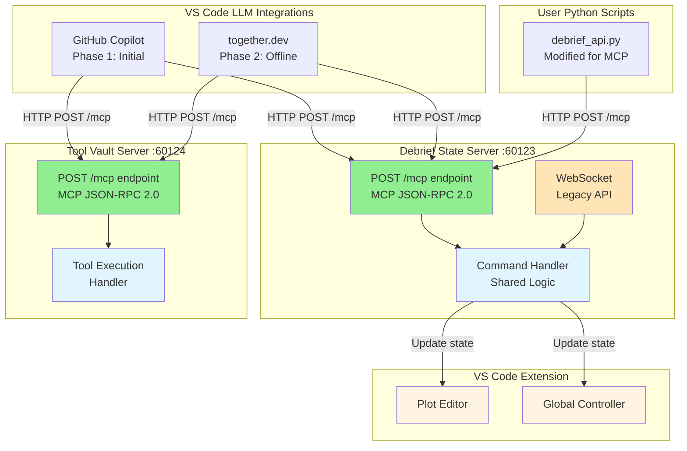

# LLM Integration Architecture for Future Debrief

**📍 Navigation Hub** | **Related Issue**: #205

---

## Executive Summary

This architecture enables VS Code-compatible LLM integrations (GitHub Copilot, Claude, together.dev) to orchestrate multi-step maritime analysis workflows within Future Debrief.

**Challenge**: LLM extensions need standardized interfaces to interact with Future Debrief's services.

**Solution**: Add MCP (Model Context Protocol) streamable-http endpoints to existing servers - no wrappers, minimal code.

**Target Users**: Naval analysts working within VS Code (Future Debrief extension), using LLMs to automate maritime plot analysis.

---

## Quick Start

### For Implementers

1. **Understand the decisions**: [Key Architectural Decisions](#key-architectural-decisions)
2. **Review specs**: [Debrief State Server](specs/debrief-state-server.md) | [Tool Vault Server](specs/tool-vault-server.md)
3. **Start coding**: [Phase 1 Implementation Plan](phases/phase-1-implementation.md) (3-5 days)

### For Analysts (End Users)

1. **Phase 2**: [GitHub Copilot Setup](specs/github-copilot-setup.md) - Easy, cloud-based
2. **Phase 3**: [together.dev Setup](phases/phase-3-together-dev.md) - Offline, local LLMs

### For Reviewers

- [Architecture Overview](#architecture-overview) (diagram + key points)
- [Platform Comparison](specs/platform-comparison.md)
- [Security Constraints](specs/security-constraints.md)

---

## Architecture Overview

### System Diagram



### Key Points

- ✅ **Two MCP servers**: Debrief State (:60123) + Tool Vault (:60124)
- ✅ **Streamable-HTTP transport**: Modern, HTTP-based MCP protocol
- ✅ **No wrappers**: Add `/mcp` endpoint to existing HTTP servers
- ✅ **Dual interface**: MCP (new) + WebSocket (legacy for VS Code extension)
- ✅ **MCP-only Tool Vault**: No legacy REST API (pre-production advantage)
- ✅ **Python scripts via MCP**: Unified protocol for all clients

---

## Key Architectural Decisions

Detailed rationale in Architecture Decision Records (ADRs):

| Decision | Impact | Details |
|----------|--------|---------|
| **[001: Streamable-HTTP Transport](decisions/001-streamable-http-transport.md)** | 🎯 Foundation | Use modern HTTP-based MCP, not stdio/SSE |
| **[002: GitHub Copilot Phase 1](decisions/002-github-copilot-phase1.md)** | ⚡ Timeline | Fast validation (3-5 days), then together.dev for offline |
| **[003: MCP-Only Tool Vault](decisions/003-mcp-only-tool-vault.md)** | 🧹 Simplicity | No legacy REST API - clean MCP-only implementation |
| **[004: Python Scripts via MCP](decisions/004-python-scripts-via-mcp.md)** | 🔄 Consistency | User scripts use same protocol as LLMs |

**Quick Decision Summary**:
- ✅ Streamable-HTTP = leverage existing HTTP servers, no wrappers
- ✅ GitHub Copilot first = fast testing, then together.dev for offline
- ✅ Tool Vault MCP-only = no legacy baggage (pre-production advantage)
- ✅ Python scripts MCP = one protocol for all clients

---

## Implementation Specifications

### Server Implementations

| Component | Spec | Implementation | Port |
|-----------|------|----------------|------|
| **Debrief State Server** | [📄 Spec](specs/debrief-state-server.md) | TypeScript/Express + WebSocket | 60123 |
| **Tool Vault Server** | [📄 Spec](specs/tool-vault-server.md) | Python/FastAPI (MCP-only) | 60124 |

### Integration & Patterns

- [🔗 Integration Patterns](specs/integration-patterns.md) - Multi-step workflows, command orchestration
- [🔒 Security Constraints](specs/security-constraints.md) - Localhost-only, authentication options
- [📊 Existing Code Impact](specs/existing-code-impact.md) - What code needs refactoring

### Platform Support

- [🆚 Platform Comparison](specs/platform-comparison.md) - GitHub Copilot vs together.dev vs alternatives
- [⚙️ GitHub Copilot Setup](specs/github-copilot-setup.md) - Configuration for Phase 1
- [🧪 Testing Strategy](specs/testing-strategy.md) - Unit, integration, end-to-end tests

---

## Implementation Phases

**📊 Current Status**: [**See Detailed Status Report →**](STATUS.md)

### Timeline Overview

| Phase | Duration | Goal | Status |
|-------|----------|------|--------|
| **[Phase 1](phases/phase-1-implementation.md)** | 5-7 days | MCP endpoints + GitHub Copilot validation | 🔄 **~60% Complete** |
| **[Phase 2](phases/phase-2-enhanced-features.md)** | 1-2 weeks | Enhanced features + robustness | 📋 Planned |
| **[Phase 3](phases/phase-3-together-dev.md)** | 2-3 weeks | together.dev integration + offline support | 📋 Planned |

**Phase 1 Progress**:
- ✅ HTTP transport foundation (PR #217)
- ✅ Server lifecycle & health monitoring (Issue #215)
- 🔄 MCP JSON-RPC protocol wrapper (in progress)

### Phase Details

#### [Phase 1: MCP Endpoint Implementation](phases/phase-1-implementation.md) (5-7 days, ~60% Complete)

**Goal**: Add `/mcp` endpoints to both servers, validate with GitHub Copilot

**Completed** (Foundation Infrastructure):
- ✅ HTTP transport layer (PR #217 - migrated from WebSocket)
- ✅ Health check endpoints on both servers
- ✅ Server lifecycle management (ServerLifecycleManager)
- ✅ Status bar indicators in VS Code (Issue #215)
- ✅ Python client HTTP connectivity

**In Progress** (MCP Protocol Layer):
- 🔄 Debrief State Server: POST `/mcp` endpoint (JSON-RPC wrapper)
- 🔄 Tool Vault Server: POST `/mcp` endpoint (JSON-RPC wrapper)
- 🔄 Modified `debrief_api.py` for MCP JSON-RPC format
- 🔄 GitHub Copilot integration testing
- 🔄 Multi-step workflow validation

**Success Criteria**:
- GitHub Copilot discovers and calls all tools
- Multi-step workflows execute correctly
- Python scripts work via MCP endpoint

[📋 Full Phase 1 Plan](phases/phase-1-implementation.md) | [📊 Detailed Status](STATUS.md)

#### [Phase 2: Enhanced Features & Robustness](phases/phase-2-enhanced-features.md) (1-2 weeks)

**Goal**: Production-ready features, error handling, performance optimization

**Deliverables**:
- Complete MCP tool coverage (time, viewport, utilities)
- Advanced error handling with retry logic
- GitHub Copilot integration validation
- Performance benchmarking

[📋 Full Phase 2 Plan](phases/phase-2-enhanced-features.md)

#### [Phase 3: together.dev & Offline Support](phases/phase-3-together-dev.md) (2-3 weeks)

**Goal**: Enable offline/local LLM support for classified environments

**Deliverables**:
- together.dev VS Code extension integration
- Fully offline operation validated
- Local LLM backend configuration
- Naval security requirements met

[📋 Full Phase 3 Plan](phases/phase-3-together-dev.md)

---

## Quick Reference

### API Endpoints

**Debrief State Server** (localhost:60123):
```http
POST /mcp                  # MCP endpoint (LLMs + Python scripts)
WS   /                     # WebSocket (VS Code extension internal)
```

**Tool Vault Server** (localhost:60124):
```http
POST /mcp                  # MCP endpoint (MCP-only, no legacy)
```

### JSON-RPC 2.0 Request Example

```json
POST http://localhost:60123/mcp
Content-Type: application/json

{
  "jsonrpc": "2.0",
  "id": 1,
  "method": "tools/call",
  "params": {
    "name": "debrief_get_selection",
    "arguments": {"filename": "mission1.plot.json"}
  }
}
```

### Available Tools

**Debrief State Server Tools**:
- `debrief_get_selection` - Get selected feature IDs
- `debrief_get_features` - Get feature collection
- `debrief_apply_command` - Apply DebriefCommand to update state
- `debrief_get_time` - Get time state
- `debrief_set_time` - Update time state
- `debrief_get_viewport` - Get viewport state
- `debrief_set_viewport` - Update viewport

**Tool Vault Tools**: Maritime analysis tools (dynamic, discovered at runtime)

---

## Additional Resources

### Documentation

- [📖 API Reference](specs/api-reference.md) - Complete endpoint documentation
- [🛠️ Troubleshooting Guide](specs/troubleshooting.md) - Common issues and solutions
- [❓ FAQ](specs/faq.md) - Frequently asked questions

### Development

- [🔧 Developer Setup](specs/developer-setup.md) - Local development environment
- [🧪 Testing Guide](specs/testing-strategy.md) - How to test MCP integration
- [📝 Contributing](specs/contributing.md) - How to add new MCP tools

### External References

- [MCP Specification](https://modelcontextprotocol.io/)
- [GitHub Copilot Documentation](https://github.com/features/copilot)
- [together.dev Documentation](https://together.ai/) (Phase 2)

---

## Document Navigation

### By Role

**I'm an Implementer** → [Debrief State Server Spec](specs/debrief-state-server.md) → [Phase 1 Plan](phases/phase-1-implementation.md)

**I'm a Tester** → [Testing Strategy](specs/testing-strategy.md) → [Existing Code Impact](specs/existing-code-impact.md)

**I'm an Analyst (End User)** → [GitHub Copilot Setup](specs/github-copilot-setup.md) → [User Workflows](specs/user-workflows.md)

**I'm a Reviewer** → [Key Decisions](#key-architectural-decisions) → [Platform Comparison](specs/platform-comparison.md)

### By Topic

**Architecture** → [Decisions](decisions/) | [Integration Patterns](specs/integration-patterns.md)

**Implementation** → [Phase 1](phases/phase-1-implementation.md) | [Debrief State Server](specs/debrief-state-server.md) | [Tool Vault Server](specs/tool-vault-server.md)

**Security** → [Security Constraints](specs/security-constraints.md) | [Authentication](specs/authentication.md)

**Testing** → [Testing Strategy](specs/testing-strategy.md) | [Existing Code Impact](specs/existing-code-impact.md)

---

## Document Metadata

**Version**: 2.1 (Updated with implementation progress)
**Last Updated**: 2025-10-05
**Status**: 🔄 Active - Phase 1 ~60% Complete
**Related Issues**:
- [#205](https://github.com/debrief/future-debrief/issues/205) - LLM Integration Planning
- [#216](https://github.com/debrief/future-debrief/issues/216) - HTTP Migration (✅ Completed PR #217)
- [#215](https://github.com/debrief/future-debrief/issues/215) - Server Status Indicators (✅ Completed)
**Previous Version**: [Legacy Monolithic Doc](../llm-integration-architecture.md) (2200+ lines)
**Implementation Status**: See [STATUS.md](STATUS.md) for detailed progress tracking

---

**💡 Pro Tip**: This documentation is deeply linked. Click any blue link to jump to detailed specs, decisions, or implementation plans. Use your browser's back button to return to this index.
