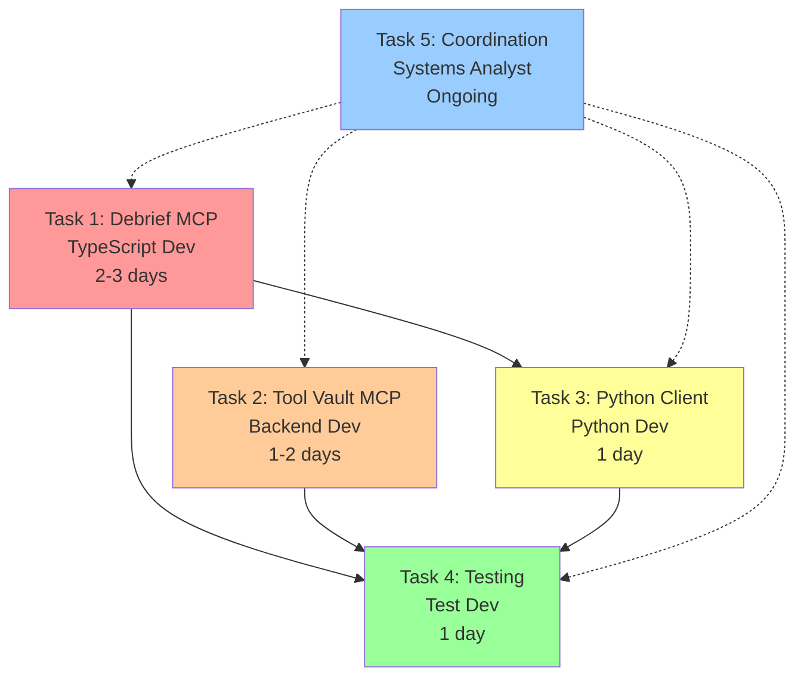

# Task Assignment Prompt (TAP): Phase 1 MCP Endpoint Implementation

**Project**: Future Debrief LLM Integration
**Phase**: 1 - MCP Endpoint Implementation
**Current Status**: ~60% Complete (Foundation Infrastructure Done)
**Estimated Time**: 3-4 days remaining work
**Created**: 2025-10-05
**Orchestrator**: @systems-analyst

---

## 🎯 Mission Statement

Complete Phase 1 by adding MCP JSON-RPC 2.0 protocol endpoints to both servers, enabling GitHub Copilot and other LLMs to orchestrate maritime analysis workflows through standardized Model Context Protocol interfaces.

---

## 📋 Executive Summary

### What's Complete (60%)
- ✅ HTTP transport layer (migrated from WebSocket)
- ✅ Health monitoring infrastructure
- ✅ Server lifecycle management
- ✅ Python client HTTP connectivity

### What's Remaining (40%)
- 🔄 MCP JSON-RPC 2.0 protocol wrapper for Debrief State Server
- 🔄 MCP JSON-RPC 2.0 protocol wrapper for Tool Vault Server
- 🔄 Python client MCP format conversion
- 🔄 GitHub Copilot integration testing

---

## 🔗 Required Context (ALL AGENTS MUST READ)

### Shared Context Document
All agents MUST read this mandatory context before starting work:

```markdown
# MANDATORY SHARED CONTEXT FOR ALL AGENTS

## Architecture Overview
- **Monorepo**: pnpm workspace with TypeScript/React components
- **Two Servers**: Debrief State (60123) and Tool Vault (60124)
- **Protocol**: MCP streamable-http with JSON-RPC 2.0
- **Target Client**: GitHub Copilot (Phase 1), together.dev (Phase 3)

## Current State
1. **Debrief State Server** (`apps/vs-code/src/services/debriefHttpServer.ts`)
   - Has Express HTTP server on port 60123
   - Has POST / endpoint with custom JSON format
   - NEEDS: POST /mcp endpoint with JSON-RPC 2.0 wrapper

2. **Tool Vault Server** (`libs/tool-vault-packager/server.py`)
   - Has FastAPI server on port 60124
   - Has REST endpoints: GET /tools/list, POST /tools/call
   - NEEDS: POST /mcp endpoint with JSON-RPC 2.0 wrapper
   - MUST KEEP: REST endpoints for SPA compatibility

3. **Python Client** (`apps/vs-code/workspace/tests/debrief_api.py`)
   - Has HTTP client using requests library
   - Uses custom JSON format
   - NEEDS: JSON-RPC 2.0 format conversion

## JSON-RPC 2.0 Format Requirements

### Request Format
{
  "jsonrpc": "2.0",
  "id": <number>,
  "method": "tools/list" | "tools/call",
  "params": {
    "name": <tool_name>,     // for tools/call
    "arguments": <tool_args> // for tools/call
  }
}

### Response Format (Success)
{
  "jsonrpc": "2.0",
  "id": <same_as_request>,
  "result": <tool_result>
}

### Response Format (Error)
{
  "jsonrpc": "2.0",
  "id": <same_as_request>,
  "error": {
    "code": -32601 | -32603 | -32600,
    "message": <error_description>
  }
}

## Error Codes
- -32600: Invalid Request (bad JSON-RPC format)
- -32601: Method not found
- -32603: Internal error

## Critical Implementation Notes
1. **Preserve existing functionality** - Don't break current REST/custom JSON
2. **Tool Vault dual mode** - Support BOTH REST (for SPA) and MCP (for LLMs)
3. **Reuse command handlers** - Wrap existing logic, don't reimplement
4. **Test incrementally** - Test each endpoint before integration
```

---

## 👥 Agent Assignments

### Agent 1: TypeScript Developer (@typescript-developer)
**Role**: Debrief State Server MCP Implementation
**Time Estimate**: 2-3 days
**Priority**: CRITICAL PATH - Must complete first

### Agent 2: Backend Developer (@backend-developer)
**Role**: Tool Vault Server MCP Implementation
**Time Estimate**: 1-2 days
**Priority**: HIGH - Can work in parallel after Agent 1 establishes pattern

### Agent 3: Python Developer (@python-developer)
**Role**: Python Client MCP Conversion
**Time Estimate**: 1 day
**Priority**: MEDIUM - Depends on Agent 1 completion

### Agent 4: Test Developer (@test-developer)
**Role**: GitHub Copilot Integration Testing
**Time Estimate**: 1 day
**Priority**: LOW - Final validation step

### Agent 5: Systems Analyst (@systems-analyst)
**Role**: Architecture Review and Handoff Coordination
**Time Estimate**: Ongoing
**Priority**: ONGOING - Available for consultation

---

## 📝 Detailed Task Assignments

### TASK 1: Debrief State Server MCP Implementation
**Assigned to**: @typescript-developer
**Blocking**: Tasks 3, 4
**Dependencies**: None (can start immediately)

#### Subtasks
- [ ] 1.1 Add POST /mcp endpoint to Express app
- [ ] 1.2 Implement JSON-RPC 2.0 request validation
- [ ] 1.3 Route tools/list to return tool index
- [ ] 1.4 Route tools/call to existing handleCommand
- [ ] 1.5 Implement JSON-RPC error responses
- [ ] 1.6 Create tool index generator script
- [ ] 1.7 Add tool index to build process
- [ ] 1.8 Test with curl/Postman

#### Key Files
- **Primary**: `apps/vs-code/src/services/debriefHttpServer.ts`
- **New**: `apps/vs-code/scripts/generate-mcp-tools.ts`
- **Build**: `apps/vs-code/package.json` (add build script)

#### Implementation Guide
```typescript
// Add to debriefHttpServer.ts after existing POST / endpoint

// Load pre-generated tool index
const mcpToolIndex = JSON.parse(
  fs.readFileSync(path.join(__dirname, 'mcp-tools.json'), 'utf8')
);

// MCP endpoint with JSON-RPC 2.0 protocol
this.app.post('/mcp', async (req, res) => {
  const { jsonrpc, method, params, id } = req.body;

  // Validate JSON-RPC 2.0
  if (jsonrpc !== '2.0') {
    return res.status(400).json({
      jsonrpc: '2.0',
      id: id || null,
      error: {
        code: -32600,
        message: 'Invalid Request: jsonrpc must be "2.0"'
      }
    });
  }

  try {
    switch (method) {
      case 'tools/list':
        return res.json({
          jsonrpc: '2.0',
          id,
          result: { tools: mcpToolIndex.tools }
        });

      case 'tools/call':
        // Map MCP tool names to existing commands
        const commandMap: Record<string, string> = {
          'debrief_get_features': 'get_feature_collection',
          'debrief_set_features': 'set_feature_collection',
          'debrief_get_selection': 'get_selected_features',
          'debrief_set_selection': 'set_selected_features',
          'debrief_update_features': 'update_features',
          'debrief_add_features': 'add_features',
          'debrief_delete_features': 'delete_features',
          'debrief_zoom_to_selection': 'zoom_to_selection',
          'debrief_list_plots': 'list_open_plots',
          'debrief_get_time': 'get_time',
          'debrief_set_time': 'set_time',
          'debrief_get_viewport': 'get_viewport',
          'debrief_set_viewport': 'set_viewport',
          'debrief_notify': 'notify'
        };

        const command = commandMap[params.name];
        if (!command) {
          return res.status(400).json({
            jsonrpc: '2.0',
            id,
            error: {
              code: -32601,
              message: `Tool not found: ${params.name}`
            }
          });
        }

        // Call existing handler
        const response = await this.handleCommand({
          command,
          params: params.arguments || {}
        });

        // Convert response to JSON-RPC format
        if (response.error) {
          return res.status(400).json({
            jsonrpc: '2.0',
            id,
            error: {
              code: response.error.code === 'MULTIPLE_PLOTS' ? -32001 : -32603,
              message: response.error.message,
              data: response.error.available_plots
            }
          });
        }

        return res.json({
          jsonrpc: '2.0',
          id,
          result: response.result
        });

      default:
        return res.status(400).json({
          jsonrpc: '2.0',
          id,
          error: {
            code: -32601,
            message: `Method not found: ${method}`
          }
        });
    }
  } catch (error) {
    console.error('MCP error:', error);
    return res.status(500).json({
      jsonrpc: '2.0',
      id,
      error: {
        code: -32603,
        message: error instanceof Error ? error.message : 'Internal error'
      }
    });
  }
});
```

#### Tool Index Generator
```typescript
// apps/vs-code/scripts/generate-mcp-tools.ts
import * as fs from 'fs';
import * as path from 'path';

const tools = [
  {
    name: "debrief_get_features",
    description: "Get the complete feature collection from a plot",
    inputSchema: {
      type: "object",
      properties: {
        filename: {
          type: "string",
          description: "Optional plot filename. If omitted, uses the single open plot or returns error if multiple plots are open"
        }
      }
    }
  },
  {
    name: "debrief_set_features",
    description: "Replace the entire feature collection in a plot",
    inputSchema: {
      type: "object",
      properties: {
        featureCollection: {
          type: "object",
          description: "GeoJSON FeatureCollection to set"
        },
        filename: {
          type: "string",
          description: "Optional plot filename"
        }
      },
      required: ["featureCollection"]
    }
  },
  {
    name: "debrief_get_selection",
    description: "Get the currently selected feature IDs",
    inputSchema: {
      type: "object",
      properties: {
        filename: { type: "string", description: "Optional plot filename" }
      }
    }
  },
  {
    name: "debrief_set_selection",
    description: "Set the selected features by ID",
    inputSchema: {
      type: "object",
      properties: {
        ids: {
          type: "array",
          items: { type: ["string", "number"] },
          description: "Feature IDs to select"
        },
        filename: { type: "string", description: "Optional plot filename" }
      },
      required: ["ids"]
    }
  },
  {
    name: "debrief_update_features",
    description: "Update specific features by ID",
    inputSchema: {
      type: "object",
      properties: {
        features: {
          type: "array",
          description: "Array of features to update (must have IDs)"
        },
        filename: { type: "string", description: "Optional plot filename" }
      },
      required: ["features"]
    }
  },
  {
    name: "debrief_add_features",
    description: "Add new features to the plot",
    inputSchema: {
      type: "object",
      properties: {
        features: {
          type: "array",
          description: "Array of features to add"
        },
        filename: { type: "string", description: "Optional plot filename" }
      },
      required: ["features"]
    }
  },
  {
    name: "debrief_delete_features",
    description: "Delete features by ID",
    inputSchema: {
      type: "object",
      properties: {
        ids: {
          type: "array",
          items: { type: ["string", "number"] },
          description: "Feature IDs to delete"
        },
        filename: { type: "string", description: "Optional plot filename" }
      },
      required: ["ids"]
    }
  },
  {
    name: "debrief_zoom_to_selection",
    description: "Zoom the map view to fit the selected features",
    inputSchema: {
      type: "object",
      properties: {
        filename: { type: "string", description: "Optional plot filename" }
      }
    }
  },
  {
    name: "debrief_list_plots",
    description: "List all currently open plot files",
    inputSchema: {
      type: "object",
      properties: {}
    }
  },
  {
    name: "debrief_get_time",
    description: "Get the current time state",
    inputSchema: {
      type: "object",
      properties: {
        filename: { type: "string", description: "Optional plot filename" }
      }
    }
  },
  {
    name: "debrief_set_time",
    description: "Set the time state",
    inputSchema: {
      type: "object",
      properties: {
        timeState: {
          type: "object",
          properties: {
            current: { type: "string" },
            start: { type: "string" },
            end: { type: "string" }
          },
          required: ["current", "start", "end"]
        },
        filename: { type: "string", description: "Optional plot filename" }
      },
      required: ["timeState"]
    }
  },
  {
    name: "debrief_get_viewport",
    description: "Get the current viewport state",
    inputSchema: {
      type: "object",
      properties: {
        filename: { type: "string", description: "Optional plot filename" }
      }
    }
  },
  {
    name: "debrief_set_viewport",
    description: "Set the viewport state",
    inputSchema: {
      type: "object",
      properties: {
        viewportState: {
          type: "object",
          properties: {
            bounds: {
              type: "array",
              items: { type: "number" },
              minItems: 4,
              maxItems: 4
            }
          },
          required: ["bounds"]
        },
        filename: { type: "string", description: "Optional plot filename" }
      },
      required: ["viewportState"]
    }
  },
  {
    name: "debrief_notify",
    description: "Show a notification message in VS Code",
    inputSchema: {
      type: "object",
      properties: {
        message: {
          type: "string",
          description: "Message to display"
        }
      },
      required: ["message"]
    }
  }
];

const outputPath = path.join(__dirname, '..', 'dist', 'mcp-tools.json');
fs.mkdirSync(path.dirname(outputPath), { recursive: true });
fs.writeFileSync(outputPath, JSON.stringify({ tools }, null, 2));
console.log(`Generated MCP tool index at ${outputPath}`);
```

#### Testing Commands
```bash
# Test tools/list
curl -X POST http://localhost:60123/mcp \
  -H "Content-Type: application/json" \
  -d '{"jsonrpc":"2.0","id":1,"method":"tools/list"}'

# Test tools/call
curl -X POST http://localhost:60123/mcp \
  -H "Content-Type: application/json" \
  -d '{
    "jsonrpc": "2.0",
    "id": 2,
    "method": "tools/call",
    "params": {
      "name": "debrief_list_plots",
      "arguments": {}
    }
  }'
```

#### Success Criteria
- [ ] /mcp endpoint responds with proper JSON-RPC 2.0 format
- [ ] tools/list returns complete tool index
- [ ] tools/call routes to correct command handlers
- [ ] Error responses use correct JSON-RPC error codes
- [ ] Existing POST / endpoint still works (backward compatibility)

#### Handoff Document
Upon completion, provide:
1. List of all MCP tool names and their mappings
2. Example curl commands for testing each tool
3. Any error scenarios discovered
4. Performance metrics (response times)

---

### TASK 2: Tool Vault Server MCP Implementation
**Assigned to**: @backend-developer
**Blocking**: Task 4
**Dependencies**: Task 1 (for pattern reference)

#### Subtasks
- [ ] 2.1 Add POST /mcp endpoint to FastAPI
- [ ] 2.2 Implement JSON-RPC 2.0 request parser
- [ ] 2.3 Route tools/list to existing tool discovery
- [ ] 2.4 Route tools/call to existing tool execution
- [ ] 2.5 Implement JSON-RPC error responses
- [ ] 2.6 Test with curl/Postman
- [ ] 2.7 Verify SPA still works with REST endpoints

#### Key Files
- **Primary**: `libs/tool-vault-packager/server.py`
- **Test**: `libs/tool-vault-packager/tests/test_mcp.py` (new)

#### Implementation Guide
```python
# Add to server.py

from typing import Any, Dict, Optional
from pydantic import BaseModel

class JSONRPCRequest(BaseModel):
    jsonrpc: str
    id: Optional[int] = None
    method: str
    params: Optional[Dict[str, Any]] = None

class JSONRPCResponse(BaseModel):
    jsonrpc: str = "2.0"
    id: Optional[int] = None
    result: Optional[Any] = None
    error: Optional[Dict[str, Any]] = None

@app.post("/mcp")
async def mcp_endpoint(request: JSONRPCRequest) -> JSONRPCResponse:
    """MCP-compatible JSON-RPC 2.0 endpoint."""

    # Validate JSON-RPC version
    if request.jsonrpc != "2.0":
        return JSONRPCResponse(
            id=request.id,
            error={
                "code": -32600,
                "message": "Invalid Request: jsonrpc must be '2.0'"
            }
        )

    try:
        if request.method == "tools/list":
            # Use existing tool discovery
            tools = []
            for tool_name, tool_info in self.tools_cache.items():
                tools.append({
                    "name": tool_name,
                    "description": tool_info.get("description", ""),
                    "inputSchema": tool_info.get("inputSchema", {})
                })

            return JSONRPCResponse(
                id=request.id,
                result={"tools": tools}
            )

        elif request.method == "tools/call":
            if not request.params or "name" not in request.params:
                return JSONRPCResponse(
                    id=request.id,
                    error={
                        "code": -32602,
                        "message": "Invalid params: missing 'name'"
                    }
                )

            tool_name = request.params["name"]
            arguments = request.params.get("arguments", {})

            # Check if tool exists
            if tool_name not in self.tools_cache:
                return JSONRPCResponse(
                    id=request.id,
                    error={
                        "code": -32601,
                        "message": f"Tool not found: {tool_name}"
                    }
                )

            # Execute tool using existing logic
            try:
                result = await execute_tool(tool_name, arguments)
                return JSONRPCResponse(
                    id=request.id,
                    result=result
                )
            except Exception as e:
                return JSONRPCResponse(
                    id=request.id,
                    error={
                        "code": -32603,
                        "message": f"Tool execution failed: {str(e)}"
                    }
                )

        else:
            return JSONRPCResponse(
                id=request.id,
                error={
                    "code": -32601,
                    "message": f"Method not found: {request.method}"
                }
            )

    except Exception as e:
        return JSONRPCResponse(
            id=request.id,
            error={
                "code": -32603,
                "message": f"Internal error: {str(e)}"
            }
        )

# Update health endpoint to indicate MCP support
@app.get("/health")
async def health_check():
    return {
        "status": "healthy",
        "transport": "http",
        "protocols": ["rest", "mcp"],  # Now supports both!
        "port": 60124
    }
```

#### Testing Commands
```bash
# Test tools/list
curl -X POST http://localhost:60124/mcp \
  -H "Content-Type: application/json" \
  -d '{"jsonrpc":"2.0","id":1,"method":"tools/list"}'

# Test tools/call
curl -X POST http://localhost:60124/mcp \
  -H "Content-Type: application/json" \
  -d '{
    "jsonrpc": "2.0",
    "id": 2,
    "method": "tools/call",
    "params": {
      "name": "word_count",
      "arguments": {"text": "Hello world"}
    }
  }'
```

#### Success Criteria
- [ ] /mcp endpoint responds with proper JSON-RPC 2.0 format
- [ ] tools/list returns all discovered tools
- [ ] tools/call executes tools correctly
- [ ] Error responses use correct JSON-RPC error codes
- [ ] REST endpoints still work for SPA (dual-mode verified)

#### Handoff Document
Upon completion, provide:
1. List of all available tools from dynamic discovery
2. Example curl commands for testing
3. Performance comparison: REST vs MCP endpoint
4. Any Python-specific considerations

---

### TASK 3: Python Client MCP Conversion
**Assigned to**: @python-developer
**Blocking**: Task 4
**Dependencies**: Task 1 (must have working MCP endpoint)

#### Subtasks
- [ ] 3.1 Create MCPClient class
- [ ] 3.2 Implement JSON-RPC 2.0 request formatting
- [ ] 3.3 Add request ID management
- [ ] 3.4 Convert all existing methods to use MCP
- [ ] 3.5 Add backward compatibility flag
- [ ] 3.6 Update all test scripts
- [ ] 3.7 Test with both servers

#### Key Files
- **Primary**: `apps/vs-code/workspace/tests/debrief_api.py`
- **Tests**: All files in `apps/vs-code/workspace/tests/`

#### Implementation Guide
```python
# Modified debrief_api.py

import json
import requests
from typing import Optional, Dict, Any, List, Union

class MCPClient:
    """MCP JSON-RPC 2.0 client for server communication."""

    def __init__(self, base_url: str, use_mcp: bool = True):
        self.base_url = base_url
        self.use_mcp = use_mcp
        self.mcp_endpoint = f"{base_url}/mcp"
        self.legacy_endpoint = base_url
        self._request_id = 0
        self.session = requests.Session()

    def _next_id(self) -> int:
        """Get next request ID."""
        self._request_id += 1
        return self._request_id

    def _call_mcp(self, method: str, params: Optional[Dict[str, Any]] = None) -> Any:
        """Make MCP JSON-RPC 2.0 call."""
        request_id = self._next_id()

        payload = {
            "jsonrpc": "2.0",
            "id": request_id,
            "method": method,
            "params": params or {}
        }

        response = self.session.post(
            self.mcp_endpoint,
            json=payload,
            timeout=10
        )

        result = response.json()

        # Check for JSON-RPC error
        if "error" in result:
            error = result["error"]
            # Special handling for MULTIPLE_PLOTS
            if error.get("code") == -32001:
                raise DebriefAPIError(
                    error["message"],
                    code="MULTIPLE_PLOTS"
                )
            raise DebriefAPIError(
                error.get("message", "Unknown error"),
                code=error.get("code")
            )

        return result.get("result")

    def _call_legacy(self, command: str, params: Optional[Dict[str, Any]] = None) -> Any:
        """Make legacy custom JSON call (backward compatibility)."""
        payload = {
            "command": command,
            "params": params or {}
        }

        response = self.session.post(
            self.legacy_endpoint,
            json=payload,
            timeout=10
        )

        result = response.json()

        if "error" in result:
            raise DebriefAPIError(
                result["error"]["message"],
                code=result["error"].get("code")
            )

        return result.get("result")

class DebriefHTTPClient(MCPClient):
    """Enhanced Debrief client with MCP support."""

    def __init__(self, use_mcp: bool = True):
        """Initialize client.

        Args:
            use_mcp: If True, use MCP protocol. If False, use legacy format.
        """
        super().__init__("http://localhost:60123", use_mcp)
        self.logger = logging.getLogger(__name__)

    def get_feature_collection(self, filename: Optional[str] = None) -> Dict[str, Any]:
        """Get the complete feature collection."""
        if self.use_mcp:
            return self._call_mcp("tools/call", {
                "name": "debrief_get_features",
                "arguments": {"filename": filename} if filename else {}
            })
        else:
            return self._call_legacy("get_feature_collection", {"filename": filename})

    def set_feature_collection(
        self,
        feature_collection: Dict[str, Any],
        filename: Optional[str] = None
    ) -> None:
        """Set the complete feature collection."""
        if self.use_mcp:
            self._call_mcp("tools/call", {
                "name": "debrief_set_features",
                "arguments": {
                    "featureCollection": feature_collection,
                    **({"filename": filename} if filename else {})
                }
            })
        else:
            self._call_legacy("set_feature_collection", {
                "featureCollection": feature_collection,
                "filename": filename
            })

    def get_selected_features(self, filename: Optional[str] = None) -> List[str]:
        """Get selected feature IDs."""
        if self.use_mcp:
            result = self._call_mcp("tools/call", {
                "name": "debrief_get_selection",
                "arguments": {"filename": filename} if filename else {}
            })
            return result if isinstance(result, list) else []
        else:
            return self._call_legacy("get_selected_features", {"filename": filename})

    def set_selected_features(
        self,
        ids: List[Union[str, int]],
        filename: Optional[str] = None
    ) -> None:
        """Set selected features by ID."""
        if self.use_mcp:
            self._call_mcp("tools/call", {
                "name": "debrief_set_selection",
                "arguments": {
                    "ids": ids,
                    **({"filename": filename} if filename else {})
                }
            })
        else:
            self._call_legacy("set_selected_features", {
                "ids": ids,
                "filename": filename
            })

    def update_features(
        self,
        features: List[Dict[str, Any]],
        filename: Optional[str] = None
    ) -> None:
        """Update specific features."""
        if self.use_mcp:
            self._call_mcp("tools/call", {
                "name": "debrief_update_features",
                "arguments": {
                    "features": features,
                    **({"filename": filename} if filename else {})
                }
            })
        else:
            self._call_legacy("update_features", {
                "features": features,
                "filename": filename
            })

    def add_features(
        self,
        features: List[Dict[str, Any]],
        filename: Optional[str] = None
    ) -> None:
        """Add new features."""
        if self.use_mcp:
            self._call_mcp("tools/call", {
                "name": "debrief_add_features",
                "arguments": {
                    "features": features,
                    **({"filename": filename} if filename else {})
                }
            })
        else:
            self._call_legacy("add_features", {
                "features": features,
                "filename": filename
            })

    def delete_features(
        self,
        ids: List[Union[str, int]],
        filename: Optional[str] = None
    ) -> None:
        """Delete features by ID."""
        if self.use_mcp:
            self._call_mcp("tools/call", {
                "name": "debrief_delete_features",
                "arguments": {
                    "ids": ids,
                    **({"filename": filename} if filename else {})
                }
            })
        else:
            self._call_legacy("delete_features", {
                "ids": ids,
                "filename": filename
            })

    def list_open_plots(self) -> List[Dict[str, str]]:
        """List all open plot files."""
        if self.use_mcp:
            return self._call_mcp("tools/call", {
                "name": "debrief_list_plots",
                "arguments": {}
            })
        else:
            return self._call_legacy("list_open_plots", {})

    def notify(self, message: str) -> None:
        """Show a notification in VS Code."""
        if self.use_mcp:
            self._call_mcp("tools/call", {
                "name": "debrief_notify",
                "arguments": {"message": message}
            })
        else:
            self._call_legacy("notify", {"message": message})

# Backward compatibility alias
DebriefWebSocketClient = DebriefHTTPClient
```

#### Test Script Updates
```python
# Example test script update
def test_mcp_protocol():
    """Test MCP protocol implementation."""

    # Test with MCP (default)
    client_mcp = DebriefHTTPClient(use_mcp=True)
    plots = client_mcp.list_open_plots()
    print(f"MCP: Found {len(plots)} open plots")

    # Test with legacy (backward compatibility)
    client_legacy = DebriefHTTPClient(use_mcp=False)
    plots = client_legacy.list_open_plots()
    print(f"Legacy: Found {len(plots)} open plots")

    # Both should return same results
    assert plots == plots, "Protocol mismatch!"

if __name__ == "__main__":
    test_mcp_protocol()
```

#### Success Criteria
- [ ] MCPClient class implements JSON-RPC 2.0 correctly
- [ ] Request IDs increment properly
- [ ] All existing methods work with MCP protocol
- [ ] Backward compatibility mode works
- [ ] All test scripts pass with both protocols

#### Handoff Document
Upon completion, provide:
1. Test results for all methods with MCP
2. Performance comparison: MCP vs legacy
3. Any breaking changes or compatibility issues
4. Migration guide for existing scripts

---

### TASK 4: GitHub Copilot Integration Testing
**Assigned to**: @test-developer
**Blocking**: None (final step)
**Dependencies**: Tasks 1, 2, 3

#### Subtasks
- [ ] 4.1 Configure GitHub Copilot settings
- [ ] 4.2 Test tool discovery (tools/list)
- [ ] 4.3 Test individual tool execution
- [ ] 4.4 Test multi-step workflows
- [ ] 4.5 Test error scenarios
- [ ] 4.6 Test concurrent requests
- [ ] 4.7 Document any issues found
- [ ] 4.8 Create demo video

#### Configuration
```json
// .vscode/settings.json
{
  "github.copilot.advanced": {
    "mcpServers": {
      "debrief-state": {
        "type": "streamable-http",
        "url": "http://localhost:60123/mcp"
      },
      "tool-vault": {
        "type": "streamable-http",
        "url": "http://localhost:60124/mcp"
      }
    }
  }
}
```

#### Test Scenarios

##### Scenario 1: Tool Discovery
```
Prompt: "What tools are available for working with Debrief plots?"
Expected: Copilot lists all MCP tools from both servers
```

##### Scenario 2: Single Tool Execution
```
Prompt: "Show me all the open plot files"
Expected: Copilot calls debrief_list_plots and displays results
```

##### Scenario 3: Multi-Step Workflow
```
Prompt: "Delete the currently selected features from the plot"
Expected:
1. Copilot calls debrief_get_selection
2. Copilot calls debrief_delete_features with IDs
3. Copilot confirms deletion
```

##### Scenario 4: Tool Vault Integration
```
Prompt: "Count the words in the selected feature's description"
Expected:
1. Copilot calls debrief_get_selection
2. Copilot gets feature details
3. Copilot calls word_count tool from Tool Vault
```

##### Scenario 5: Error Handling
```
Test: Open multiple plots, ask to modify without specifying which
Expected: Copilot handles MULTIPLE_PLOTS error gracefully
```

#### Success Criteria
- [ ] GitHub Copilot discovers all MCP tools
- [ ] Single tool execution works correctly
- [ ] Multi-step workflows execute properly
- [ ] Error messages are handled gracefully
- [ ] Performance is acceptable (<2s per tool call)
- [ ] Concurrent requests don't cause issues

#### Handoff Document
Upon completion, provide:
1. Test execution results (pass/fail for each scenario)
2. Performance metrics
3. List of any bugs or issues found
4. Recommendations for Phase 2
5. Demo video showing successful integration

---

### TASK 5: Architecture Review and Coordination
**Assigned to**: @systems-analyst
**Blocking**: None
**Dependencies**: Ongoing support for all tasks

#### Responsibilities
- [ ] 5.1 Review implementation PRs for architectural compliance
- [ ] 5.2 Coordinate handoffs between agents
- [ ] 5.3 Resolve any architectural questions
- [ ] 5.4 Update STATUS.md with progress
- [ ] 5.5 Prepare Phase 2 planning based on learnings

---

## 🔄 Task Dependencies



---

## 📊 Progress Tracking

### Daily Standup Questions
1. What did you complete yesterday?
2. What are you working on today?
3. Are there any blockers?
4. Do you need clarification on requirements?

### Progress Checkpoints

#### Day 1 Checkpoint
- [ ] Task 1: MCP endpoint implemented (not necessarily tested)
- [ ] Task 2: Started implementation
- [ ] Task 3: Reviewed existing code

#### Day 2 Checkpoint
- [ ] Task 1: Tool index generator complete
- [ ] Task 2: MCP endpoint implemented
- [ ] Task 3: MCPClient class created

#### Day 3 Checkpoint
- [ ] Task 1: COMPLETE with testing
- [ ] Task 2: COMPLETE with testing
- [ ] Task 3: All methods converted

#### Day 4 Checkpoint
- [ ] Task 3: COMPLETE with testing
- [ ] Task 4: Configuration complete, testing in progress
- [ ] All integration points verified

---

## 🚀 Definition of Done

### Phase 1 is COMPLETE when:

1. **Both MCP Endpoints Operational**
   - [ ] POST /mcp on port 60123 responds correctly
   - [ ] POST /mcp on port 60124 responds correctly
   - [ ] Both implement JSON-RPC 2.0 properly

2. **Tool Discovery Works**
   - [ ] tools/list returns all Debrief tools
   - [ ] tools/list returns all Tool Vault tools
   - [ ] GitHub Copilot sees all tools

3. **Tool Execution Works**
   - [ ] All Debrief tools executable via MCP
   - [ ] All Tool Vault tools executable via MCP
   - [ ] Multi-step workflows succeed

4. **Python Client Works**
   - [ ] All methods work via MCP protocol
   - [ ] Backward compatibility maintained
   - [ ] Test scripts all pass

5. **Documentation Complete**
   - [ ] STATUS.md updated to 100% Phase 1
   - [ ] All handoff documents delivered
   - [ ] Phase 2 planning ready

---

## 🎯 Success Metrics

### Quantitative Metrics
- Response time: <500ms for tool/list, <2s for tool/call
- Error rate: <1% for valid requests
- Test coverage: 100% of MCP endpoints tested
- Tool availability: 100% of tools accessible via MCP

### Qualitative Metrics
- GitHub Copilot integration feels natural
- Error messages are helpful and actionable
- Multi-step workflows execute smoothly
- No regression in existing functionality

---

## 📚 Resources

### Documentation
- [STATUS.md](/Users/ian/git/future-debrief-parent/a/docs/llm-integration/STATUS.md)
- [Phase 1 Implementation](/Users/ian/git/future-debrief-parent/a/docs/llm-integration/phases/phase-1-implementation.md)
- [Debrief State Server Spec](/Users/ian/git/future-debrief-parent/a/docs/llm-integration/specs/debrief-state-server.md)
- [Tool Vault Server Spec](/Users/ian/git/future-debrief-parent/a/docs/llm-integration/specs/tool-vault-server.md)

### Code References
- Debrief HTTP Server: `/Users/ian/git/future-debrief-parent/a/apps/vs-code/src/services/debriefHttpServer.ts`
- Tool Vault Server: `/Users/ian/git/future-debrief-parent/a/libs/tool-vault-packager/server.py`
- Python Client: `/Users/ian/git/future-debrief-parent/a/apps/vs-code/workspace/tests/debrief_api.py`

### MCP Protocol
- [JSON-RPC 2.0 Specification](https://www.jsonrpc.org/specification)
- [MCP Streamable HTTP](https://github.com/anthropics/mcp)

---

## 🤝 Communication Protocol

### Handoff Process
1. Complete your task to success criteria
2. Create handoff document with:
   - What was implemented
   - How to test it
   - Any issues or considerations
   - Performance metrics
3. Tag next dependent agent in PR/comment
4. Update this TAP with completion status

### Escalation Path
1. Technical questions → @systems-analyst
2. Requirement clarifications → Check shared context first, then @systems-analyst
3. Blocking issues → Immediate notification to @systems-analyst
4. Architecture changes → Must be approved by @systems-analyst

---

## 🏁 Final Checklist

Before declaring Phase 1 complete:

- [ ] All tasks marked complete
- [ ] All success criteria met
- [ ] All tests passing
- [ ] GitHub Copilot integration validated
- [ ] Performance metrics acceptable
- [ ] Documentation updated
- [ ] Phase 2 planning ready
- [ ] Demo video created
- [ ] Stakeholders notified

---

**END OF TAP**

*This Task Assignment Prompt is ready for multi-agent execution. Each agent should start with their assigned task, following the implementation guides and success criteria. Regular coordination through @systems-analyst ensures smooth integration and timely delivery.*