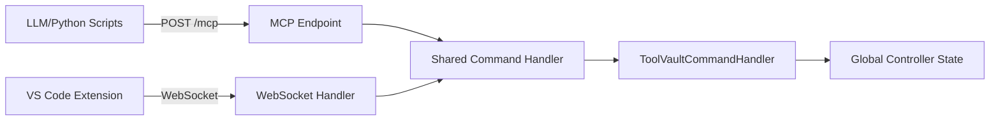

# Debrief State Server Specification

**Back to**: [Main Index](../README.md) | **Related**: [Tool Vault Server](tool-vault-server.md) | [ADR 001](../decisions/001-streamable-http-transport.md)

**Status**: 🔄 ~60% Complete | **See**: [STATUS.md](../STATUS.md)

---

## Overview

The Debrief State Server manages plot state and provides MCP tools for LLM-driven maritime analysis.

**Implementation**: TypeScript/Express HTTP
**Port**: 60123
**Architecture**: HTTP with custom JSON format (MCP JSON-RPC 2.0 planned)

### Current Status

**✅ Implemented** (PR #217):
- HTTP server with Express
- POST / endpoint (custom JSON command format)
- GET /health endpoint
- Command handlers for all operations
- Server lifecycle management

**🔄 Planned** (Phase 1 remaining):
- POST /mcp endpoint (JSON-RPC 2.0)
- MCP tool index generation
- tools/list and tools/call methods

---

## Quick Reference

### Endpoints

**✅ Current** (Implemented):
```
POST /             # Custom JSON command endpoint (Python scripts)
GET  /health       # Health check endpoint
```

**🔄 Planned** (Phase 1):
```
POST /mcp          # MCP JSON-RPC 2.0 endpoint (LLMs + Python scripts)
```

**Note**: WebSocket interface was replaced by HTTP in PR #217.

### Available MCP Tools

| Tool Name | Purpose | Key Parameters |
|-----------|---------|----------------|
| `debrief_get_selection` | Get selected feature IDs | `filename` (optional) |
| `debrief_get_features` | Get feature collection | `filename` (optional) |
| `debrief_apply_command` | Apply DebriefCommand to update state | `command`, `filename` (optional) |
| `debrief_set_selection` | Update selected features | `selectedIds[]`, `filename` (optional) |
| `debrief_get_time` | Get time state | `filename` (optional) |
| `debrief_set_time` | Update time state | `timeState`, `filename` (optional) |
| `debrief_get_viewport` | Get viewport state | `filename` (optional) |
| `debrief_set_viewport` | Update viewport | `viewportState`, `filename` (optional) |

---

## Architecture

### Dual Interface Design



**Key Insight**: Both interfaces route to the same command handler - **no code duplication**.

### Code Locations

- **Server**: `apps/vs-code/src/services/debriefHttpServer.ts` (renamed from debriefWebSocketServer.ts in PR #217)
- **Command Handler**: Inline in `debriefHttpServer.ts` (handleCommand method)
- **Global Controller**: `apps/vs-code/src/core/globalController.ts`
- **Lifecycle Manager**: `apps/vs-code/src/services/ServerLifecycleManager.ts` ✅
- **Tool Index Generation**: `apps/vs-code/scripts/generate-mcp-tools.ts` (🔄 to be created)

---

## Implementation Details

### MCP Endpoint (New)

```typescript
// apps/vs-code/src/services/debriefStateServer.ts
import express from 'express';
import toolIndex from '../../dist/mcp-tools.json'; // Pre-cached at build

app.post('/mcp', async (req, res) => {
  const { method, params, id } = req.body;

  if (method === 'tools/list') {
    return res.json({
      jsonrpc: '2.0',
      id,
      result: { tools: toolIndex.tools }
    });
  }

  if (method === 'tools/call') {
    const result = await handleCommand(params.name, params.arguments);
    return res.json({ jsonrpc: '2.0', id, result });
  }

  res.status(400).json({
    jsonrpc: '2.0',
    id,
    error: { code: -32601, message: 'Method not found' }
  });
});
```

### Shared Command Handler (Reuses Existing Code)

```typescript
// apps/vs-code/src/services/commandHandler.ts
import { ToolVaultCommandHandler } from '@debrief/web-components/services';

const commandHandler = new ToolVaultCommandHandler(stateSetter);

export async function handleCommand(command: string, params: any) {
  switch (command) {
    case 'debrief_apply_command':
      // Delegate to existing ToolVaultCommandHandler - no duplication!
      return await commandHandler.processCommands(
        [params.command],
        currentFeatureCollection
      )[0];

    case 'debrief_get_selection':
      return globalController.getSelection(params.filename);

    // ... other commands
  }
}
```

**Benefits**:
- ✅ No duplication - reuses existing `ToolVaultCommandHandler`
- ✅ Consistent behavior across WebSocket and MCP
- ✅ Single source of truth for command processing

---

## Key Integration Point: `debrief_apply_command`

This is the **universal protocol** for plot manipulation:

```json
{
  "method": "tools/call",
  "params": {
    "name": "debrief_apply_command",
    "arguments": {
      "command": {
        "command": "setFeatureCollection",
        "payload": { "features": [...] }
      }
    }
  }
}
```

**Command Producers**:
- Tool Vault maritime analysis tools
- User Python scripts (via `debrief_api.py`)
- LLM-generated code

All produce the same `DebriefCommand` format → applied via this tool.

---

## Pre-Cached Tool Index

Generated at build time for fast server startup:

```typescript
// apps/vs-code/scripts/generate-mcp-tools.ts
const tools = [
  {
    name: "debrief_get_selection",
    description: "Get currently selected feature IDs",
    inputSchema: { /* JSON Schema */ }
  },
  // ... all tools
];

fs.writeFileSync('dist/mcp-tools.json', JSON.stringify({ tools }));
```

Loaded once during server initialization → served instantly to MCP clients.

---

## Implementation Checklist

**Phase 1 Tasks**:
- [ ] Add Express HTTP server alongside WebSocket
- [ ] Implement POST `/mcp` endpoint with JSON-RPC 2.0 handler
- [ ] Route `tools/list` to pre-cached index
- [ ] Route `tools/call` to existing `handleCommand()`
- [ ] Generate `dist/mcp-tools.json` during build
- [ ] Add JSON-RPC error handling (codes -32601, -32603)
- [ ] Test with GitHub Copilot
- [ ] Verify backward compatibility (WebSocket still works)

**Success Criteria**:
- ✅ GitHub Copilot discovers all Debrief tools
- ✅ Multi-step workflows execute (get selection → apply command)
- ✅ Python scripts work via MCP endpoint
- ✅ WebSocket clients unaffected

---

## Detailed Specifications

For complete implementation details including:
- Full tool schemas
- Error handling patterns
- Multi-plot support
- Optional filename parameters
- Integration patterns

See: [Original Architecture Document - Section 2.2](../../llm-integration-architecture.md#22-debrief-state-server-native-mcp-streamable-http)

---

## Related Documentation

- [Tool Vault Server Spec](tool-vault-server.md)
- [Integration Patterns](integration-patterns.md)
- [Existing Code Impact Analysis](existing-code-impact.md)
- [ADR 001: Streamable-HTTP Transport](../decisions/001-streamable-http-transport.md)
- [ADR 004: Python Scripts via MCP](../decisions/004-python-scripts-via-mcp.md)
- [Phase 1 Implementation Plan](../phases/phase-1-implementation.md)

---

**Back to**: [Main Index](../README.md) | **Next**: [Tool Vault Server Spec](tool-vault-server.md)
