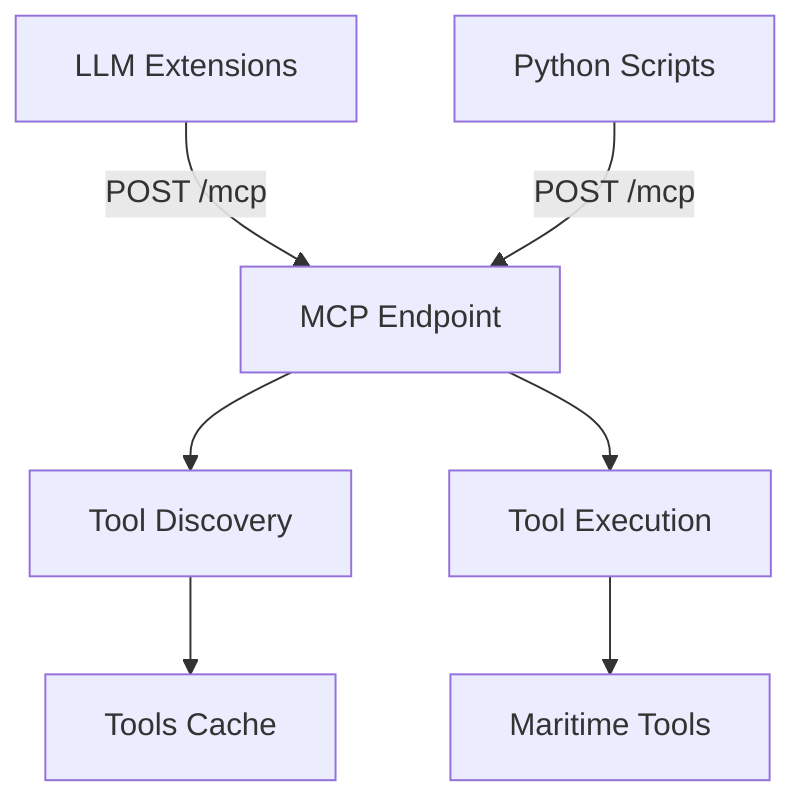

# Tool Vault Server Specification

**Back to**: [Main Index](../README.md) | **Related**: [Debrief State Server](debrief-state-server.md) | [ADR 003](../decisions/003-mcp-only-tool-vault.md)

---

## Overview

The Tool Vault Server exposes maritime analysis tools through an MCP endpoint.

**Implementation**: Python/FastAPI
**Port**: 60124
**Architecture**: **MCP-only** (no legacy REST API)

---

## Quick Reference

### Endpoint

```
POST /mcp          # MCP JSON-RPC 2.0 endpoint (ONLY endpoint)
```

### Why MCP-Only?

✅ Not in production yet - no legacy clients to support
✅ Clean implementation without technical debt
✅ 50% less code vs dual-API approach
✅ Single protocol for all clients (LLMs + Python scripts)

See: [ADR 003: MCP-Only Tool Vault](../decisions/003-mcp-only-tool-vault.md)

---

## Architecture



**Code Location**: `libs/tool-vault-packager/server.py`

---

## Implementation

### FastAPI Server (MCP-Only)

```python
# libs/tool-vault-packager/server.py
from fastapi import FastAPI
from discovery import discover_tools

app = FastAPI()
tools_cache = discover_tools("./tools")  # Load once at startup

@app.post("/mcp")
async def mcp_endpoint(request: dict):
    """MCP JSON-RPC 2.0 endpoint - ONLY endpoint needed!"""
    method = request.get("method")
    request_id = request.get("id")

    if method == "tools/list":
        return {
            "jsonrpc": "2.0",
            "id": request_id,
            "result": {
                "tools": [
                    {
                        "name": tool["name"],
                        "description": tool["description"],
                        "inputSchema": tool["inputSchema"]
                    }
                    for tool in tools_cache
                ]
            }
        }

    elif method == "tools/call":
        tool_name = request["params"]["name"]
        arguments = request["params"]["arguments"]
        result = await call_tool(tool_name, arguments)

        return {
            "jsonrpc": "2.0",
            "id": request_id,
            "result": result
        }

    else:
        return {
            "jsonrpc": "2.0",
            "id": request_id,
            "error": {
                "code": -32601,
                "message": f"Method not found: {method}"
            }
        }
```

**That's it!** No legacy REST endpoints cluttering the codebase.

---

## Tool Discovery

Tools are discovered at startup from `tools/` directory:

```python
# discovery.py
def discover_tools(tools_path: str) -> List[Dict]:
    """Discover all tools and extract MCP schemas."""
    tools = []

    for tool_file in Path(tools_path).glob("*.py"):
        # Extract function signature and docstring
        tool_schema = extract_tool_schema(tool_file)
        tools.append(tool_schema)

    return tools
```

**Tool Requirements**:
- Single public function per file
- Complete type annotations
- Descriptive docstring

---

## Tool Execution

```python
async def call_tool(tool_name: str, arguments: dict) -> Any:
    """Execute a tool with given arguments."""
    tool_module = import_module(f"tools.{tool_name}")
    tool_function = getattr(tool_module, tool_name)

    # Validate arguments against input schema
    validate_arguments(tool_function, arguments)

    # Execute tool
    result = tool_function(**arguments)

    # Tool may return DebriefCommand for state updates
    return result
```

---

## Client Usage

All clients use identical MCP protocol:

```python
# LLM extension or Python script
import requests

response = requests.post("http://localhost:60124/mcp", json={
    "jsonrpc": "2.0",
    "id": 1,
    "method": "tools/call",
    "params": {
        "name": "word_count",
        "arguments": {"text": "Hello world"}
    }
})

result = response.json()["result"]
```

---

## Implementation Checklist

**Phase 1 Tasks**:
- [ ] Add POST `/mcp` endpoint with JSON-RPC 2.0 handler
- [ ] Implement `tools/list` method (wrap existing tool discovery)
- [ ] Implement `tools/call` method (wrap existing tool execution)
- [ ] Error handling with JSON-RPC error codes
- [ ] Update server startup to log MCP endpoint availability
- [ ] **No legacy REST API** - MCP-only implementation
- [ ] Test with GitHub Copilot
- [ ] Test with Python scripts via `debrief_api.py`

**Success Criteria**:
- ✅ MCP endpoint responds to JSON-RPC 2.0 requests
- ✅ Tool discovery works at startup
- ✅ Tool execution returns proper results
- ✅ Error responses use JSON-RPC error format
- ✅ Multiple concurrent clients supported

---

## Comparison with Debrief State Server

| Aspect | Tool Vault :60124 | Debrief State :60123 |
|--------|-------------------|----------------------|
| **Implementation** | Python/FastAPI | TypeScript/Express |
| **Architecture** | MCP-only | Dual (MCP + WebSocket) |
| **Why different?** | No existing clients | VS Code extension uses WebSocket |
| **Benefit** | Simpler, cleaner code | Backward compatibility |

---

## Detailed Specifications

For complete implementation details including:
- Tool schema extraction
- Input validation
- Error handling patterns
- Sample data bundling
- Performance optimization

See: [Original Architecture Document - Section 2.3](../../llm-integration-architecture.md#23-tool-vault-server-native-mcp-streamable-http)

---

## Related Documentation

- [Debrief State Server Spec](debrief-state-server.md)
- [Tool Development Guide](../../tool-vault-packager/DEVELOPERS.md)
- [ADR 003: MCP-Only Tool Vault](../decisions/003-mcp-only-tool-vault.md)
- [ADR 001: Streamable-HTTP Transport](../decisions/001-streamable-http-transport.md)
- [Phase 1 Implementation Plan](../phases/phase-1-implementation.md)

---

**Back to**: [Main Index](../README.md) | **Previous**: [Debrief State Server Spec](debrief-state-server.md)
