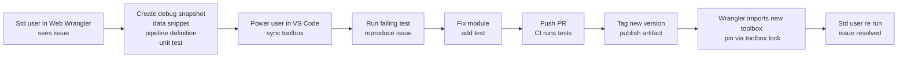

## End-to-end Data Wrangler flow

```mermaid
flowchart LR
    A[Std user in Web Wrangler\nsees issue] --> B[Create debug snapshot\n data snippet\n pipeline definition\n unit test]
    B --> C[Power user in VS Code\nsync toolbox]
    C --> D[Run failing test\nreproduce issue]
    D --> E[Fix module\n add test]
    E --> F[Push PR\n CI runs tests]
    F --> G[Tag new version\n publish artifact]
    G --> H[Wrangler imports new toolbox\n pin via toolbox lock]
    H --> I[Std user re run\n issue resolved]
```

