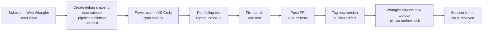
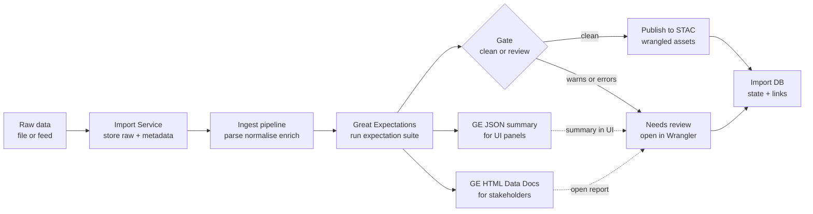

## End-to-end Data Wrangler flow

```mermaid
flowchart LR
    A[Std user in Web Wrangler\nsees issue] --> B[Create debug snapshot\n data snippet\n pipeline definition\n unit test]
    B --> C[Power user in VS Code\nsync toolbox]
    C --> D[Run failing test\nreproduce issue]
    D --> E[Fix module\n add test]
    E --> F[Push PR\n CI runs tests]
    F --> G[Tag new version\n publish artifact]
    G --> H[Wrangler imports new toolbox\n pin via toolbox lock]
    H --> I[Std user re run\n issue resolved]
```

## Great Expectations data quality

```mermaid
flowchart LR
    SRC[Raw data\nfile or feed]
    IMP[Import Service\nstore raw + metadata]
    PIPE[Ingest pipeline\nparse normalise enrich]
    GE[Great Expectations\nrun expectation suite]
    GJ[GE JSON summary\nfor UI panels]
    GH[GE HTML Data Docs\nfor stakeholders]
    GATE{Gate\nclean or review}
    STAC[Publish to STAC\nwrangled assets]
    REV[Needs review\nopen in Wrangler]
    DB[Import DB\nstate + links]

    SRC --> IMP
    IMP --> PIPE
    PIPE --> GE
    GE --> GJ
    GE --> GH
    GE --> GATE

    GATE -->|clean| STAC
    GATE -->|warns or errors| REV

    STAC --> DB
    REV --> DB

    %% UI linkbacks
    GJ -.->|summary in UI| REV
    GH -.->|open report| REV
```

