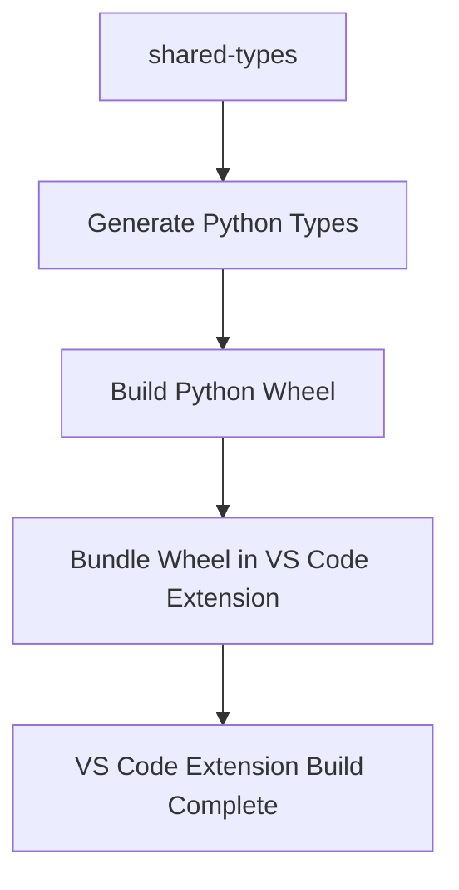

# Debrief Python Types: Dual-Distribution System

This document describes the dual-distribution system for Debrief Python types, providing both standalone wheel distribution and automatic VS Code extension integration.

## Overview

The Debrief shared-types package now provides Python types and validators through two distribution methods:

1. **Standalone Wheel Distribution**: Manual installation for any Python IDE (PyCharm, Jupyter, Spyder, etc.)
2. **VS Code Extension Integration**: Automatic installation when using the Debrief VS Code extension

## Package Structure

```
debrief/
├── types/                    # Maritime GeoJSON types + Application state
│   ├── __init__.py          # Clean re-exports for all types
│   ├── track.py             # TrackFeature type definition
│   ├── point.py             # PointFeature type definition  
│   ├── annotation.py        # AnnotationFeature type definition
│   ├── featurecollection.py # DebriefFeatureCollection type definition
│   ├── timestate.py         # TimeState type definition
│   ├── viewportstate.py     # ViewportState type definition
│   ├── selectionstate.py    # SelectionState type definition
│   └── editorstate.py       # EditorState type definition
├── validators/              # Maritime data validators
│   ├── __init__.py          # Validator function exports
│   ├── track_validator.py   # Track feature validation
│   ├── point_validator.py   # Point feature validation
│   ├── annotation_validator.py # Annotation feature validation
│   └── featurecollection_validator.py # Feature collection validation
└── schemas/                 # JSON schemas for validation
    ├── __init__.py          # Schema loading utilities
    └── *.json              # All JSON schema files
```

## Installation Methods

### Method 1: Standalone Wheel Installation

For use in any Python IDE or environment:

#### From GitHub Releases (Recommended)
```bash
# Download latest release wheel from GitHub
pip install path/to/debrief_types-X.Y.Z-py3-none-any.whl
```

#### From Local Build
```bash
# Build from source (requires Node.js/pnpm)
cd libs/shared-types
pnpm build:python-wheel
pip install dist/python/debrief_types-*.whl
```

**Use Cases:**
- PyCharm, IntelliJ IDEA, or any JetBrains IDE
- Jupyter notebooks and JupyterLab
- Spyder, Thonny, or other Python IDEs
- CI/CD pipelines processing .plot.json files
- Command-line scripts and batch processing
- Data science workflows outside VS Code

### Method 2: VS Code Extension (Automatic)

For users of the Debrief VS Code extension:

1. **Install the Debrief VS Code extension** (includes Python wheel)
2. **Open a workspace** with Python files
3. **Types are installed automatically** when the extension activates

**Features:**
- **Zero configuration** - works out of the box
- **Automatic updates** aligned with extension releases  
- **Environment detection** - works with venv, conda, Poetry, system Python
- **User notifications** for installation success/failure
- **Manual installation fallback** with helpful error messages

## Usage Examples

Both installation methods provide the same import interface:

### Basic Type Usage
```python
from debrief.types import (
    TrackFeature,
    PointFeature, 
    AnnotationFeature,
    DebriefFeatureCollection,
    TimeState,
    ViewportState,
    SelectionState,
    EditorState
)

# All types are available for type hints and runtime validation
track_data: TrackFeature = {
    "type": "Feature",
    "geometry": {
        "type": "LineString",
        "coordinates": [[0, 0], [1, 1], [2, 2]]
    },
    "properties": {
        "name": "Example Track",
        "timestamps": ["2024-01-01T00:00:00Z", "2024-01-01T00:01:00Z", "2024-01-01T00:02:00Z"]
    }
}
```

### Validation Functions
```python
from debrief.validators import (
    validate_track_feature,
    validate_point_feature,
    validate_annotation_feature,
    validate_feature_collection
)

# Validate maritime data
is_valid = validate_track_feature(track_data)
if not is_valid:
    print("Track data validation failed")

# Validate complete feature collections
collection = {
    "type": "FeatureCollection",
    "features": [track_data],
    "properties": {"name": "Test Collection"}
}

is_valid_collection = validate_feature_collection(collection)
```

### Schema Access
```python
from debrief.schemas import (
    get_track_schema,
    get_point_schema,
    get_annotation_schema,
    list_schemas
)

# Load JSON schemas for custom validation
track_schema = get_track_schema()
print(f"Track schema title: {track_schema.get('title')}")

# List all available schemas
schemas = list_schemas()
print(f"Available schemas: {schemas}")
```

### Integration with VS Code WebSocket Bridge
```python
# In VS Code environment with Debrief extension active
from debrief.types import TimeState, ViewportState
from debrief_api import debrief  # Available via WebSocket bridge

# Create application state objects
time_state: TimeState = {
    "currentTime": "2024-01-01T12:00:00Z",
    "startTime": "2024-01-01T00:00:00Z",
    "endTime": "2024-01-01T23:59:59Z",
    "isPlaying": False,
    "playbackSpeed": 1.0
}

# Send to VS Code extension via WebSocket
debrief.send_command("update_time", time_state)
```

## Build System Integration

### Monorepo Build Pipeline

The dual-distribution system is integrated into the existing Turborepo build pipeline:



**Build Commands:**
```bash
# Build everything (includes Python wheel)
pnpm build

# Build only shared-types with Python wheel
pnpm build:shared-types

# Build only Python wheel
cd libs/shared-types
pnpm build:python-wheel

# Build VS Code extension (includes wheel bundling)
cd apps/vs-code  
pnpm build
```

### Version Synchronization

The Python package version is automatically synchronized with the npm package version:

- **Source of truth**: `libs/shared-types/package.json` version field
- **Python package**: Reads version dynamically from package.json
- **VS Code extension**: Bundles wheel with matching version
- **GitHub releases**: Wheel filename includes version number

### Continuous Integration

The build system automatically:

1. **Generates Python types** from JSON schemas using quicktype
2. **Builds standalone wheel** for distribution
3. **Bundles wheel** into VS Code extension
4. **Validates installation** in clean Python environments
5. **Tests both distribution paths** (standalone + VS Code)

## VS Code Extension Auto-Installation

### How It Works

When the Debrief VS Code extension activates:

1. **Detects Python environment** via VS Code Python extension API
2. **Checks current installation** of debrief-types package
3. **Compares versions** between installed and bundled wheel
4. **Installs/upgrades** if needed using pip
5. **Handles multiple environments** (venv, conda, Poetry, system Python)
6. **Shows user notifications** with installation status

### Environment Support

The auto-installer supports:

- **Virtual environments** (venv, virtualenv)
- **Conda environments** (base and named environments)
- **Poetry managed environments**
- **System Python** installations
- **Python from VS Code Python extension settings**

### Error Handling

If auto-installation fails:

- **Non-blocking error** - VS Code extension continues to work
- **Helpful error messages** with manual installation instructions
- **Fallback instructions** for manual wheel installation
- **Troubleshooting guide** available in error dialogs

## Testing

### Automated Test Suite

The implementation includes comprehensive tests covering:

```bash
# Run all tests
cd libs/shared-types
python test_wheel_installation.py
```

**Test Coverage:**
- ✅ Standalone wheel installation and imports
- ✅ Type functionality and validator execution  
- ✅ VS Code extension wheel bundling
- ✅ Version synchronization between npm and Python
- ✅ Complete integration workflows

### Manual Testing Scenarios

**Standalone Installation:**
1. Install wheel in clean Python environment
2. Test all imports and functionality
3. Validate integration with existing maritime data

**VS Code Extension:**
1. Install extension in VS Code
2. Open Python workspace
3. Verify automatic installation notifications
4. Test imports in Python files

## Troubleshooting

### Common Issues

**Import Errors:**
```bash
# Verify installation
pip list | grep debrief

# Check import paths
python -c "import debrief; print(debrief.__file__)"

# Test basic import
python -c "from debrief.types import TrackFeature; print('✓ Import successful')"
```

**VS Code Auto-Installation Issues:**
- Check Python extension is installed and active
- Verify Python interpreter is configured
- Look at VS Code Developer Console for error messages
- Try manual installation as fallback

**Version Mismatches:**
```bash
# Check package version
python -c "from debrief import __version__; print(__version__)"

# Reinstall with force
pip install --force-reinstall path/to/debrief_types-*.whl
```

### Getting Help

- **GitHub Issues**: Report bugs and feature requests
- **VS Code Extension**: Check extension output panel for detailed logs
- **Manual Installation**: See error dialog instructions
- **Documentation**: This file and inline docstrings

## Development Workflow

### Making Changes

1. **Update JSON schemas** in `schema/` or `schemas/` directories
2. **Regenerate types**: `pnpm generate:python`
3. **Build wheel**: `pnpm build:python-wheel` 
4. **Test installation**: `python test_wheel_installation.py`
5. **Build VS Code extension**: `cd ../../apps/vs-code && pnpm build`

### Adding New Types

1. **Add JSON schema** to appropriate directory
2. **Update build scripts** to include new schema in generation
3. **Add exports** to `debrief/types/__init__.py`
4. **Create validators** if needed in `debrief/validators/`
5. **Update documentation** and examples

### Release Process

1. **Update version** in `libs/shared-types/package.json`
2. **Build everything**: `pnpm build`
3. **Test both distributions**: Run test suite
4. **Create GitHub release** with wheel attached
5. **Publish VS Code extension** with bundled wheel

## Architecture Benefits

### Single Source of Truth
- **JSON schemas** define maritime data contracts
- **Automatic generation** ensures consistency
- **Version synchronization** prevents mismatches
- **Build-time validation** catches errors early

### Developer Experience
- **Zero setup** for VS Code users
- **Familiar pip workflow** for standalone installation
- **Consistent API** regardless of installation method
- **Rich type hints** and validation in all environments

### Maintenance Benefits  
- **Single wheel** serves both distribution channels
- **Automated build pipeline** reduces manual work
- **Comprehensive testing** prevents regressions
- **Clear documentation** enables self-service

This dual-distribution system provides maximum flexibility for Python developers working with Debrief maritime data, whether in VS Code or any other Python development environment.