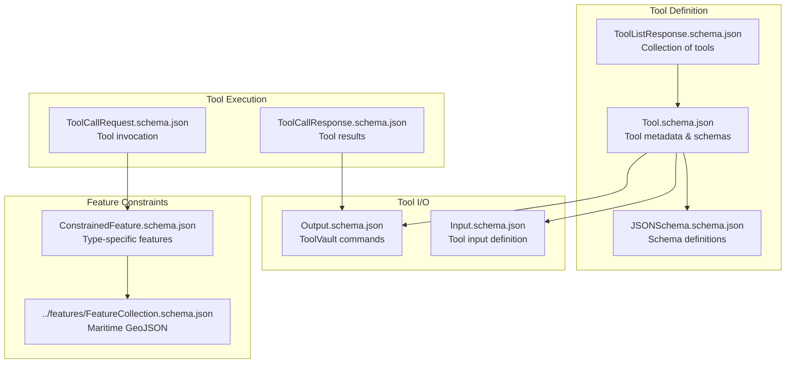
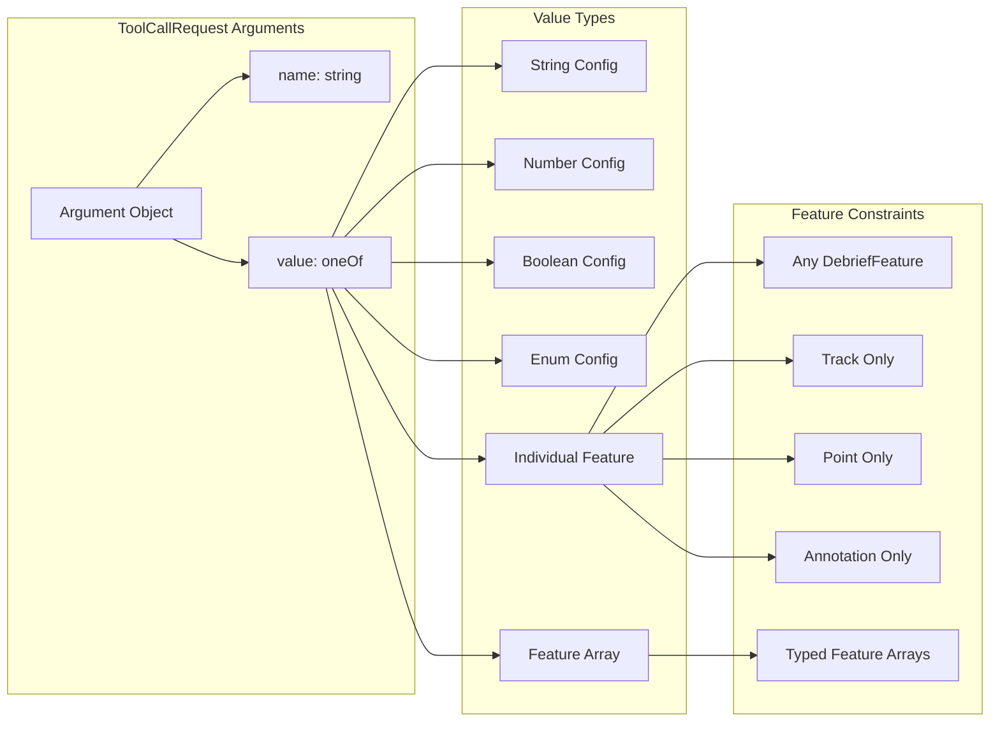
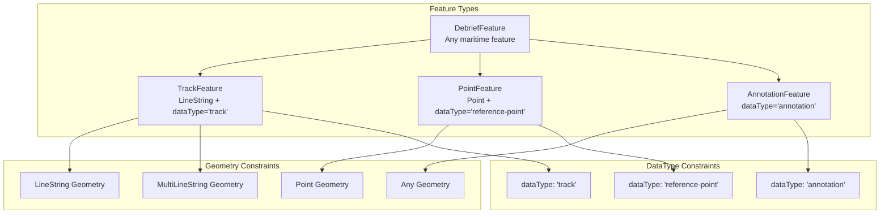
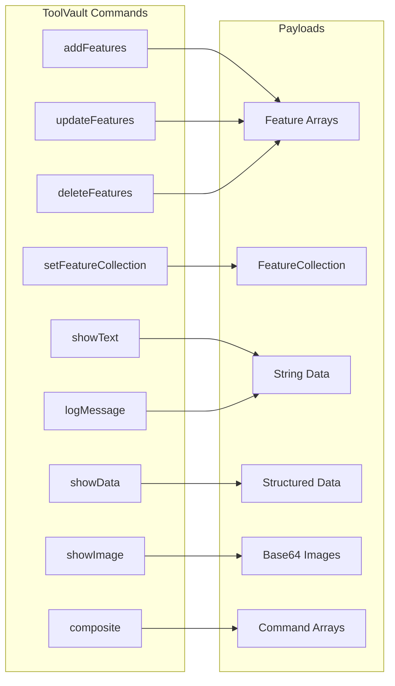

# Tool Protocol Schemas

This directory contains JSON Schema definitions for a unified tool protocol supporting maritime analysis tools. The schemas define how tools are described, called, and how they respond with commands.

## Schema Overview

The tool protocol consists of several interconnected schemas that define a complete tool execution lifecycle:



## Core Schemas

### 1. **Tool.schema.json**
Defines an individual tool with its metadata and interface:
- `name`: Unique tool identifier
- `description`: Human-readable description
- `inputSchema`: JSON Schema for expected inputs
- `outputSchema`: JSON Schema for expected outputs

### 2. **ToolListResponse.schema.json**
Response format for tool discovery endpoints:
- `tools`: Array of Tool objects
- `version`: Optional version identifier
- `description`: Optional collection description

### 3. **ToolCallRequest.schema.json**
Request format for tool execution:
- `name`: Tool to invoke
- `arguments`: Array of named parameters (features + config)

### 4. **ToolCallResponse.schema.json**
Response format for tool execution results:
- `result`: ToolVault command object
- `isError`: Optional error flag

## Parameter Type System

Tools accept parameters through a flexible type-safe system:



### Parameter Examples

#### Configuration Parameters
```json
{
  "name": "threshold",
  "value": 1000
}
```

#### Individual Features
```json
{
  "name": "source",
  "value": {
    "type": "Feature",
    "properties": { "dataType": "track" },
    "geometry": { "type": "LineString", "coordinates": [...] }
  }
}
```

#### Feature Arrays
```json
{
  "name": "tracks",
  "value": [
    { /* TrackFeature 1 */ },
    { /* TrackFeature 2 */ }
  ]
}
```

## Feature Type Constraints

### 5. **ConstrainedFeature.schema.json**
Provides type-specific feature constraints:



## Tool Input/Output System

### 6. **Input.schema.json**
Defines tool capability declarations:
- Feature inputs with geometry/dataType constraints
- Configuration parameters (number, enum)
- Input validation rules

### 7. **Output.schema.json**
Defines ToolVault command objects:



## JSON Schema Infrastructure

### 8. **JSONSchema.schema.json**
Meta-schema for defining JSON Schema objects used in tool definitions:
- Recursive `JSONSchemaProperty` definitions
- Support for nested object/array schemas
- Type validation for schema properties

## Usage Examples

### Tool Definition
```json
{
  "name": "calculate_bearing",
  "description": "Calculate bearing between two maritime features",
  "inputSchema": {
    "type": "object",
    "properties": {
      "source": { "$ref": "ConstrainedFeature.schema.json#/$defs/TrackFeature" },
      "target": { "$ref": "ConstrainedFeature.schema.json#/$defs/PointFeature" },
      "units": { "type": "string", "enum": ["degrees", "radians"] }
    }
  },
  "outputSchema": { "$ref": "Output.schema.json" }
}
```

### Tool Invocation
```json
{
  "name": "calculate_bearing",
  "arguments": [
    {
      "name": "source",
      "value": { /* TrackFeature object */ }
    },
    {
      "name": "target",
      "value": { /* PointFeature object */ }
    },
    {
      "name": "units",
      "value": "degrees"
    }
  ]
}
```

### Tool Response
```json
{
  "result": {
    "command": "showText",
    "payload": "Bearing from HMS Victory to Gibraltar: 127.5°"
  },
  "isError": false
}
```

## Integration Points

### With ToolVault
- Tools implement Python functions with type annotations
- Discovery system generates Tool schemas from function signatures
- Execution system validates requests and wraps responses

### With Maritime Features
- Direct references to `../features/FeatureCollection.schema.json`
- Leverages discriminated unions for type safety
- Supports all maritime feature types (tracks, points, annotations)

### With Shared Types
- Generated TypeScript/Python types from these schemas
- Runtime validation via Pydantic (Python) or AJV (TypeScript)
- Build-time type checking for tool implementations

## Development Workflow

1. **Define Tool**: Create Tool schema with input/output specifications
2. **Implement Function**: Write Python function with matching signature
3. **Generate Types**: Build shared-types to create TypeScript/Python types
4. **Validate**: Use schema validation for runtime type checking
5. **Execute**: Call tools via ToolCallRequest/Response protocol

This schema system provides a complete foundation for type-safe, maritime-aware tool execution across multiple platforms and languages.